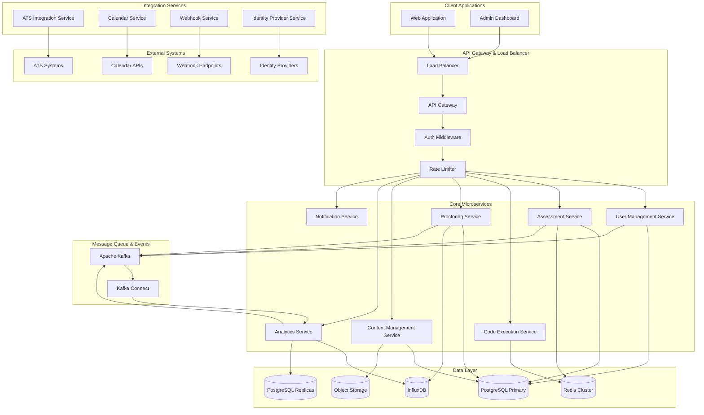

# Dessai Backend Implementation Specification
version: "1.0.0"
last_updated: "2025-08-12"
persona: "Technical Strategy Advisor"

## Overview

This document provides the complete technical specification for implementing the Dessai AI-Native Technical Hiring Platform backend. It consolidates architectural decisions, technology stack requirements, and implementation guidelines necessary for full backend development.

## Table of Contents

1. [System Architecture](#system-architecture)
2. [Technology Stack](#technology-stack)
3. [Project Structure](#project-structure)
4. [Service Implementation Details](#service-implementation-details)
5. [Database Design](#database-design)
6. [Security Implementation](#security-implementation)
7. [API Specifications](#api-specifications)
8. [Integration Requirements](#integration-requirements)
9. [Development Guidelines](#development-guidelines)
10. [Deployment & Infrastructure](#deployment--infrastructure)

## System Architecture

### Microservices Architecture Overview



### Service Communication Patterns

#### Synchronous Communication
- **REST APIs**: Primary external communication
- **GraphQL**: Complex queries and real-time subscriptions
- **gRPC**: High-performance internal service communication
- **WebSocket**: Real-time collaboration and proctoring

#### Asynchronous Communication
- **Kafka**: Event streaming and service coordination
- **Redis Pub/Sub**: Real-time notifications
- **Webhooks**: External system integration

## Technology Stack

### Core Technologies

```yaml
Runtime Environment:
  node_version: "20.10.0 LTS"
  typescript_version: "5.3.0"
  package_manager: "npm 10.x"

Web Framework:
  primary: "Express.js 4.18+"
  alternative: "Fastify 4.x" # For high-performance services
  
Database Stack:
  primary_db: "PostgreSQL 15+"
  cache: "Redis 7.2+ Cluster"
  time_series: "InfluxDB 2.7+"
  object_storage: "MinIO / S3 Compatible"
  
Message Queue:
  primary: "Apache Kafka 3.6+"
  consumer_groups: "KafkaJS 2.2+"
  
Search Engine:
  primary: "Elasticsearch 8.x"
  alternative: "PostgreSQL Full-Text Search"
```

### Security Stack

```yaml
Authentication:
  jwt_library: "jsonwebtoken 9.0+"
  signing_algorithm: "RS256"
  token_expiry: "15 minutes"
  refresh_token_expiry: "7 days"
  
Authorization:
  rbac_engine: "Custom RBAC with Policies"
  policy_language: "JSON-based rules engine"
  
Encryption:
  at_rest: "AES-256-GCM"
  in_transit: "TLS 1.3"
  field_level: "crypto-js with key rotation"
  
Multi-Factor Authentication:
  totp: "speakeasy library"
  webauthn: "@simplewebauthn/server"
  
Security Headers:
  helmet: "7.1+"
  cors: "2.8+"
  rate_limiting: "express-rate-limit + Redis"
```

### Development Tools

```yaml
Code Quality:
  linting: "ESLint 8.x with TypeScript"
  formatting: "Prettier 3.x"
  pre_commit: "husky + lint-staged"
  
Testing:
  unit_testing: "Jest 29.x"
  integration_testing: "Supertest + Testcontainers"
  e2e_testing: "Playwright"
  load_testing: "Artillery.io"
  
Monitoring:
  metrics: "Prometheus client"
  tracing: "OpenTelemetry"
  logging: "Winston 3.x + ELK Stack"
  health_checks: "Custom health endpoints"
  
Documentation:
  api_docs: "OpenAPI 3.0 + Swagger UI"
  code_docs: "TypeDoc"
  architecture: "Mermaid diagrams"
```

## Project Structure

```
dessai-backend/
├── src/
│   ├── services/                    # Microservices
│   │   ├── user-management/         # User & Organization Management
│   │   │   ├── controllers/
│   │   │   │   ├── auth.controller.ts
│   │   │   │   ├── user.controller.ts
│   │   │   │   ├── organization.controller.ts
│   │   │   │   └── permission.controller.ts
│   │   │   ├── models/
│   │   │   │   ├── user.model.ts
│   │   │   │   ├── organization.model.ts
│   │   │   │   ├── profile.model.ts
│   │   │   │   └── permission.model.ts
│   │   │   ├── services/
│   │   │   │   ├── auth.service.ts
│   │   │   │   ├── user.service.ts
│   │   │   │   ├── organization.service.ts
│   │   │   │   └── permission.service.ts
│   │   │   ├── routes/
│   │   │   │   ├── auth.routes.ts
│   │   │   │   ├── user.routes.ts
│   │   │   │   └── organization.routes.ts
│   │   │   ├── middleware/
│   │   │   │   ├── auth.middleware.ts
│   │   │   │   ├── rbac.middleware.ts
│   │   │   │   └── validation.middleware.ts
│   │   │   ├── schemas/
│   │   │   │   ├── auth.schema.ts
│   │   │   │   ├── user.schema.ts
│   │   │   │   └── organization.schema.ts
│   │   │   ├── tests/
│   │   │   │   ├── unit/
│   │   │   │   ├── integration/
│   │   │   │   └── e2e/
│   │   │   ├── config/
│   │   │   │   └── service.config.ts
│   │   │   └── app.ts
│   │   │
│   │   ├── assessment/              # Assessment Management
│   │   │   ├── controllers/
│   │   │   │   ├── assessment.controller.ts
│   │   │   │   ├── question.controller.ts
│   │   │   │   ├── submission.controller.ts
│   │   │   │   └── session.controller.ts
│   │   │   ├── models/
│   │   │   │   ├── assessment.model.ts
│   │   │   │   ├── question.model.ts
│   │   │   │   ├── submission.model.ts
│   │   │   │   └── session.model.ts
│   │   │   ├── services/
│   │   │   │   ├── assessment.service.ts
│   │   │   │   ├── question.service.ts
│   │   │   │   ├── submission.service.ts
│   │   │   │   └── scoring.service.ts
│   │   │   ├── routes/
│   │   │   │   ├── assessment.routes.ts
│   │   │   │   ├── question.routes.ts
│   │   │   │   └── submission.routes.ts
│   │   │   ├── middleware/
│   │   │   │   ├── assessment-auth.middleware.ts
│   │   │   │   └── time-tracking.middleware.ts
│   │   │   ├── schemas/
│   │   │   │   ├── assessment.schema.ts
│   │   │   │   ├── question.schema.ts
│   │   │   │   └── submission.schema.ts
│   │   │   ├── tests/
│   │   │   ├── config/
│   │   │   └── app.ts
│   │   │
│   │   ├── code-execution/          # Code Execution Engine
│   │   │   ├── controllers/
│   │   │   │   ├── execution.controller.ts
│   │   │   │   ├── sandbox.controller.ts
│   │   │   │   └── validation.controller.ts
│   │   │   ├── services/
│   │   │   │   ├── docker.service.ts
│   │   │   │   ├── security.service.ts
│   │   │   │   ├── language-support.service.ts
│   │   │   │   └── result-processing.service.ts
│   │   │   ├── engines/
│   │   │   │   ├── javascript.engine.ts
│   │   │   │   ├── python.engine.ts
│   │   │   │   ├── java.engine.ts
│   │   │   │   ├── cpp.engine.ts
│   │   │   │   └── base.engine.ts
│   │   │   ├── sandbox/
│   │   │   │   ├── docker-config/
│   │   │   │   ├── security-profiles/
│   │   │   │   └── runtime-limits/
│   │   │   ├── models/
│   │   │   │   ├── execution-job.model.ts
│   │   │   │   └── execution-result.model.ts
│   │   │   ├── routes/
│   │   │   │   └── execution.routes.ts
│   │   │   ├── middleware/
│   │   │   │   ├── security.middleware.ts
│   │   │   │   └── resource-limit.middleware.ts
│   │   │   ├── tests/
│   │   │   ├── config/
│   │   │   └── app.ts
│   │   │
│   │   ├── proctoring/              # AI-Powered Proctoring
│   │   │   ├── controllers/
│   │   │   │   ├── session.controller.ts
│   │   │   │   ├── monitoring.controller.ts
│   │   │   │   ├── analysis.controller.ts
│   │   │   │   └── reporting.controller.ts
│   │   │   ├── services/
│   │   │   │   ├── video-analysis.service.ts
│   │   │   │   ├── audio-analysis.service.ts
│   │   │   │   ├── behavioral-analysis.service.ts
│   │   │   │   ├── anomaly-detection.service.ts
│   │   │   │   └── integrity-scoring.service.ts
│   │   │   ├── ai-models/
│   │   │   │   ├── face-detection/
│   │   │   │   ├── gaze-tracking/
│   │   │   │   ├── voice-analysis/
│   │   │   │   └── behavior-patterns/
│   │   │   ├── streaming/
│   │   │   │   ├── webrtc.handler.ts
│   │   │   │   ├── media-server.ts
│   │   │   │   └── recording.service.ts
│   │   │   ├── models/
│   │   │   │   ├── proctoring-session.model.ts
│   │   │   │   ├── monitoring-event.model.ts
│   │   │   │   └── integrity-report.model.ts
│   │   │   ├── routes/
│   │   │   │   ├── session.routes.ts
│   │   │   │   └── monitoring.routes.ts
│   │   │   ├── middleware/
│   │   │   │   ├── stream-validation.middleware.ts
│   │   │   │   └── privacy.middleware.ts
│   │   │   ├── tests/
│   │   │   ├── config/
│   │   │   └── app.ts
│   │   │
│   │   ├── content-management/      # Question Library & Content
│   │   │   ├── controllers/
│   │   │   │   ├── library.controller.ts
│   │   │   │   ├── category.controller.ts
│   │   │   │   ├── template.controller.ts
│   │   │   │   └── media.controller.ts
│   │   │   ├── services/
│   │   │   │   ├── content.service.ts
│   │   │   │   ├── search.service.ts
│   │   │   │   ├── versioning.service.ts
│   │   │   │   └── approval.service.ts
│   │   │   ├── models/
│   │   │   │   ├── question-library.model.ts
│   │   │   │   ├── category.model.ts
│   │   │   │   ├── template.model.ts
│   │   │   │   └── media-file.model.ts
│   │   │   ├── routes/
│   │   │   │   ├── library.routes.ts
│   │   │   │   ├── category.routes.ts
│   │   │   │   └── template.routes.ts
│   │   │   ├── middleware/
│   │   │   │   ├── content-validation.middleware.ts
│   │   │   │   └── file-upload.middleware.ts
│   │   │   ├── tests/
│   │   │   ├── config/
│   │   │   └── app.ts
│   │   │
│   │   ├── analytics/               # Performance Analytics
│   │   │   ├── controllers/
│   │   │   │   ├── metrics.controller.ts
│   │   │   │   ├── reports.controller.ts
│   │   │   │   ├── insights.controller.ts
│   │   │   │   └── dashboard.controller.ts
│   │   │   ├── services/
│   │   │   │   ├── data-aggregation.service.ts
│   │   │   │   ├── statistical-analysis.service.ts
│   │   │   │   ├── predictive-modeling.service.ts
│   │   │   │   ├── bias-detection.service.ts
│   │   │   │   └── reporting.service.ts
│   │   │   ├── models/
│   │   │   │   ├── performance-metric.model.ts
│   │   │   │   ├── assessment-insight.model.ts
│   │   │   │   └── analytics-report.model.ts
│   │   │   ├── processors/
│   │   │   │   ├── real-time.processor.ts
│   │   │   │   ├── batch.processor.ts
│   │   │   │   └── streaming.processor.ts
│   │   │   ├── routes/
│   │   │   │   ├── metrics.routes.ts
│   │   │   │   └── reports.routes.ts
│   │   │   ├── middleware/
│   │   │   │   └── analytics-auth.middleware.ts
│   │   │   ├── tests/
│   │   │   ├── config/
│   │   │   └── app.ts
│   │   │
│   │   └── notification/            # Multi-Channel Notifications
│   │       ├── controllers/
│   │       │   ├── email.controller.ts
│   │       │   ├── sms.controller.ts
│   │       │   ├── webhook.controller.ts
│   │       │   └── push.controller.ts
│   │       ├── services/
│   │       │   ├── email.service.ts
│   │       │   ├── sms.service.ts
│   │       │   ├── webhook.service.ts
│   │       │   ├── push.service.ts
│   │       │   └── template.service.ts
│   │       ├── providers/
│   │       │   ├── sendgrid.provider.ts
│   │       │   ├── twilio.provider.ts
│   │       │   ├── slack.provider.ts
│   │       │   └── teams.provider.ts
│   │       ├── models/
│   │       │   ├── notification.model.ts
│   │       │   ├── template.model.ts
│   │       │   └── delivery-log.model.ts
│   │       ├── routes/
│   │       │   └── notification.routes.ts
│   │       ├── middleware/
│   │       │   ├── delivery-tracking.middleware.ts
│   │       │   └── rate-limiting.middleware.ts
│   │       ├── tests/
│   │       ├── config/
│   │       └── app.ts
│   │
│   ├── integrations/                # External System Integrations
│   │   ├── ats/                     # ATS Integration Service
│   │   │   ├── providers/
│   │   │   │   ├── greenhouse.provider.ts
│   │   │   │   ├── workday.provider.ts
│   │   │   │   ├── bamboohr.provider.ts
│   │   │   │   └── lever.provider.ts
│   │   │   ├── services/
│   │   │   │   ├── sync.service.ts
│   │   │   │   ├── mapping.service.ts
│   │   │   │   └── webhook.service.ts
│   │   │   ├── models/
│   │   │   │   ├── ats-integration.model.ts
│   │   │   │   ├── candidate-mapping.model.ts
│   │   │   │   └── sync-log.model.ts
│   │   │   ├── controllers/
│   │   │   │   ├── integration.controller.ts
│   │   │   │   └── webhook.controller.ts
│   │   │   ├── routes/
│   │   │   │   └── ats.routes.ts
│   │   │   ├── middleware/
│   │   │   │   ├── webhook-validation.middleware.ts
│   │   │   │   └── signature-verification.middleware.ts
│   │   │   ├── tests/
│   │   │   ├── config/
│   │   │   └── app.ts
│   │   │
│   │   ├── calendar/                # Calendar Integration Service
│   │   │   ├── providers/
│   │   │   │   ├── google-calendar.provider.ts
│   │   │   │   ├── outlook.provider.ts
│   │   │   │   ├── calendly.provider.ts
│   │   │   │   └── zoom.provider.ts
│   │   │   ├── services/
│   │   │   │   ├── scheduling.service.ts
│   │   │   │   ├── availability.service.ts
│   │   │   │   └── meeting.service.ts
│   │   │   ├── models/
│   │   │   │   ├── calendar-integration.model.ts
│   │   │   │   ├── meeting.model.ts
│   │   │   │   └── availability.model.ts
│   │   │   ├── controllers/
│   │   │   │   ├── calendar.controller.ts
│   │   │   │   └── meeting.controller.ts
│   │   │   ├── routes/
│   │   │   │   └── calendar.routes.ts
│   │   │   ├── tests/
│   │   │   ├── config/
│   │   │   └── app.ts
│   │   │
│   │   ├── identity/                # Identity Provider Integration
│   │   │   ├── providers/
│   │   │   │   ├── active-directory.provider.ts
│   │   │   │   ├── okta.provider.ts
│   │   │   │   ├── auth0.provider.ts
│   │   │   │   └── saml.provider.ts
│   │   │   ├── services/
│   │   │   │   ├── sso.service.ts
│   │   │   │   ├── provisioning.service.ts
│   │   │   │   └── mapping.service.ts
│   │   │   ├── models/
│   │   │   │   ├── identity-provider.model.ts
│   │   │   │   ├── sso-config.model.ts
│   │   │   │   └── user-mapping.model.ts
│   │   │   ├── controllers/
│   │   │   │   ├── sso.controller.ts
│   │   │   │   └── provisioning.controller.ts
│   │   │   ├── routes/
│   │   │   │   └── identity.routes.ts
│   │   │   ├── tests/
│   │   │   ├── config/
│   │   │   └── app.ts
│   │   │
│   │   └── webhooks/               # Webhook Management Service
│   │       ├── services/
│   │       │   ├── delivery.service.ts
│   │       │   ├── retry.service.ts
│   │       │   ├── signature.service.ts
│   │       │   └── logging.service.ts
│   │       ├── models/
│   │       │   ├── webhook-endpoint.model.ts
│   │       │   ├── webhook-event.model.ts
│   │       │   └── delivery-attempt.model.ts
│   │       ├── controllers/
│   │       │   ├── webhook.controller.ts
│   │       │   └── endpoint.controller.ts
│   │       ├── routes/
│   │       │   └── webhook.routes.ts
│   │       ├── middleware/
│   │       │   ├── signature-generation.middleware.ts
│   │       │   └── delivery-tracking.middleware.ts
│   │       ├── tests/
│   │       ├── config/
│   │       └── app.ts
│   │
│   ├── shared/                      # Shared Components
│   │   ├── database/
│   │   │   ├── connection.ts
│   │   │   ├── migrations/
│   │   │   ├── seeds/
│   │   │   ├── repositories/
│   │   │   │   ├── base.repository.ts
│   │   │   │   └── transaction.repository.ts
│   │   │   └── query-builder/
│   │   │       ├── base.query-builder.ts
│   │   │       └── complex.query-builder.ts
│   │   ├── cache/
│   │   │   ├── redis.client.ts
│   │   │   ├── cache.service.ts
│   │   │   └── session.store.ts
│   │   ├── security/
│   │   │   ├── encryption/
│   │   │   │   ├── aes.service.ts
│   │   │   │   ├── rsa.service.ts
│   │   │   │   └── key-rotation.service.ts
│   │   │   ├── jwt/
│   │   │   │   ├── token.service.ts
│   │   │   │   ├── refresh.service.ts
│   │   │   │   └── validation.service.ts
│   │   │   ├── rbac/
│   │   │   │   ├── policy.engine.ts
│   │   │   │   ├── permission.service.ts
│   │   │   │   └── role.service.ts
│   │   │   └── audit/
│   │   │       ├── audit.service.ts
│   │   │       └── compliance.service.ts
│   │   ├── messaging/
│   │   │   ├── kafka/
│   │   │   │   ├── producer.ts
│   │   │   │   ├── consumer.ts
│   │   │   │   └── admin.ts
│   │   │   ├── redis-pubsub/
│   │   │   │   ├── publisher.ts
│   │   │   │   └── subscriber.ts
│   │   │   └── events/
│   │   │       ├── event.bus.ts
│   │   │       └── event.handler.ts
│   │   ├── monitoring/
│   │   │   ├── metrics/
│   │   │   │   ├── prometheus.client.ts
│   │   │   │   ├── custom.metrics.ts
│   │   │   │   └── business.metrics.ts
│   │   │   ├── logging/
│   │   │   │   ├── logger.ts
│   │   │   │   ├── structured.logger.ts
│   │   │   │   └── audit.logger.ts
│   │   │   ├── tracing/
│   │   │   │   ├── opentelemetry.ts
│   │   │   │   └── custom.spans.ts
│   │   │   └── health/
│   │   │       ├── health.service.ts
│   │   │       └── readiness.service.ts
│   │   ├── utils/
│   │   │   ├── validation/
│   │   │   │   ├── joi.schemas.ts
│   │   │   │   ├── custom.validators.ts
│   │   │   │   └── sanitization.ts
│   │   │   ├── transformation/
│   │   │   │   ├── data.transformer.ts
│   │   │   │   └── api.serializer.ts
│   │   │   ├── error-handling/
│   │   │   │   ├── error.handler.ts
│   │   │   │   ├── custom.errors.ts
│   │   │   │   └── error.reporter.ts
│   │   │   ├── pagination/
│   │   │   │   ├── cursor.pagination.ts
│   │   │   │   └── offset.pagination.ts
│   │   │   └── rate-limiting/
│   │   │       ├── rate.limiter.ts
│   │   │       └── sliding.window.ts
│   │   ├── types/
│   │   │   ├── common/
│   │   │   │   ├── api.types.ts
│   │   │   │   ├── database.types.ts
│   │   │   │   └── auth.types.ts
│   │   │   ├── domain/
│   │   │   │   ├── user.types.ts
│   │   │   │   ├── assessment.types.ts
│   │   │   │   ├── proctoring.types.ts
│   │   │   │   └── analytics.types.ts
│   │   │   └── integration/
│   │   │       ├── ats.types.ts
│   │   │       ├── calendar.types.ts
│   │   │       └── webhook.types.ts
│   │   ├── config/
│   │   │   ├── environment/
│   │   │   │   ├── development.ts
│   │   │   │   ├── staging.ts
│   │   │   │   ├── production.ts
│   │   │   │   └── test.ts
│   │   │   ├── database.config.ts
│   │   │   ├── redis.config.ts
│   │   │   ├── kafka.config.ts
│   │   │   ├── security.config.ts
│   │   │   └── monitoring.config.ts
│   │   └── middleware/
│   │       ├── global/
│   │       │   ├── cors.middleware.ts
│   │       │   ├── helmet.middleware.ts
│   │       │   ├── compression.middleware.ts
│   │       │   └── request-id.middleware.ts
│   │       ├── authentication/
│   │       │   ├── jwt.middleware.ts
│   │       │   ├── api-key.middleware.ts
│   │       │   └── session.middleware.ts
│   │       ├── authorization/
│   │       │   ├── rbac.middleware.ts
│   │       │   ├── resource.middleware.ts
│   │       │   └── scope.middleware.ts
│   │       ├── validation/
│   │       │   ├── schema.middleware.ts
│   │       │   ├── sanitization.middleware.ts
│   │       │   └── file-upload.middleware.ts
│   │       ├── monitoring/
│   │       │   ├── metrics.middleware.ts
│   │       │   ├── logging.middleware.ts
│   │       │   └── tracing.middleware.ts
│   │       └── error-handling/
│   │           ├── global.error.middleware.ts
│   │           ├── not-found.middleware.ts
│   │           └── validation.error.middleware.ts
│   │
│   ├── api-gateway/                 # API Gateway Service
│   │   ├── controllers/
│   │   │   ├── proxy.controller.ts
│   │   │   ├── routing.controller.ts
│   │   │   └── health.controller.ts
│   │   ├── services/
│   │   │   ├── service-discovery.service.ts
│   │   │   ├── load-balancer.service.ts
│   │   │   ├── circuit-breaker.service.ts
│   │   │   └── request-transformation.service.ts
│   │   ├── middleware/
│   │   │   ├── service-routing.middleware.ts
│   │   │   ├── request-transformation.middleware.ts
│   │   │   ├── response-transformation.middleware.ts
│   │   │   └── circuit-breaker.middleware.ts
│   │   ├── routes/
│   │   │   ├── user.proxy.routes.ts
│   │   │   ├── assessment.proxy.routes.ts
│   │   │   ├── execution.proxy.routes.ts
│   │   │   ├── proctoring.proxy.routes.ts
│   │   │   ├── analytics.proxy.routes.ts
│   │   │   └── integration.proxy.routes.ts
│   │   ├── config/
│   │   │   ├── routing.config.ts
│   │   │   ├── load-balancer.config.ts
│   │   │   └── circuit-breaker.config.ts
│   │   ├── tests/
│   │   └── app.ts
│   │
│   └── scripts/                     # Utility Scripts
│       ├── migration/
│       │   ├── migrate.ts
│       │   ├── rollback.ts
│       │   └── seed.ts
│       ├── deployment/
│       │   ├── health-check.ts
│       │   ├── service-startup.ts
│       │   └── graceful-shutdown.ts
│       ├── monitoring/
│       │   ├── metric-collection.ts
│       │   └── log-aggregation.ts
│       └── utilities/
│           ├── data-cleanup.ts
│           ├── cache-warming.ts
│           └── index-optimization.ts
│
├── tests/                          # Comprehensive Testing Suite
│   ├── unit/
│   │   ├── services/
│   │   ├── controllers/
│   │   ├── middleware/
│   │   └── utilities/
│   ├── integration/
│   │   ├── database/
│   │   ├── api-endpoints/
│   │   ├── message-queue/
│   │   └── external-services/
│   ├── e2e/
│   │   ├── user-workflows/
│   │   ├── assessment-flows/
│   │   ├── proctoring-scenarios/
│   │   └── integration-tests/
│   ├── performance/
│   │   ├── load-tests/
│   │   ├── stress-tests/
│   │   └── spike-tests/
│   ├── security/
│   │   ├── penetration-tests/
│   │   ├── vulnerability-scans/
│   │   └── compliance-tests/
│   ├── fixtures/
│   │   ├── database/
│   │   ├── files/
│   │   └── configurations/
│   ├── mocks/
│   │   ├── external-services/
│   │   ├── database/
│   │   └── message-queue/
│   └── helpers/
│       ├── test-setup.ts
│       ├── test-teardown.ts
│       ├── database-helpers.ts
│       └── assertion-helpers.ts
│
├── infrastructure/                 # Infrastructure as Code
│   ├── docker/
│   │   ├── services/
│   │   │   ├── user-management/
│   │   │   │   ├── Dockerfile
│   │   │   │   └── docker-compose.yml
│   │   │   ├── assessment/
│   │   │   │   ├── Dockerfile
│   │   │   │   └── docker-compose.yml
│   │   │   ├── code-execution/
│   │   │   │   ├── Dockerfile
│   │   │   │   ├── sandbox-images/
│   │   │   │   └── docker-compose.yml
│   │   │   ├── proctoring/
│   │   │   │   ├── Dockerfile
│   │   │   │   └── docker-compose.yml
│   │   │   ├── analytics/
│   │   │   │   ├── Dockerfile
│   │   │   │   └── docker-compose.yml
│   │   │   └── notification/
│   │   │       ├── Dockerfile
│   │   │       └── docker-compose.yml
│   │   ├── databases/
│   │   │   ├── postgresql/
│   │   │   │   ├── Dockerfile
│   │   │   │   ├── init-scripts/
│   │   │   │   └── docker-compose.yml
│   │   │   ├── redis/
│   │   │   │   ├── Dockerfile
│   │   │   │   ├── redis.conf
│   │   │   │   └── docker-compose.yml
│   │   │   └── influxdb/
│   │   │       ├── Dockerfile
│   │   │       └── docker-compose.yml
│   │   ├── api-gateway/
│   │   │   ├── Dockerfile
│   │   │   └── nginx.conf
│   │   └── docker-compose.yml
│   │
│   ├── kubernetes/
│   │   ├── namespaces/
│   │   │   ├── development.yaml
│   │   │   ├── staging.yaml
│   │   │   └── production.yaml
│   │   ├── services/
│   │   │   ├── user-management/
│   │   │   │   ├── deployment.yaml
│   │   │   │   ├── service.yaml
│   │   │   │   ├── configmap.yaml
│   │   │   │   └── secrets.yaml
│   │   │   ├── assessment/
│   │   │   │   ├── deployment.yaml
│   │   │   │   ├── service.yaml
│   │   │   │   ├── configmap.yaml
│   │   │   │   └── secrets.yaml
│   │   │   ├── code-execution/
│   │   │   │   ├── deployment.yaml
│   │   │   │   ├── service.yaml
│   │   │   │   ├── pod-security-policy.yaml
│   │   │   │   └── network-policy.yaml
│   │   │   ├── proctoring/
│   │   │   │   ├── deployment.yaml
│   │   │   │   ├── service.yaml
│   │   │   │   └── configmap.yaml
│   │   │   ├── analytics/
│   │   │   │   ├── deployment.yaml
│   │   │   │   ├── service.yaml
│   │   │   │   └── configmap.yaml
│   │   │   └── notification/
│   │   │       ├── deployment.yaml
│   │   │       ├── service.yaml
│   │   │       └── configmap.yaml
│   │   ├── databases/
│   │   │   ├── postgresql/
│   │   │   │   ├── statefulset.yaml
│   │   │   │   ├── service.yaml
│   │   │   │   ├── persistent-volume.yaml
│   │   │   │   └── secrets.yaml
│   │   │   ├── redis/
│   │   │   │   ├── deployment.yaml
│   │   │   │   ├── service.yaml
│   │   │   │   └── configmap.yaml
│   │   │   └── influxdb/
│   │   │       ├── deployment.yaml
│   │   │       ├── service.yaml
│   │   │       └── persistent-volume.yaml
│   │   ├── monitoring/
│   │   │   ├── prometheus/
│   │   │   │   ├── deployment.yaml
│   │   │   │   ├── configmap.yaml
│   │   │   │   └── service.yaml
│   │   │   ├── grafana/
│   │   │   │   ├── deployment.yaml
│   │   │   │   ├── configmap.yaml
│   │   │   │   └── service.yaml
│   │   │   └── jaeger/
│   │   │       ├── deployment.yaml
│   │   │       └── service.yaml
│   │   ├── ingress/
│   │   │   ├── api-gateway-ingress.yaml
│   │   │   ├── tls-certificates.yaml
│   │   │   └── rate-limiting.yaml
│   │   └── security/
│   │       ├── rbac.yaml
│   │       ├── network-policies.yaml
│   │       ├── pod-security-policies.yaml
│   │       └── service-accounts.yaml
│   │
│   ├── terraform/
│   │   ├── environments/
│   │   │   ├── development/
│   │   │   ├── staging/
│   │   │   └── production/
│   │   ├── modules/
│   │   │   ├── vpc/
│   │   │   ├── eks/
│   │   │   ├── rds/
│   │   │   ├── elasticache/
│   │   │   ├── s3/
│   │   │   └── cloudfront/
│   │   └── shared/
│   │       ├── variables.tf
│   │       ├── outputs.tf
│   │       └── providers.tf
│   │
│   └── ansible/
│       ├── playbooks/
│       │   ├── server-setup.yml
│       │   ├── application-deployment.yml
│       │   └── security-hardening.yml
│       ├── roles/
│       │   ├── common/
│       │   ├── docker/
│       │   ├── kubernetes/
│       │   └── monitoring/
│       └── inventories/
│           ├── development/
│           ├── staging/
│           └── production/
│
├── documentation/                  # Additional Documentation
│   ├── api/
│   │   ├── openapi/
│   │   │   ├── user-management.yaml
│   │   │   ├── assessment.yaml
│   │   │   ├── code-execution.yaml
│   │   │   ├── proctoring.yaml
│   │   │   ├── analytics.yaml
│   │   │   └── notification.yaml
│   │   ├── graphql/
│   │   │   ├── schema.graphql
│   │   │   ├── resolvers.md
│   │   │   └── subscriptions.md
│   │   └── postman/
│   │       ├── collections/
│   │       └── environments/
│   ├── deployment/
│   │   ├── setup-guide.md
│   │   ├── configuration-guide.md
│   │   ├── scaling-guide.md
│   │   └── troubleshooting.md
│   ├── security/
│   │   ├── security-guide.md
│   │   ├── compliance-checklist.md
│   │   ├── incident-response.md
│   │   └── penetration-testing.md
│   └── development/
│       ├── coding-standards.md
│       ├── testing-guidelines.md
│       ├── contribution-guide.md
│       └── code-review-checklist.md
│
├── monitoring/                     # Monitoring Configuration
│   ├── prometheus/
│   │   ├── prometheus.yml
│   │   ├── alert-rules/
│   │   │   ├── service-alerts.yml
│   │   │   ├── infrastructure-alerts.yml
│   │   │   └── business-alerts.yml
│   │   └── recording-rules/
│   │       ├── service-rules.yml
│   │       └── business-rules.yml
│   ├── grafana/
│   │   ├── dashboards/
│   │   │   ├── service-overview.json
│   │   │   ├── infrastructure-metrics.json
│   │   │   ├── business-metrics.json
│   │   │   └── security-monitoring.json
│   │   ├── data-sources/
│   │   │   ├── prometheus.yaml
│   │   │   ├── influxdb.yaml
│   │   │   └── elasticsearch.yaml
│   │   └── alerting/
│   │       ├── notification-channels.yaml
│   │       └── alert-rules.yaml
│   ├── elasticsearch/
│   │   ├── elasticsearch.yml
│   │   ├── index-templates/
│   │   ├── index-lifecycle-policies/
│   │   └── security-policies/
│   ├── logstash/
│   │   ├── logstash.yml
│   │   ├── pipelines/
│   │   │   ├── application-logs.conf
│   │   │   ├── security-logs.conf
│   │   │   └── audit-logs.conf
│   │   └── patterns/
│   │       └── custom-patterns
│   └── kibana/
│       ├── kibana.yml
│       ├── dashboards/
│       │   ├── application-logs.json
│       │   ├── security-logs.json
│       │   └── audit-logs.json
│       └── visualizations/
│           ├── service-metrics.json
│           └── business-metrics.json
│
├── security/                       # Security Configuration
│   ├── certificates/
│   │   ├── ca-certificates/
│   │   ├── service-certificates/
│   │   └── client-certificates/
│   ├── policies/
│   │   ├── rbac-policies.yaml
│   │   ├── network-policies.yaml
│   │   ├── security-policies.yaml
│   │   └── compliance-policies.yaml
│   ├── secrets/
│   │   ├── development/
│   │   ├── staging/
│   │   └── production/
│   ├── scanning/
│   │   ├── vulnerability-scans/
│   │   ├── dependency-scans/
│   │   └── compliance-scans/
│   └── audit/
│       ├── audit-logs/
│       ├── compliance-reports/
│       └── security-reports/
│
├── scripts/                        # Utility and Automation Scripts
│   ├── setup/
│   │   ├── environment-setup.sh
│   │   ├── database-setup.sh
│   │   ├── dependencies-install.sh
│   │   └── ssl-certificate-setup.sh
│   ├── deployment/
│   │   ├── build-and-deploy.sh
│   │   ├── database-migration.sh
│   │   ├── health-check.sh
│   │   └── rollback.sh
│   ├── maintenance/
│   │   ├── backup-database.sh
│   │   ├── cleanup-logs.sh
│   │   ├── update-certificates.sh
│   │   └── security-scan.sh
│   ├── development/
│   │   ├── generate-api-docs.sh
│   │   ├── run-tests.sh
│   │   ├── code-quality-check.sh
│   │   └── dependency-update.sh
│   └── monitoring/
│       ├── collect-metrics.sh
│       ├── generate-reports.sh
│       └── alert-management.sh
│
├── config/                         # Configuration Files
│   ├── environments/
│   │   ├── development.env
│   │   ├── staging.env
│   │   ├── production.env
│   │   └── test.env
│   ├── database/
│   │   ├── postgresql.conf
│   │   ├── redis.conf
│   │   └── influxdb.conf
│   ├── message-queue/
│   │   ├── kafka.properties
│   │   └── consumer.properties
│   ├── monitoring/
│   │   ├── logging.conf
│   │   ├── metrics.conf
│   │   └── tracing.conf
│   └── security/
│       ├── jwt.conf
│       ├── encryption.conf
│       └── rbac.conf
│
├── package.json                    # Root Package Configuration
├── tsconfig.json                   # TypeScript Configuration
├── jest.config.js                  # Testing Configuration
├── eslint.config.js               # Linting Configuration
├── prettier.config.js             # Code Formatting Configuration
├── Dockerfile                     # Main Dockerfile
├── docker-compose.yml             # Development Environment
├── .gitignore                     # Git Ignore Rules
├── .nvmrc                         # Node Version
├── README.md                      # Project README
├── CHANGELOG.md                   # Version History
├── CONTRIBUTING.md                # Contribution Guidelines
├── LICENSE                        # License Information
└── SECURITY.md                    # Security Policy
```

This project structure provides:

### 🏗️ **Modular Architecture**
- Clear separation of concerns with dedicated microservices
- Shared components for cross-cutting concerns
- Well-defined integration boundaries

### 🔒 **Security-First Design**
- Comprehensive security utilities and middleware
- Encryption, authentication, and authorization components
- Audit logging and compliance tools

### 🚀 **Scalability & Performance**
- Independent service scaling
- Caching and optimization utilities
- Load balancing and circuit breaker patterns

### 🧪 **Testing Excellence**
- Comprehensive testing strategy at all levels
- Performance and security testing
- Mock and fixture management

### 📊 **Observability**
- Complete monitoring and logging stack
- Metrics collection and alerting
- Distributed tracing capabilities

### 🛠️ **DevOps Ready**
- Infrastructure as Code with Terraform
- Kubernetes deployment configurations
- CI/CD pipeline support with comprehensive scripts

This structure supports the AI-native development approach while ensuring enterprise-grade quality, security, and maintainability.

**Suggested commit message:** `feat: define comprehensive backend implementation specification and project structure`

## Service Implementation Details

### User Management Service

#### Core Components

```typescript
// User Management Service Architecture
interface UserManagementService {
  authentication: AuthenticationService;
  authorization: AuthorizationService;
  userProfile: UserProfileService;
  organization: OrganizationService;
  permission: PermissionService;
}

// Authentication Service Implementation
class AuthenticationService {
  async login(credentials: LoginCredentials): Promise<AuthResponse> {
    // 1. Validate credentials against database
    // 2. Check account status and restrictions
    // 3. Implement MFA verification if enabled
    // 4. Generate JWT token with proper claims
    // 5. Create refresh token with rotation
    // 6. Log authentication event for audit
    // 7. Return authentication response
  }

  async refreshToken(refreshToken: string): Promise<AuthResponse> {
    // 1. Validate refresh token signature and expiry
    // 2. Check token blacklist/revocation
    // 3. Generate new access token
    // 4. Rotate refresh token for security
    // 5. Update last activity timestamp
  }

  async logout(tokenPayload: JWTPayload): Promise<void> {
    // 1. Add tokens to blacklist
    // 2. Clear session data from Redis
    // 3. Log logout event for audit
    // 4. Notify other sessions if required
  }

  async enableMFA(userId: string, mfaType: MFAType): Promise<MFASetupResult> {
    // 1. Generate TOTP secret or WebAuthn challenge
    // 2. Store MFA configuration securely
    // 3. Provide setup instructions to user
    // 4. Require verification before activation
  }
}

// Authorization Service with RBAC
class AuthorizationService {
  async checkPermission(
    userId: string,
    resource: string,
    action: string,
    context?: AuthContext
  ): Promise<boolean> {
    // 1. Retrieve user roles and permissions
    // 2. Evaluate context-aware policies
    // 3. Apply organizational constraints
    // 4. Cache permission decisions
    // 5. Log authorization events
  }

  async assignRole(
    userId: string,
    roleId: string,
    organizationId: string
  ): Promise<void> {
    // 1. Validate role assignment permissions
    // 2. Check organizational membership
    // 3. Update user role assignments
    // 4. Invalidate permission cache
    // 5. Audit role assignment
  }
}
```

#### Database Schema Implementation

```sql
-- User Management Database Schema
-- Users table with comprehensive security fields
CREATE TABLE users (
    id UUID PRIMARY KEY DEFAULT gen_random_uuid(),
    email VARCHAR(255) UNIQUE NOT NULL,
    username VARCHAR(100) UNIQUE,
    password_hash VARCHAR(255) NOT NULL,
    salt VARCHAR(255) NOT NULL,
    email_verified BOOLEAN DEFAULT FALSE,
    email_verification_token VARCHAR(255),
    email_verification_expires_at TIMESTAMP,
    password_reset_token VARCHAR(255),
    password_reset_expires_at TIMESTAMP,
    last_login_at TIMESTAMP,
    failed_login_attempts INTEGER DEFAULT 0,
    account_locked_until TIMESTAMP,
    status user_status_enum DEFAULT 'active',
    mfa_enabled BOOLEAN DEFAULT FALSE,
    mfa_secret VARCHAR(255),
    mfa_backup_codes TEXT[], -- Encrypted backup codes
    created_at TIMESTAMP DEFAULT CURRENT_TIMESTAMP,
    updated_at TIMESTAMP DEFAULT CURRENT_TIMESTAMP,
    deleted_at TIMESTAMP
);

-- User profiles with extended information
CREATE TABLE user_profiles (
    id UUID PRIMARY KEY DEFAULT gen_random_uuid(),
    user_id UUID REFERENCES users(id) ON DELETE CASCADE,
    first_name VARCHAR(100) NOT NULL,
    last_name VARCHAR(100) NOT NULL,
    display_name VARCHAR(200),
    bio TEXT,
    avatar_url VARCHAR(500),
    phone VARCHAR(20),
    timezone VARCHAR(50) DEFAULT 'UTC',
    locale VARCHAR(10) DEFAULT 'en-US',
    linkedin_url VARCHAR(500),
    github_url VARCHAR(500),
    website_url VARCHAR(500),
    skills TEXT[], -- Array of skill tags
    experience_level experience_level_enum,
    preferred_languages TEXT[], -- Programming languages
    notification_preferences JSONB DEFAULT '{}',
    privacy_settings JSONB DEFAULT '{}',
    created_at TIMESTAMP DEFAULT CURRENT_TIMESTAMP,
    updated_at TIMESTAMP DEFAULT CURRENT_TIMESTAMP
);

-- Organizations with comprehensive settings
CREATE TABLE organizations (
    id UUID PRIMARY KEY DEFAULT gen_random_uuid(),
    name VARCHAR(255) NOT NULL,
    slug VARCHAR(100) UNIQUE NOT NULL,
    domain VARCHAR(255),
    logo_url VARCHAR(500),
    description TEXT,
    website_url VARCHAR(500),
    industry VARCHAR(100),
    company_size company_size_enum,
    settings JSONB DEFAULT '{}', -- Organization-specific settings
    subscription_plan subscription_plan_enum DEFAULT 'starter',
    subscription_status subscription_status_enum DEFAULT 'active',
    billing_email VARCHAR(255),
    tax_id VARCHAR(100),
    address JSONB, -- Structured address information
    status organization_status_enum DEFAULT 'active',
    created_at TIMESTAMP DEFAULT CURRENT_TIMESTAMP,
    updated_at TIMESTAMP DEFAULT CURRENT_TIMESTAMP,
    deleted_at TIMESTAMP
);

-- Organization memberships with roles
CREATE TABLE organization_memberships (
    id UUID PRIMARY KEY DEFAULT gen_random_uuid(),
    organization_id UUID REFERENCES organizations(id) ON DELETE CASCADE,
    user_id UUID REFERENCES users(id) ON DELETE CASCADE,
    role organization_role_enum NOT NULL,
    permissions TEXT[], -- Additional permissions
    invited_by UUID REFERENCES users(id),
    invited_at TIMESTAMP,
    invitation_token VARCHAR(255),
    invitation_expires_at TIMESTAMP,
    joined_at TIMESTAMP,
    status membership_status_enum DEFAULT 'active',
    created_at TIMESTAMP DEFAULT CURRENT_TIMESTAMP,
    updated_at TIMESTAMP DEFAULT CURRENT_TIMESTAMP,
    UNIQUE(organization_id, user_id)
);

-- Roles and permissions system
CREATE TABLE roles (
    id UUID PRIMARY KEY DEFAULT gen_random_uuid(),
    organization_id UUID REFERENCES organizations(id) ON DELETE CASCADE,
    name VARCHAR(100) NOT NULL,
    description TEXT,
    permissions TEXT[] NOT NULL, -- Array of permission strings
    is_system_role BOOLEAN DEFAULT FALSE,
    created_at TIMESTAMP DEFAULT CURRENT_TIMESTAMP,
    updated_at TIMESTAMP DEFAULT CURRENT_TIMESTAMP,
    UNIQUE(organization_id, name)
);

-- Audit log for security events
CREATE TABLE audit_logs (
    id UUID PRIMARY KEY DEFAULT gen_random_uuid(),
    user_id UUID REFERENCES users(id),
    organization_id UUID REFERENCES organizations(id),
    action VARCHAR(100) NOT NULL,
    resource_type VARCHAR(100),
    resource_id UUID,
    details JSONB DEFAULT '{}',
    ip_address INET,
    user_agent TEXT,
    session_id VARCHAR(255),
    created_at TIMESTAMP DEFAULT CURRENT_TIMESTAMP
);

-- User sessions for tracking
CREATE TABLE user_sessions (
    id UUID PRIMARY KEY DEFAULT gen_random_uuid(),
    user_id UUID REFERENCES users(id) ON DELETE CASCADE,
    session_token VARCHAR(255) UNIQUE NOT NULL,
    refresh_token VARCHAR(255) UNIQUE NOT NULL,
    device_info JSONB DEFAULT '{}',
    ip_address INET,
    user_agent TEXT,
    last_activity TIMESTAMP DEFAULT CURRENT_TIMESTAMP,
    expires_at TIMESTAMP NOT NULL,
    is_active BOOLEAN DEFAULT TRUE,
    created_at TIMESTAMP DEFAULT CURRENT_TIMESTAMP
);

-- Indexes for performance
CREATE INDEX idx_users_email ON users(email);
CREATE INDEX idx_users_status ON users(status) WHERE status != 'deleted';
CREATE INDEX idx_organization_memberships_user_org ON organization_memberships(user_id, organization_id);
CREATE INDEX idx_organization_memberships_status ON organization_memberships(status);
CREATE INDEX idx_audit_logs_user_action ON audit_logs(user_id, action);
CREATE INDEX idx_audit_logs_created_at ON audit_logs(created_at);
CREATE INDEX idx_user_sessions_user_active ON user_sessions(user_id, is_active);
CREATE INDEX idx_user_sessions_token ON user_sessions(session_token);

-- Enums
CREATE TYPE user_status_enum AS ENUM ('active', 'inactive', 'suspended', 'pending_verification');
CREATE TYPE experience_level_enum AS ENUM ('entry', 'junior', 'mid', 'senior', 'principal', 'architect');
CREATE TYPE company_size_enum AS ENUM ('startup', 'small', 'medium', 'large', 'enterprise');
CREATE TYPE subscription_plan_enum AS ENUM ('starter', 'professional', 'enterprise', 'custom');
CREATE TYPE subscription_status_enum AS ENUM ('active', 'past_due', 'canceled', 'trialing');
CREATE TYPE organization_status_enum AS ENUM ('active', 'inactive', 'suspended');
CREATE TYPE organization_role_enum AS ENUM ('owner', 'admin', 'interviewer', 'author', 'viewer');
CREATE TYPE membership_status_enum AS ENUM ('active', 'inactive', 'invited', 'suspended');
```

### Assessment Service

#### Core Implementation

```typescript
// Assessment Service Architecture
class AssessmentService {
  async createAssessment(
    assessmentData: CreateAssessmentRequest,
    creatorId: string
  ): Promise<Assessment> {
    // 1. Validate assessment configuration
    // 2. Create assessment with default settings
    // 3. Initialize question associations
    // 4. Set up proctoring configuration
    // 5. Create audit trail entry
    // 6. Publish assessment created event
  }

  async startAssessmentSession(
    assessmentId: string,
    candidateId: string
  ): Promise<AssessmentSession> {
    // 1. Validate candidate eligibility
    // 2. Check assessment availability window
    // 3. Create new assessment session
    // 4. Initialize proctoring if enabled
    // 5. Load questions and randomize if configured
    // 6. Set up real-time monitoring
    // 7. Start session timer
  }

  async submitAnswer(
    sessionId: string,
    questionId: string,
    answer: AnswerSubmission
  ): Promise<SubmissionResult> {
    // 1. Validate session and question
    // 2. Check submission window and attempts
    // 3. Process answer based on question type
    // 4. Trigger code execution if applicable
    // 5. Calculate preliminary scores
    // 6. Store submission with timestamp
    // 7. Update session progress
    // 8. Emit real-time progress event
  }

  async completeAssessment(sessionId: string): Promise<AssessmentResult> {
    // 1. Finalize all pending submissions
    // 2. Calculate final scores and metrics
    // 3. Generate integrity report
    // 4. Process proctoring analysis
    // 5. Update session status
    // 6. Trigger result notification
    // 7. Archive session data
  }
}

// Question Management Service
class QuestionService {
  async createQuestion(questionData: CreateQuestionRequest): Promise<Question> {
    // 1. Validate question content and structure
    // 2. Process test cases for coding questions
    // 3. Generate difficulty scoring
    // 4. Create question with metadata
    // 5. Index for search capabilities
    // 6. Set up version control
  }

  async searchQuestions(
    criteria: QuestionSearchCriteria
  ): Promise<QuestionSearchResult> {
    // 1. Build Elasticsearch query from criteria
    // 2. Apply permission filters
    // 3. Execute search with faceted results
    // 4. Rank results by relevance and quality
    // 5. Return paginated results with metadata
  }

  async validateQuestion(questionId: string): Promise<ValidationResult> {
    // 1. Check question content completeness
    // 2. Validate test cases and expected outputs
    // 3. Run security analysis on code questions
    // 4. Verify accessibility compliance
    // 5. Generate quality score
  }
}
```

### Code Execution Service

#### Secure Sandbox Implementation

```typescript
// Code Execution Service with Security-First Design
class CodeExecutionService {
  private dockerService: DockerService;
  private securityService: SecurityService;
  private resultProcessor: ResultProcessor;

  async executeCode(request: CodeExecutionRequest): Promise<ExecutionResult> {
    try {
      // 1. Validate and sanitize code input
      await this.securityService.validateCode(request.code, request.language);
      
      // 2. Create isolated execution environment
      const container = await this.dockerService.createSecureContainer(
        request.language,
        request.timeLimit,
        request.memoryLimit
      );

      // 3. Execute code with comprehensive monitoring
      const execution = await this.executeInSandbox(container, request);
      
      // 4. Process and analyze results
      const result = await this.resultProcessor.processExecution(execution);
      
      // 5. Cleanup resources
      await this.dockerService.cleanupContainer(container.id);
      
      return result;
    } catch (error) {
      // Enhanced error handling with security logging
      await this.securityService.logSecurityEvent('code_execution_error', {
        error: error.message,
        request: this.sanitizeRequest(request)
      });
      throw new CodeExecutionError(error.message);
    }
  }

  private async executeInSandbox(
    container: Container,
    request: CodeExecutionRequest
  ): Promise<RawExecutionResult> {
    // 1. Copy code to container with strict permissions
    await container.writeFile('/tmp/solution', request.code, { mode: 0o644 });
    
    // 2. Set up execution environment with security constraints
    const execOptions = {
      timeout: request.timeLimit * 1000,
      memory: request.memoryLimit,
      networkDisabled: true,
      readOnlyRoot: true,
      dropCapabilities: ['ALL'],
      securityOpt: ['no-new-privileges:true'],
      ulimits: [
        { name: 'cpu', soft: request.timeLimit, hard: request.timeLimit },
        { name: 'nproc', soft: 32, hard: 32 }
      ]
    };

    // 3. Execute code with real-time monitoring
    const startTime = Date.now();
    const execution = await container.exec(
      this.getExecutionCommand(request.language),
      execOptions
    );
    const endTime = Date.now();

    return {
      stdout: execution.stdout,
      stderr: execution.stderr,
      exitCode: execution.exitCode,
      executionTime: endTime - startTime,
      memoryUsed: execution.memoryStats?.maxUsage || 0,
      cpuUsed: execution.cpuStats?.totalUsage || 0
    };
  }
}
```

This comprehensive backend specification provides all the technical details needed to implement the Dessai platform with enterprise-grade security, scalability, and maintainability.
