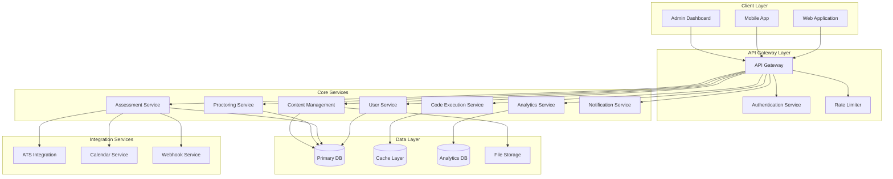
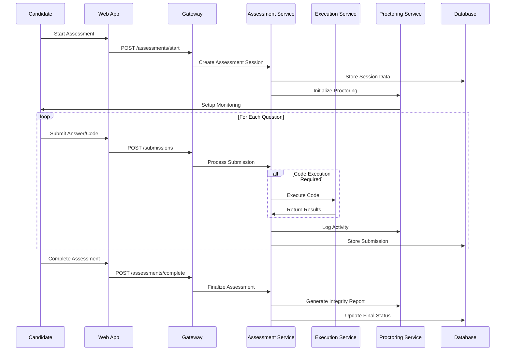
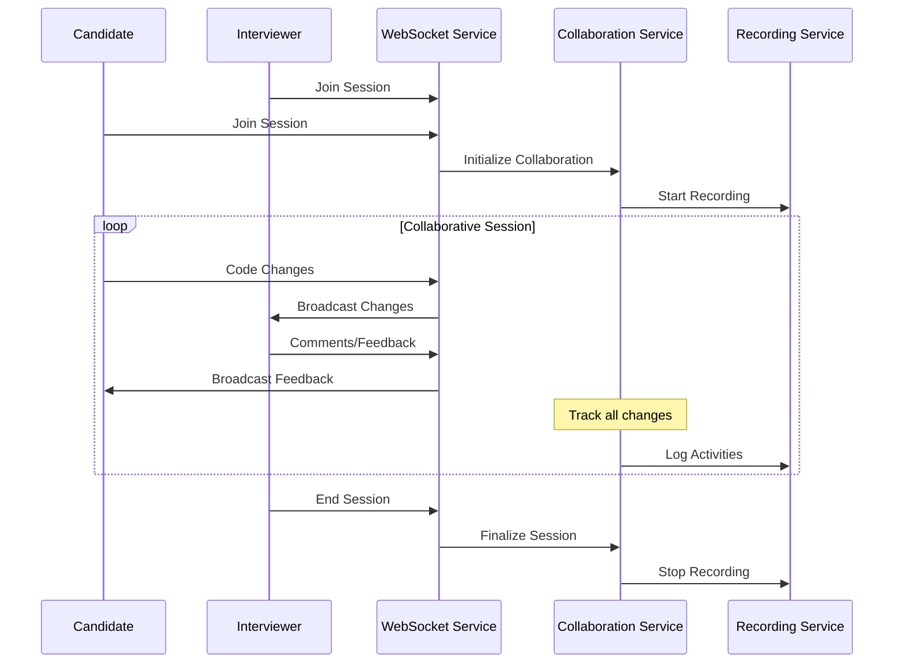
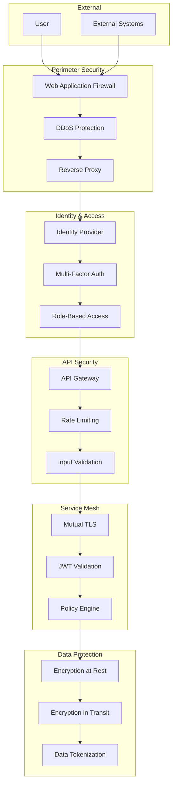
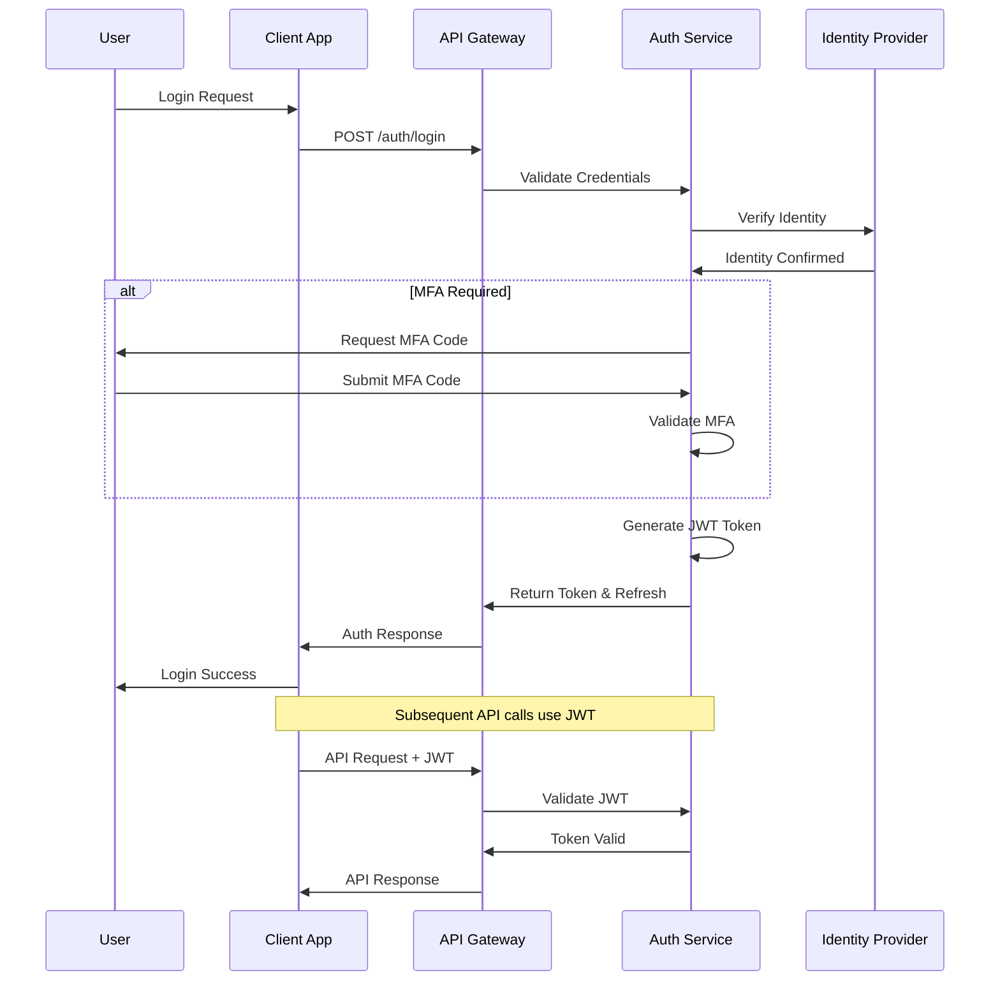
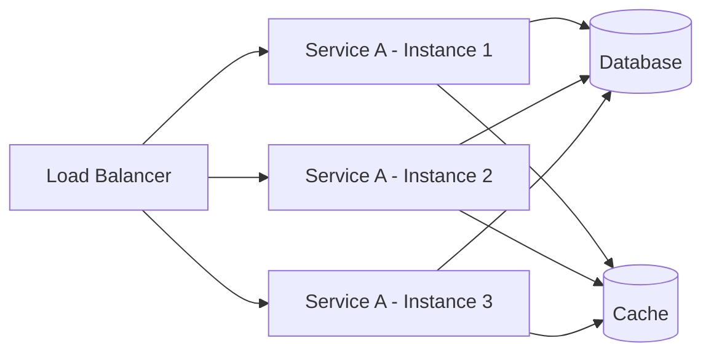
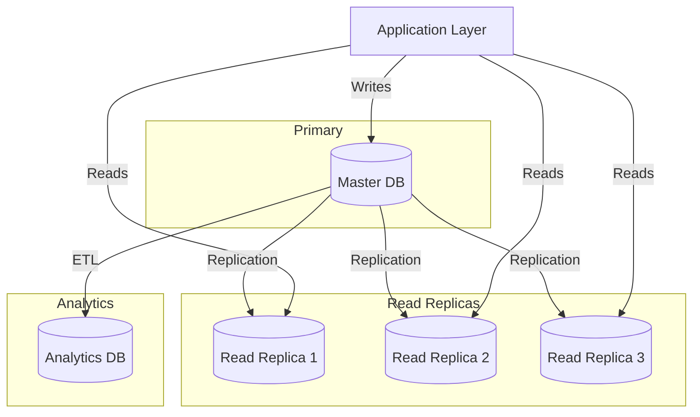
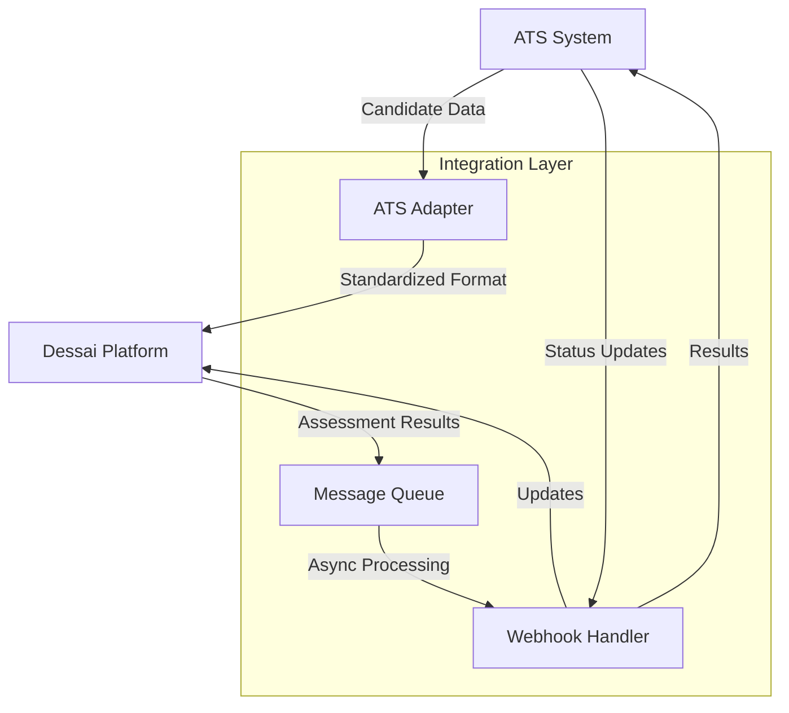
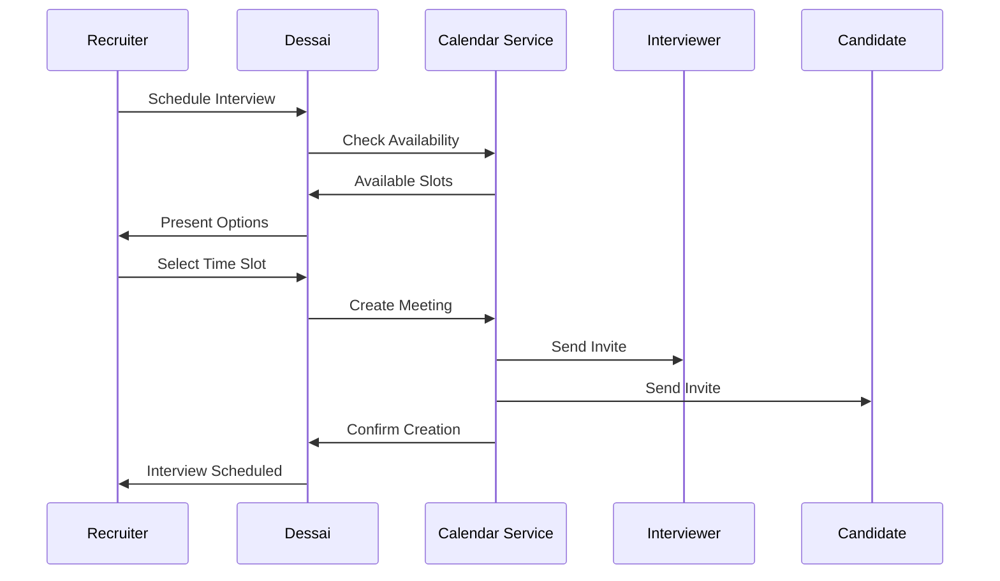

# Dessai System Architecture
version: "1.0.0"
last_updated: "2025-08-08"

Persona: Technical Architect

## Overview

Dessai is a comprehensive technical hiring platform designed with security, scalability, and accessibility as core principles. The platform supports multiple assessment formats, proctoring capabilities, and seamless integrations with existing HR systems.

## Table of Contents

1. [System Components](#system-components)
2. [Component Architecture](#component-architecture)
3. [Data Flow Architecture](#data-flow-architecture)
4. [API Architecture](#api-architecture)
5. [Security Architecture](#security-architecture)
6. [Deployment Architecture](#deployment-architecture)
7. [Scalability Considerations](#scalability-considerations)
8. [Integration Points](#integration-points)

## System Components

### Core Services



### Service Responsibilities

#### Client Layer
- **Web Application (Next.js)**: Primary candidate and interviewer interface (built with Next.js for SSR, routing, and performance)
- **Mobile App**: Mobile-optimized candidate experience
- **Admin Dashboard**: Administrative controls and analytics

#### API Gateway Layer
- **API Gateway**: Request routing, load balancing, protocol translation
- **Authentication Service**: OAuth2/JWT token management
- **Rate Limiter**: Request throttling and DDoS protection

#### Core Services
- **User Service**: User management, profiles, permissions
- **Assessment Service**: Test orchestration, flow management
- **Code Execution Service**: Sandboxed code execution and evaluation
- **Proctoring Service**: Integrity monitoring and behavioral analysis
- **Content Management**: Question library, authoring tools
- **Analytics Service**: Performance metrics and reporting
- **Notification Service**: Email, SMS, webhook notifications

#### Integration Services
- **ATS Integration**: Applicant tracking system connectivity
- **Calendar Service**: Interview scheduling and management
- **Webhook Service**: External system notifications

#### Data Layer
- **Primary DB**: Transactional data storage
- **Cache Layer**: High-speed data access
- **Analytics DB**: Time-series and analytical data
- **File Storage**: Media and document storage

## Component Architecture

### Microservices Design Principles

```
┌─────────────────────────────────────────────────────────────────┐
│                     Service Mesh Architecture                   │
├─────────────────────────────────────────────────────────────────┤
│  ┌───────────┐  ┌───────────┐  ┌───────────┐  ┌───────────┐     │
│  │  Service  │  │  Service  │  │  Service  │  │  Service  │     │
│  │     A     │  │     B     │  │     C     │  │     D     │     │
│  └───────────┘  └───────────┘  └───────────┘  └───────────┘     │
│       │              │              │              │            │
├───────┼──────────────┼──────────────┼──────────────┼────────────┤
│  ┌────▼────┐    ┌────▼────┐    ┌────▼────┐    ┌────▼────┐       │
│  │ Service │    │ Service │    │ Service │    │ Service │       │
│  │ Proxy   │    │ Proxy   │    │ Proxy   │    │ Proxy   │       │
│  └─────────┘    └─────────┘    └─────────┘    └─────────┘       │
├─────────────────────────────────────────────────────────────────┤
│                  Infrastructure Layer                           │
│  • Service Discovery  • Load Balancing  • Circuit Breakers     │
│  • Observability      • Security        • Configuration        │
└─────────────────────────────────────────────────────────────────┘
```

### Service Communication Patterns

#### Synchronous Communication
- **HTTP REST APIs**: Standard CRUD operations
- **GraphQL**: Complex data queries with field selection
- **gRPC**: High-performance internal service communication

#### Asynchronous Communication
- **Message Queues**: Task processing and job queues
- **Event Streaming**: Real-time updates and notifications
- **Webhooks**: External system integration

## Data Flow Architecture

### Assessment Flow



### Real-time Collaboration Flow



## API Architecture

### RESTful API Design

#### Base URL Structure
```
https://api.dessai.com/v1
```

#### Authentication
```http
Authorization: Bearer <JWT_TOKEN>
X-API-Key: <API_KEY>
```

#### Core Endpoints

##### User Management
```
GET    /users/{id}                 # Get user profile
PUT    /users/{id}                 # Update user profile
POST   /users                      # Create user
DELETE /users/{id}                 # Delete user
GET    /users/{id}/permissions     # Get user permissions
```

##### Assessment Management
```
GET    /assessments               # List assessments
POST   /assessments               # Create assessment
GET    /assessments/{id}          # Get assessment details
PUT    /assessments/{id}          # Update assessment
DELETE /assessments/{id}          # Delete assessment

POST   /assessments/{id}/start    # Start assessment session
GET    /assessments/{id}/status   # Get assessment status
POST   /assessments/{id}/submit   # Submit assessment
```

##### Question Library
```
GET    /questions                 # List questions
POST   /questions                 # Create question
GET    /questions/{id}            # Get question
PUT    /questions/{id}            # Update question
DELETE /questions/{id}            # Delete question

GET    /questions/search          # Search questions
POST   /questions/bulk            # Bulk operations
```

##### Code Execution
```
POST   /execute                   # Execute code
GET    /execute/{job_id}/status   # Check execution status
GET    /execute/{job_id}/result   # Get execution results
POST   /execute/validate          # Validate code syntax
```

##### Proctoring
```
POST   /proctoring/session        # Initialize proctoring
POST   /proctoring/events         # Log proctoring events
GET    /proctoring/{session_id}   # Get proctoring data
POST   /proctoring/integrity      # Submit integrity signals
```

#### API Response Format

##### Success Response
```json
{
  "status": "success",
  "data": {
    "id": "uuid",
    "type": "resource_type",
    "attributes": {},
    "relationships": {}
  },
  "meta": {
    "timestamp": "2025-08-08T10:00:00Z",
    "request_id": "req_uuid"
  }
}
```

##### Error Response
```json
{
  "status": "error",
  "errors": [
    {
      "code": "VALIDATION_ERROR",
      "title": "Validation Failed",
      "detail": "The field 'email' is required",
      "source": {
        "pointer": "/data/attributes/email"
      }
    }
  ],
  "meta": {
    "timestamp": "2025-08-08T10:00:00Z",
    "request_id": "req_uuid"
  }
}
```

#### GraphQL Schema

```graphql
type Query {
  user(id: ID!): User
  assessment(id: ID!): Assessment
  questions(filter: QuestionFilter, pagination: Pagination): QuestionConnection
  submissions(assessmentId: ID!): [Submission]
}

type Mutation {
  createAssessment(input: CreateAssessmentInput!): Assessment
  startAssessment(id: ID!): AssessmentSession
  submitAnswer(input: SubmitAnswerInput!): Submission
  executeCode(input: ExecuteCodeInput!): ExecutionResult
}

type Subscription {
  assessmentUpdates(sessionId: ID!): AssessmentUpdate
  collaborationEvents(sessionId: ID!): CollaborationEvent
  proctoringAlerts(sessionId: ID!): ProctoringAlert
}
```

## Security Architecture

### Zero Trust Security Model



### Authentication Flow



### Security Controls

#### Access Control Matrix
```
Role        | Users | Assessments | Questions | Analytics | System
------------|-------|-------------|-----------|-----------|--------
Candidate   |   R   |      R      |     R     |     -     |    -
Interviewer |   R   |     RU      |     R     |     R     |    -
Author      |   R   |     R       |    CRUD   |     R     |    -
Admin       |  CRUD |    CRUD     |    CRUD   |    CRUD   |   CRUD
Recruiter   |   R   |    CRUD     |     R     |     R     |    -

Legend: C=Create, R=Read, U=Update, D=Delete
```

#### Data Classification
```
Classification | Examples              | Encryption | Retention | Access
--------------|------------------------|------------|-----------|--------
Public        | Marketing materials    | Optional   | Unlimited | All
Internal      | System documentation   | Standard   | 7 years   | Employee
Confidential  | Assessment questions   | Strong     | 5 years   | Role-based
Restricted    | Candidate PII          | Strong+HSM | Legal req | Minimal
```

## Deployment Architecture

### Cloud-Agnostic Deployment Options

#### Option 1: Containerized Microservices
```yaml
# Example Kubernetes deployment structure
apiVersion: apps/v1
kind: Deployment
metadata:
  name: assessment-service
spec:
  replicas: 3
  selector:
    matchLabels:
      app: assessment-service
  template:
    metadata:
      labels:
        app: assessment-service
    spec:
      containers:
      - name: assessment-service
        image: dessai/assessment-service:latest
        ports:
        - containerPort: 8080
        env:
        - name: DATABASE_URL
          valueFrom:
            secretKeyRef:
              name: db-secret
              key: url
        resources:
          requests:
            memory: "256Mi"
            cpu: "250m"
          limits:
            memory: "512Mi"
            cpu: "500m"
```

#### Option 2: Serverless Architecture
```yaml
# Example serverless configuration
functions:
  assessmentHandler:
    handler: handlers/assessment.handler
    runtime: nodejs18
    timeout: 30
    memory: 512
    events:
      - http:
          path: /assessments/{id}
          method: get
    environment:
      DATABASE_URL: ${env:DATABASE_URL}
      
  codeExecutor:
    handler: handlers/executor.handler
    runtime: python39
    timeout: 60
    memory: 1024
    layers:
      - arn:aws:lambda:us-east-1:123456789:layer:code-runtime
```

#### Option 3: Hybrid Deployment
```
┌─────────────────────────────────────────────────┐
│                 Load Balancer                   │
├─────────────────────────────────────────────────┤
│  ┌─────────────┐  ┌─────────────┐  ┌──────────┐ │
│  │   Static    │  │  API Gateway │  │   CDN    │ │
│  │   Content   │  │  (Managed)   │  │(External)│ │
│  └─────────────┘  └─────────────┘  └──────────┘ │
├─────────────────────────────────────────────────┤
│           Container Orchestration               │
│  ┌─────────────┐  ┌─────────────┐  ┌──────────┐ │
│  │    Core     │  │ Execution   │  │Analytics │ │
│  │  Services   │  │  Service    │  │ Service  │ │
│  │(Kubernetes) │  │(Serverless) │  │(Managed) │ │
│  └─────────────┘  └─────────────┘  └──────────┘ │
├─────────────────────────────────────────────────┤
│               Data Layer                        │
│  ┌─────────────┐  ┌─────────────┐  ┌──────────┐ │
│  │  Primary    │  │    Cache    │  │  Object  │ │
│  │ Database    │  │   (Redis)   │  │ Storage  │ │
│  │(Managed)    │  │  (Managed)  │  │(Managed) │ │
│  └─────────────┘  └─────────────┘  └──────────┘ │
└─────────────────────────────────────────────────┘
```

### Environment Configuration

#### Development Environment
```yaml
# docker-compose.dev.yml
version: '3.8'
services:
  api-gateway:
    build: ./services/gateway
    ports:
      - "8080:8080"
    environment:
      - NODE_ENV=development
      - LOG_LEVEL=debug
    depends_on:
      - database
      - redis
      
  database:
    image: postgres:15
    ports:
      - "5432:5432"
    environment:
      - POSTGRES_DB=dessai_dev
      - POSTGRES_USER=dev
      - POSTGRES_PASSWORD=devpass
    volumes:
      - pgdata:/var/lib/postgresql/data
      
  redis:
    image: redis:7-alpine
    ports:
      - "6379:6379"
      
volumes:
  pgdata:
```

#### Production Environment
```yaml
# Production deployment configuration
apiVersion: v1
kind: ConfigMap
metadata:
  name: dessai-config
data:
  database_pool_size: "20"
  cache_ttl: "3600"
  rate_limit_rpm: "1000"
  
---
apiVersion: apps/v1
kind: Deployment
metadata:
  name: dessai-api
spec:
  replicas: 5
  strategy:
    type: RollingUpdate
    rollingUpdate:
      maxSurge: 1
      maxUnavailable: 0
  template:
    spec:
      containers:
      - name: api
        image: dessai/api:v1.0.0
        readinessProbe:
          httpGet:
            path: /health
            port: 8080
          initialDelaySeconds: 10
          periodSeconds: 5
        livenessProbe:
          httpGet:
            path: /health
            port: 8080
          initialDelaySeconds: 30
          periodSeconds: 10
```

## Scalability Considerations

### Horizontal Scaling Patterns

#### Service-Level Scaling


#### Database Scaling


### Performance Targets

#### Response Time SLAs
```
Operation Type          | p50    | p95    | p99    | Timeout
------------------------|--------|--------|--------|---------
Authentication          | 100ms  | 250ms  | 500ms  | 2s
Question Loading        | 200ms  | 500ms  | 1s     | 5s
Code Execution (Sample) | 500ms  | 1.5s   | 2s     | 10s
Code Execution (Full)   | 2s     | 8s     | 15s    | 30s
Report Generation       | 1s     | 3s     | 5s     | 30s
```

#### Throughput Requirements
```
Component              | Baseline TPS | Peak TPS | Scaling Trigger
-----------------------|--------------|----------|----------------
API Gateway            | 1,000        | 10,000   | CPU > 70%
Assessment Service     | 500          | 5,000    | Queue Length > 100
Code Execution         | 100          | 1,000    | Queue Depth > 50
Database (Reads)       | 2,000        | 20,000   | Connection > 80%
Database (Writes)      | 200          | 2,000    | Replication Lag > 1s
```

## Integration Points

### External System Integration

#### ATS Integration Architecture


#### Calendar Integration


### Data Synchronization Patterns

#### Event-Driven Synchronization
```json
{
  "event_type": "candidate.assessment.completed",
  "event_id": "evt_12345",
  "timestamp": "2025-08-08T10:00:00Z",
  "source": "dessai.assessment-service",
  "data": {
    "candidate_id": "cand_67890",
    "assessment_id": "assess_54321",
    "status": "completed",
    "score": 85.5,
    "duration": 3600,
    "integrity_flags": []
  },
  "metadata": {
    "correlation_id": "corr_99999",
    "retry_count": 0,
    "max_retries": 3
  }
}
```

#### Webhook Delivery Guarantees
```
┌─────────────┐    ┌──────────────┐    ┌─────────────┐
│   Source    │───▶│    Queue     │───▶│ Destination │
│   Service   │    │   Manager    │    │   System    │
└─────────────┘    └──────────────┘    └─────────────┘
                           │
                           ▼
                   ┌──────────────┐
                   │  Retry Logic │
                   │ • Exp Backoff│
                   │ • Dead Letter│
                   │ • Idempotency│
                   └──────────────┘
```

This system architecture provides a comprehensive foundation for implementing the Dessai platform with proper separation of concerns, scalability, security, and maintainability built-in from the ground up.

**Validation Checklist:**
- [x] Persona identified
- [x] Documentation checked/updated  
- [x] Commit message included (if changes made)
- [x] Project conventions followed
