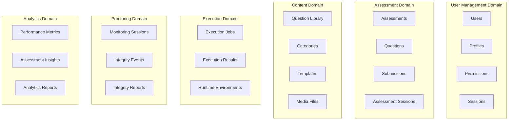
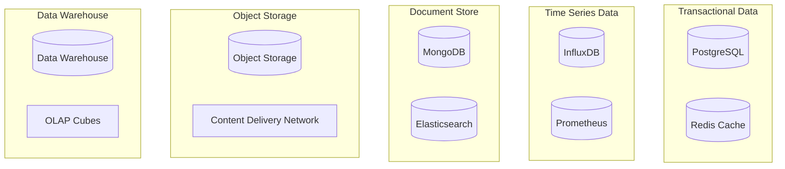
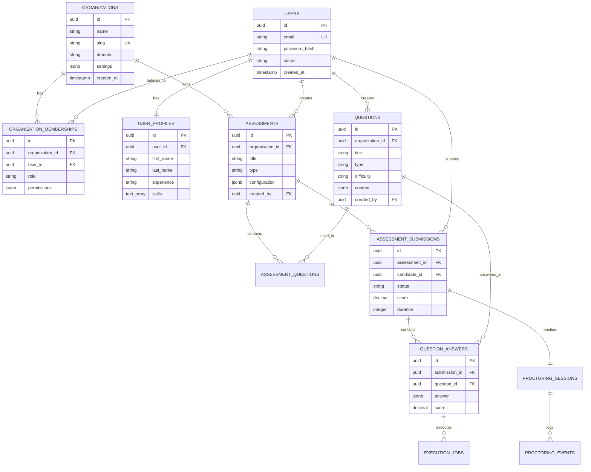

# Dessai Data Models & Schemas
version: "1.0.0"
last_updated: "2025-08-08"

## Overview

This document defines the comprehensive data models, database schemas, and data relationships for the Dessai technical hiring platform. The data architecture follows Domain-Driven Design principles with clear boundaries between business domains.

## Table of Contents

1. [Data Architecture Overview](#data-architecture-overview)
2. [Domain Models](#domain-models)
3. [Database Schemas](#database-schemas)
4. [API Data Transfer Objects](#api-data-transfer-objects)
5. [Data Relationships](#data-relationships)
6. [Data Access Patterns](#data-access-patterns)
7. [Data Governance](#data-governance)
8. [Migration Strategies](#migration-strategies)

## Data Architecture Overview

### Domain Boundaries



### Data Storage Strategy



## Domain Models

### User Management Domain

#### User Model
```typescript
interface User {
  id: UUID;
  email: string;
  username?: string;
  passwordHash: string;
  emailVerified: boolean;
  emailVerificationToken?: string;
  passwordResetToken?: string;
  passwordResetExpiry?: Date;
  lastLoginAt?: Date;
  status: UserStatus;
  createdAt: Date;
  updatedAt: Date;
  deletedAt?: Date;
  
  // Relationships
  profile?: UserProfile;
  permissions: Permission[];
  sessions: UserSession[];
  organizationMemberships: OrganizationMembership[];
}

enum UserStatus {
  ACTIVE = 'active',
  INACTIVE = 'inactive',
  SUSPENDED = 'suspended',
  PENDING_VERIFICATION = 'pending_verification'
}

interface UserProfile {
  id: UUID;
  userId: UUID;
  firstName: string;
  lastName: string;
  displayName?: string;
  bio?: string;
  avatarUrl?: string;
  timeZone: string;
  locale: string;
  phone?: string;
  linkedinUrl?: string;
  githubUrl?: string;
  websiteUrl?: string;
  skills: string[];
  experience: ExperienceLevel;
  preferredLanguages: string[];
  createdAt: Date;
  updatedAt: Date;
}

enum ExperienceLevel {
  ENTRY = 'entry',
  JUNIOR = 'junior',
  MID = 'mid',
  SENIOR = 'senior',
  PRINCIPAL = 'principal',
  ARCHITECT = 'architect'
}
```

#### Organization & Permissions Model
```typescript
interface Organization {
  id: UUID;
  name: string;
  slug: string;
  domain?: string;
  logo?: string;
  description?: string;
  settings: OrganizationSettings;
  subscription: SubscriptionInfo;
  status: OrganizationStatus;
  createdAt: Date;
  updatedAt: Date;
  
  // Relationships
  memberships: OrganizationMembership[];
  assessments: Assessment[];
}

interface OrganizationMembership {
  id: UUID;
  organizationId: UUID;
  userId: UUID;
  role: OrganizationRole;
  permissions: Permission[];
  invitedBy?: UUID;
  invitedAt?: Date;
  joinedAt: Date;
  status: MembershipStatus;
}

enum OrganizationRole {
  OWNER = 'owner',
  ADMIN = 'admin',
  INTERVIEWER = 'interviewer',
  AUTHOR = 'author',
  VIEWER = 'viewer'
}

interface Permission {
  id: UUID;
  resource: string;
  action: string;
  conditions?: Record<string, any>;
}
```

### Assessment Domain

#### Assessment Model
```typescript
interface Assessment {
  id: UUID;
  organizationId: UUID;
  title: string;
  description?: string;
  type: AssessmentType;
  status: AssessmentStatus;
  configuration: AssessmentConfiguration;
  questions: AssessmentQuestion[];
  invitations: AssessmentInvitation[];
  submissions: AssessmentSubmission[];
  createdBy: UUID;
  createdAt: Date;
  updatedAt: Date;
  publishedAt?: Date;
  archivedAt?: Date;
}

enum AssessmentType {
  CODING_CHALLENGE = 'coding_challenge',
  TECHNICAL_INTERVIEW = 'technical_interview',
  SYSTEM_DESIGN = 'system_design',
  TAKE_HOME = 'take_home',
  LIVE_CODING = 'live_coding'
}

interface AssessmentConfiguration {
  duration?: number; // in minutes
  allowedAttempts: number;
  randomizeQuestions: boolean;
  showResults: boolean;
  proctoringEnabled: boolean;
  proctoringSettings?: ProctoringSettings;
  codeExecutionEnabled: boolean;
  collaborationEnabled: boolean;
  recordingEnabled: boolean;
  browserLockdown: boolean;
  allowedLanguages: string[];
  difficultyLevel: DifficultyLevel;
  passingScore?: number;
  instructions?: string;
  startDate?: Date;
  endDate?: Date;
}

enum DifficultyLevel {
  BEGINNER = 'beginner',
  INTERMEDIATE = 'intermediate',
  ADVANCED = 'advanced',
  EXPERT = 'expert'
}
```

#### Question Model
```typescript
interface Question {
  id: UUID;
  organizationId?: UUID;
  title: string;
  description: string;
  type: QuestionType;
  difficulty: DifficultyLevel;
  estimatedTime: number; // in minutes
  tags: string[];
  categories: UUID[];
  language?: string;
  content: QuestionContent;
  validation: QuestionValidation;
  metadata: QuestionMetadata;
  status: QuestionStatus;
  createdBy: UUID;
  reviewedBy?: UUID;
  createdAt: Date;
  updatedAt: Date;
  publishedAt?: Date;
}

enum QuestionType {
  MULTIPLE_CHOICE = 'multiple_choice',
  CODING = 'coding',
  SYSTEM_DESIGN = 'system_design',
  ESSAY = 'essay',
  SQL = 'sql',
  DEBUGGING = 'debugging',
  CODE_REVIEW = 'code_review',
  ARCHITECTURE = 'architecture'
}

interface QuestionContent {
  // For coding questions
  starterCode?: Record<string, string>; // language -> code
  sampleInput?: string;
  sampleOutput?: string;
  constraints?: string[];
  
  // For multiple choice
  options?: QuestionOption[];
  
  // For system design
  requirements?: string[];
  resources?: MediaFile[];
  
  // For essay
  wordLimit?: number;
  guidelines?: string[];
}

interface QuestionValidation {
  // For coding questions
  testCases?: TestCase[];
  timeLimit?: number; // in seconds
  memoryLimit?: number; // in MB
  
  // For multiple choice
  correctAnswers?: string[];
  
  // For essay/design
  rubric?: EvaluationRubric;
}

interface TestCase {
  id: string;
  input: string;
  expectedOutput: string;
  isHidden: boolean;
  weight: number;
  explanation?: string;
}
```

#### Submission Model
```typescript
interface AssessmentSubmission {
  id: UUID;
  assessmentId: UUID;
  candidateId: UUID;
  sessionId: UUID;
  status: SubmissionStatus;
  startedAt: Date;
  submittedAt?: Date;
  completedAt?: Date;
  duration: number; // in seconds
  score?: number;
  maxScore: number;
  percentage?: number;
  answers: QuestionAnswer[];
  integrity: IntegrityReport;
  metadata: SubmissionMetadata;
  feedback?: AssessmentFeedback;
}

interface QuestionAnswer {
  questionId: UUID;
  answer: AnswerContent;
  executionResults?: ExecutionResult[];
  timeSpent: number; // in seconds
  attempts: number;
  score?: number;
  maxScore: number;
  feedback?: string;
  submittedAt: Date;
}

interface AnswerContent {
  // For coding questions
  code?: Record<string, string>; // language -> code
  
  // For multiple choice
  selectedOptions?: string[];
  
  // For essay/design
  text?: string;
  
  // For file uploads
  files?: MediaFile[];
  
  // For collaborative sessions
  collaborationHistory?: CollaborationEvent[];
}

interface ExecutionResult {
  id: UUID;
  language: string;
  code: string;
  input?: string;
  output?: string;
  error?: string;
  exitCode: number;
  executionTime: number; // in milliseconds
  memoryUsed: number; // in bytes
  testResults?: TestCaseResult[];
  createdAt: Date;
}

interface TestCaseResult {
  testCaseId: string;
  passed: boolean;
  actualOutput: string;
  executionTime: number;
  error?: string;
}
```

### Content Domain

#### Question Library Model
```typescript
interface QuestionLibrary {
  id: UUID;
  organizationId?: UUID; // null for public library
  name: string;
  description?: string;
  visibility: LibraryVisibility;
  categories: QuestionCategory[];
  tags: string[];
  questionsCount: number;
  contributors: UUID[];
  createdBy: UUID;
  createdAt: Date;
  updatedAt: Date;
}

interface QuestionCategory {
  id: UUID;
  libraryId: UUID;
  name: string;
  description?: string;
  parentCategoryId?: UUID;
  color?: string;
  icon?: string;
  orderIndex: number;
  questionsCount: number;
  
  // Relationships
  parentCategory?: QuestionCategory;
  subCategories: QuestionCategory[];
  questions: Question[];
}

interface QuestionTemplate {
  id: UUID;
  name: string;
  description?: string;
  type: QuestionType;
  template: QuestionContent;
  variables: TemplateVariable[];
  createdBy: UUID;
  createdAt: Date;
  updatedAt: Date;
}

interface TemplateVariable {
  name: string;
  type: string;
  description?: string;
  required: boolean;
  defaultValue?: any;
  constraints?: Record<string, any>;
}
```

### Proctoring Domain

#### Proctoring Models
```typescript
interface ProctoringSession {
  id: UUID;
  assessmentSubmissionId: UUID;
  candidateId: UUID;
  status: ProctoringStatus;
  settings: ProctoringSettings;
  startedAt: Date;
  endedAt?: Date;
  events: ProctoringEvent[];
  integrityReport: IntegrityReport;
  recordings: ProctoringRecording[];
  flags: IntegrityFlag[];
}

interface ProctoringSettings {
  webcamRequired: boolean;
  microphoneRequired: boolean;
  screenRecording: boolean;
  tabSwitchDetection: boolean;
  copyPasteDetection: boolean;
  multiplePersonDetection: boolean;
  environmentCheck: boolean;
  browserLockdown: boolean;
  allowedApplications: string[];
  keywordMonitoring: boolean;
  keywords: string[];
  alertThresholds: AlertThreshold[];
}

interface ProctoringEvent {
  id: UUID;
  sessionId: UUID;
  type: EventType;
  severity: EventSeverity;
  description: string;
  timestamp: Date;
  metadata: Record<string, any>;
  confidence: number; // 0-1
  requiresReview: boolean;
  reviewedBy?: UUID;
  reviewedAt?: Date;
  reviewNotes?: string;
}

enum EventType {
  // Environment Events
  MULTIPLE_PERSONS_DETECTED = 'multiple_persons_detected',
  PERSON_LEFT_FRAME = 'person_left_frame',
  NO_PERSON_DETECTED = 'no_person_detected',
  UNAUTHORIZED_DEVICE = 'unauthorized_device',
  
  // Browser Events
  TAB_SWITCH = 'tab_switch',
  WINDOW_SWITCH = 'window_switch',
  FULLSCREEN_EXIT = 'fullscreen_exit',
  BROWSER_RESIZE = 'browser_resize',
  
  // Input Events
  COPY_PASTE_DETECTED = 'copy_paste_detected',
  EXTERNAL_INPUT = 'external_input',
  SUSPICIOUS_TYPING = 'suspicious_typing',
  
  // Audio Events
  VOICE_DETECTED = 'voice_detected',
  BACKGROUND_NOISE = 'background_noise',
  MICROPHONE_DISCONNECTED = 'microphone_disconnected',
  
  // Network Events
  CONNECTIVITY_ISSUE = 'connectivity_issue',
  VPN_DETECTED = 'vpn_detected',
  PROXY_DETECTED = 'proxy_detected'
}

interface IntegrityReport {
  sessionId: UUID;
  overallScore: number; // 0-100
  riskLevel: RiskLevel;
  summary: string;
  categories: IntegrityCategory[];
  flags: IntegrityFlag[];
  recommendations: string[];
  generatedAt: Date;
}

enum RiskLevel {
  LOW = 'low',
  MEDIUM = 'medium',
  HIGH = 'high',
  CRITICAL = 'critical'
}

interface IntegrityFlag {
  type: EventType;
  severity: EventSeverity;
  description: string;
  count: number;
  firstOccurred: Date;
  lastOccurred: Date;
  impact: number; // 0-10
  evidence: string[];
}
```

### Analytics Domain

#### Analytics Models
```typescript
interface AssessmentAnalytics {
  id: UUID;
  assessmentId: UUID;
  organizationId: UUID;
  periodStart: Date;
  periodEnd: Date;
  metrics: AssessmentMetrics;
  trends: TrendAnalysis[];
  insights: AnalyticsInsight[];
  generatedAt: Date;
  updatedAt: Date;
}

interface AssessmentMetrics {
  totalSubmissions: number;
  completedSubmissions: number;
  averageScore: number;
  averageDuration: number;
  passRate: number;
  dropoffRate: number;
  integrityViolations: number;
  questionMetrics: QuestionMetrics[];
  difficultyDistribution: Record<DifficultyLevel, number>;
  languageUsage: Record<string, number>;
}

interface QuestionMetrics {
  questionId: UUID;
  averageScore: number;
  attemptCount: number;
  averageTimeSpent: number;
  successRate: number;
  commonMistakes: string[];
  difficultyRating: number;
}

interface CandidatePerformance {
  candidateId: UUID;
  assessmentId: UUID;
  overallScore: number;
  questionScores: QuestionScore[];
  timeDistribution: TimeSpentDistribution;
  codeQualityMetrics: CodeQualityMetrics;
  behavioralMetrics: BehavioralMetrics;
  comparisonMetrics: ComparisonMetrics;
}

interface CodeQualityMetrics {
  complexity: number;
  maintainability: number;
  testCoverage: number;
  codeSmells: string[];
  bestPractices: number;
  performance: number;
}

interface BehavioralMetrics {
  focusScore: number;
  consistencyScore: number;
  problemSolvingApproach: string;
  debuggingEfficiency: number;
  collaborationRating?: number;
}
```

## Database Schemas

### PostgreSQL Schema

#### Core Tables
```sql
-- Organizations
CREATE TABLE organizations (
    id UUID PRIMARY KEY DEFAULT gen_random_uuid(),
    name VARCHAR(255) NOT NULL,
    slug VARCHAR(100) UNIQUE NOT NULL,
    domain VARCHAR(255),
    logo TEXT,
    description TEXT,
    settings JSONB DEFAULT '{}',
    subscription JSONB DEFAULT '{}',
    status VARCHAR(50) DEFAULT 'active',
    created_at TIMESTAMP WITH TIME ZONE DEFAULT NOW(),
    updated_at TIMESTAMP WITH TIME ZONE DEFAULT NOW(),
    
    CONSTRAINT valid_status CHECK (status IN ('active', 'inactive', 'suspended')),
    CONSTRAINT valid_slug CHECK (slug ~ '^[a-z0-9-]+$')
);

-- Users
CREATE TABLE users (
    id UUID PRIMARY KEY DEFAULT gen_random_uuid(),
    email VARCHAR(320) UNIQUE NOT NULL,
    username VARCHAR(50) UNIQUE,
    password_hash VARCHAR(255) NOT NULL,
    email_verified BOOLEAN DEFAULT FALSE,
    email_verification_token VARCHAR(255),
    password_reset_token VARCHAR(255),
    password_reset_expiry TIMESTAMP WITH TIME ZONE,
    last_login_at TIMESTAMP WITH TIME ZONE,
    status VARCHAR(50) DEFAULT 'pending_verification',
    created_at TIMESTAMP WITH TIME ZONE DEFAULT NOW(),
    updated_at TIMESTAMP WITH TIME ZONE DEFAULT NOW(),
    deleted_at TIMESTAMP WITH TIME ZONE,
    
    CONSTRAINT valid_email CHECK (email ~* '^[A-Za-z0-9._%-]+@[A-Za-z0-9.-]+[.][A-Za-z]+$'),
    CONSTRAINT valid_status CHECK (status IN ('active', 'inactive', 'suspended', 'pending_verification')),
    CONSTRAINT valid_username CHECK (username ~ '^[a-zA-Z0-9_-]+$')
);

-- User Profiles
CREATE TABLE user_profiles (
    id UUID PRIMARY KEY DEFAULT gen_random_uuid(),
    user_id UUID NOT NULL REFERENCES users(id) ON DELETE CASCADE,
    first_name VARCHAR(100) NOT NULL,
    last_name VARCHAR(100) NOT NULL,
    display_name VARCHAR(200),
    bio TEXT,
    avatar_url TEXT,
    time_zone VARCHAR(50) DEFAULT 'UTC',
    locale VARCHAR(10) DEFAULT 'en',
    phone VARCHAR(20),
    linkedin_url TEXT,
    github_url TEXT,
    website_url TEXT,
    skills TEXT[], -- Array of skill names
    experience VARCHAR(20) DEFAULT 'junior',
    preferred_languages TEXT[], -- Array of programming languages
    created_at TIMESTAMP WITH TIME ZONE DEFAULT NOW(),
    updated_at TIMESTAMP WITH TIME ZONE DEFAULT NOW(),
    
    UNIQUE(user_id),
    CONSTRAINT valid_experience CHECK (experience IN ('entry', 'junior', 'mid', 'senior', 'principal', 'architect'))
);

-- Organization Memberships
CREATE TABLE organization_memberships (
    id UUID PRIMARY KEY DEFAULT gen_random_uuid(),
    organization_id UUID NOT NULL REFERENCES organizations(id) ON DELETE CASCADE,
    user_id UUID NOT NULL REFERENCES users(id) ON DELETE CASCADE,
    role VARCHAR(50) NOT NULL DEFAULT 'viewer',
    permissions JSONB DEFAULT '[]',
    invited_by UUID REFERENCES users(id),
    invited_at TIMESTAMP WITH TIME ZONE,
    joined_at TIMESTAMP WITH TIME ZONE DEFAULT NOW(),
    status VARCHAR(50) DEFAULT 'active',
    
    UNIQUE(organization_id, user_id),
    CONSTRAINT valid_role CHECK (role IN ('owner', 'admin', 'interviewer', 'author', 'viewer')),
    CONSTRAINT valid_status CHECK (status IN ('active', 'inactive', 'invited', 'expired'))
);

-- Assessments
CREATE TABLE assessments (
    id UUID PRIMARY KEY DEFAULT gen_random_uuid(),
    organization_id UUID NOT NULL REFERENCES organizations(id) ON DELETE CASCADE,
    title VARCHAR(500) NOT NULL,
    description TEXT,
    type VARCHAR(50) NOT NULL,
    status VARCHAR(50) DEFAULT 'draft',
    configuration JSONB DEFAULT '{}',
    created_by UUID NOT NULL REFERENCES users(id),
    created_at TIMESTAMP WITH TIME ZONE DEFAULT NOW(),
    updated_at TIMESTAMP WITH TIME ZONE DEFAULT NOW(),
    published_at TIMESTAMP WITH TIME ZONE,
    archived_at TIMESTAMP WITH TIME ZONE,
    
    CONSTRAINT valid_type CHECK (type IN ('coding_challenge', 'technical_interview', 'system_design', 'take_home', 'live_coding')),
    CONSTRAINT valid_status CHECK (status IN ('draft', 'published', 'archived'))
);

-- Questions
CREATE TABLE questions (
    id UUID PRIMARY KEY DEFAULT gen_random_uuid(),
    organization_id UUID REFERENCES organizations(id) ON DELETE CASCADE,
    title VARCHAR(500) NOT NULL,
    description TEXT NOT NULL,
    type VARCHAR(50) NOT NULL,
    difficulty VARCHAR(20) NOT NULL DEFAULT 'intermediate',
    estimated_time INTEGER DEFAULT 30, -- minutes
    tags TEXT[],
    language VARCHAR(50),
    content JSONB DEFAULT '{}',
    validation JSONB DEFAULT '{}',
    metadata JSONB DEFAULT '{}',
    status VARCHAR(50) DEFAULT 'draft',
    created_by UUID NOT NULL REFERENCES users(id),
    reviewed_by UUID REFERENCES users(id),
    created_at TIMESTAMP WITH TIME ZONE DEFAULT NOW(),
    updated_at TIMESTAMP WITH TIME ZONE DEFAULT NOW(),
    published_at TIMESTAMP WITH TIME ZONE,
    
    CONSTRAINT valid_type CHECK (type IN ('multiple_choice', 'coding', 'system_design', 'essay', 'sql', 'debugging', 'code_review', 'architecture')),
    CONSTRAINT valid_difficulty CHECK (difficulty IN ('beginner', 'intermediate', 'advanced', 'expert')),
    CONSTRAINT valid_status CHECK (status IN ('draft', 'review', 'published', 'archived'))
);

-- Assessment Questions (Junction Table)
CREATE TABLE assessment_questions (
    id UUID PRIMARY KEY DEFAULT gen_random_uuid(),
    assessment_id UUID NOT NULL REFERENCES assessments(id) ON DELETE CASCADE,
    question_id UUID NOT NULL REFERENCES questions(id) ON DELETE CASCADE,
    order_index INTEGER NOT NULL DEFAULT 0,
    points INTEGER DEFAULT 10,
    required BOOLEAN DEFAULT TRUE,
    configuration JSONB DEFAULT '{}',
    
    UNIQUE(assessment_id, question_id),
    UNIQUE(assessment_id, order_index)
);

-- Assessment Submissions
CREATE TABLE assessment_submissions (
    id UUID PRIMARY KEY DEFAULT gen_random_uuid(),
    assessment_id UUID NOT NULL REFERENCES assessments(id) ON DELETE CASCADE,
    candidate_id UUID NOT NULL REFERENCES users(id) ON DELETE CASCADE,
    session_id UUID UNIQUE,
    status VARCHAR(50) DEFAULT 'started',
    started_at TIMESTAMP WITH TIME ZONE DEFAULT NOW(),
    submitted_at TIMESTAMP WITH TIME ZONE,
    completed_at TIMESTAMP WITH TIME ZONE,
    duration INTEGER DEFAULT 0, -- seconds
    score DECIMAL(5,2),
    max_score DECIMAL(5,2) NOT NULL DEFAULT 100,
    percentage DECIMAL(5,2),
    metadata JSONB DEFAULT '{}',
    
    CONSTRAINT valid_status CHECK (status IN ('started', 'in_progress', 'submitted', 'completed', 'expired', 'cancelled')),
    CONSTRAINT valid_score CHECK (score >= 0 AND score <= max_score),
    CONSTRAINT valid_percentage CHECK (percentage >= 0 AND percentage <= 100)
);

-- Question Answers
CREATE TABLE question_answers (
    id UUID PRIMARY KEY DEFAULT gen_random_uuid(),
    submission_id UUID NOT NULL REFERENCES assessment_submissions(id) ON DELETE CASCADE,
    question_id UUID NOT NULL REFERENCES questions(id) ON DELETE CASCADE,
    answer JSONB DEFAULT '{}',
    time_spent INTEGER DEFAULT 0, -- seconds
    attempts INTEGER DEFAULT 0,
    score DECIMAL(5,2),
    max_score DECIMAL(5,2) NOT NULL DEFAULT 10,
    feedback TEXT,
    submitted_at TIMESTAMP WITH TIME ZONE DEFAULT NOW(),
    
    UNIQUE(submission_id, question_id),
    CONSTRAINT valid_score CHECK (score >= 0 AND score <= max_score)
);
```

#### Proctoring Tables
```sql
-- Proctoring Sessions
CREATE TABLE proctoring_sessions (
    id UUID PRIMARY KEY DEFAULT gen_random_uuid(),
    submission_id UUID NOT NULL REFERENCES assessment_submissions(id) ON DELETE CASCADE,
    candidate_id UUID NOT NULL REFERENCES users(id) ON DELETE CASCADE,
    status VARCHAR(50) DEFAULT 'initializing',
    settings JSONB DEFAULT '{}',
    started_at TIMESTAMP WITH TIME ZONE DEFAULT NOW(),
    ended_at TIMESTAMP WITH TIME ZONE,
    
    UNIQUE(submission_id),
    CONSTRAINT valid_status CHECK (status IN ('initializing', 'active', 'paused', 'completed', 'terminated'))
);

-- Proctoring Events
CREATE TABLE proctoring_events (
    id UUID PRIMARY KEY DEFAULT gen_random_uuid(),
    session_id UUID NOT NULL REFERENCES proctoring_sessions(id) ON DELETE CASCADE,
    type VARCHAR(100) NOT NULL,
    severity VARCHAR(20) DEFAULT 'low',
    description TEXT NOT NULL,
    timestamp TIMESTAMP WITH TIME ZONE DEFAULT NOW(),
    metadata JSONB DEFAULT '{}',
    confidence DECIMAL(3,2) DEFAULT 1.00,
    requires_review BOOLEAN DEFAULT FALSE,
    reviewed_by UUID REFERENCES users(id),
    reviewed_at TIMESTAMP WITH TIME ZONE,
    review_notes TEXT,
    
    CONSTRAINT valid_severity CHECK (severity IN ('low', 'medium', 'high', 'critical')),
    CONSTRAINT valid_confidence CHECK (confidence >= 0 AND confidence <= 1)
);

-- Code Execution Jobs
CREATE TABLE execution_jobs (
    id UUID PRIMARY KEY DEFAULT gen_random_uuid(),
    answer_id UUID NOT NULL REFERENCES question_answers(id) ON DELETE CASCADE,
    language VARCHAR(50) NOT NULL,
    code TEXT NOT NULL,
    input TEXT,
    output TEXT,
    error TEXT,
    exit_code INTEGER,
    execution_time INTEGER, -- milliseconds
    memory_used BIGINT, -- bytes
    status VARCHAR(50) DEFAULT 'queued',
    created_at TIMESTAMP WITH TIME ZONE DEFAULT NOW(),
    started_at TIMESTAMP WITH TIME ZONE,
    completed_at TIMESTAMP WITH TIME ZONE,
    
    CONSTRAINT valid_status CHECK (status IN ('queued', 'running', 'completed', 'failed', 'timeout', 'cancelled'))
);
```

#### Indexes for Performance
```sql
-- User and authentication indexes
CREATE INDEX idx_users_email ON users(email);
CREATE INDEX idx_users_status ON users(status) WHERE status != 'active';
CREATE INDEX idx_user_profiles_user_id ON user_profiles(user_id);

-- Organization and membership indexes
CREATE INDEX idx_organization_memberships_org_user ON organization_memberships(organization_id, user_id);
CREATE INDEX idx_organization_memberships_user ON organization_memberships(user_id);

-- Assessment indexes
CREATE INDEX idx_assessments_organization ON assessments(organization_id);
CREATE INDEX idx_assessments_status ON assessments(status);
CREATE INDEX idx_assessments_created_by ON assessments(created_by);

-- Question indexes
CREATE INDEX idx_questions_organization ON questions(organization_id);
CREATE INDEX idx_questions_type ON questions(type);
CREATE INDEX idx_questions_difficulty ON questions(difficulty);
CREATE INDEX idx_questions_tags ON questions USING GIN(tags);
CREATE INDEX idx_questions_status ON questions(status);

-- Submission indexes
CREATE INDEX idx_submissions_assessment ON assessment_submissions(assessment_id);
CREATE INDEX idx_submissions_candidate ON assessment_submissions(candidate_id);
CREATE INDEX idx_submissions_status ON assessment_submissions(status);
CREATE INDEX idx_submissions_created_at ON assessment_submissions(started_at);

-- Answer indexes
CREATE INDEX idx_answers_submission ON question_answers(submission_id);
CREATE INDEX idx_answers_question ON question_answers(question_id);

-- Proctoring indexes
CREATE INDEX idx_proctoring_sessions_submission ON proctoring_sessions(submission_id);
CREATE INDEX idx_proctoring_events_session ON proctoring_events(session_id);
CREATE INDEX idx_proctoring_events_timestamp ON proctoring_events(timestamp);
CREATE INDEX idx_proctoring_events_type ON proctoring_events(type);

-- Execution indexes
CREATE INDEX idx_execution_jobs_answer ON execution_jobs(answer_id);
CREATE INDEX idx_execution_jobs_status ON execution_jobs(status);
CREATE INDEX idx_execution_jobs_created_at ON execution_jobs(created_at);
```

## API Data Transfer Objects

### Request/Response DTOs

#### Authentication DTOs
```typescript
// Request DTOs
interface LoginRequest {
  email: string;
  password: string;
  rememberMe?: boolean;
}

interface RegisterRequest {
  email: string;
  password: string;
  firstName: string;
  lastName: string;
  organizationName?: string;
  inviteToken?: string;
}

interface ResetPasswordRequest {
  email: string;
}

// Response DTOs
interface AuthResponse {
  user: UserDTO;
  accessToken: string;
  refreshToken: string;
  expiresIn: number;
}

interface UserDTO {
  id: string;
  email: string;
  profile: UserProfileDTO;
  permissions: string[];
  organizationMemberships: OrganizationMembershipDTO[];
}

interface UserProfileDTO {
  firstName: string;
  lastName: string;
  displayName?: string;
  avatarUrl?: string;
  timeZone: string;
  skills: string[];
  experience: string;
}
```

#### Assessment DTOs
```typescript
// Request DTOs
interface CreateAssessmentRequest {
  title: string;
  description?: string;
  type: string;
  configuration: AssessmentConfigurationDTO;
  questionIds: string[];
}

interface AssessmentConfigurationDTO {
  duration?: number;
  allowedAttempts: number;
  randomizeQuestions: boolean;
  proctoringEnabled: boolean;
  codeExecutionEnabled: boolean;
  allowedLanguages: string[];
  passingScore?: number;
}

interface StartAssessmentRequest {
  assessmentId: string;
  candidateEmail?: string;
}

// Response DTOs
interface AssessmentDTO {
  id: string;
  title: string;
  description?: string;
  type: string;
  status: string;
  configuration: AssessmentConfigurationDTO;
  questions: QuestionDTO[];
  createdBy: string;
  createdAt: string;
  statistics?: AssessmentStatisticsDTO;
}

interface AssessmentSessionDTO {
  id: string;
  assessmentId: string;
  candidateId: string;
  status: string;
  startedAt: string;
  timeRemaining?: number;
  currentQuestionIndex: number;
  totalQuestions: number;
  canNavigateBack: boolean;
  proctoringActive: boolean;
}
```

#### Question DTOs
```typescript
interface QuestionDTO {
  id: string;
  title: string;
  description: string;
  type: string;
  difficulty: string;
  estimatedTime: number;
  tags: string[];
  content: QuestionContentDTO;
  // Validation rules excluded for candidate view
}

interface QuestionContentDTO {
  // Coding questions
  starterCode?: Record<string, string>;
  sampleInput?: string;
  sampleOutput?: string;
  constraints?: string[];
  
  // Multiple choice
  options?: QuestionOptionDTO[];
  
  // System design
  requirements?: string[];
  resources?: MediaFileDTO[];
}

interface SubmitAnswerRequest {
  sessionId: string;
  questionId: string;
  answer: {
    code?: Record<string, string>;
    selectedOptions?: string[];
    text?: string;
    files?: string[]; // File IDs
  };
}

interface ExecutionResultDTO {
  output?: string;
  error?: string;
  executionTime: number;
  memoryUsed: number;
  testResults?: TestCaseResultDTO[];
}
```

## Data Relationships

### Entity Relationship Diagram



### Data Access Patterns

#### Read Patterns
```sql
-- Get user with profile and memberships (N+1 prevention)
SELECT 
    u.*,
    up.*,
    om.role,
    om.permissions,
    o.name as organization_name
FROM users u
LEFT JOIN user_profiles up ON u.id = up.user_id
LEFT JOIN organization_memberships om ON u.id = om.user_id
LEFT JOIN organizations o ON om.organization_id = o.id
WHERE u.id = $1;

-- Get assessment with questions and submissions count
SELECT 
    a.*,
    COUNT(DISTINCT aq.question_id) as question_count,
    COUNT(DISTINCT sub.id) as submission_count,
    AVG(sub.score) as average_score
FROM assessments a
LEFT JOIN assessment_questions aq ON a.id = aq.assessment_id
LEFT JOIN assessment_submissions sub ON a.id = sub.assessment_id
WHERE a.organization_id = $1
GROUP BY a.id;

-- Get candidate submission with answers
SELECT 
    sub.*,
    jsonb_agg(
        jsonb_build_object(
            'questionId', qa.question_id,
            'answer', qa.answer,
            'score', qa.score,
            'timeSpent', qa.time_spent
        ) ORDER BY aq.order_index
    ) as answers
FROM assessment_submissions sub
JOIN question_answers qa ON sub.id = qa.submission_id
JOIN assessment_questions aq ON qa.question_id = aq.question_id AND sub.assessment_id = aq.assessment_id
WHERE sub.id = $1
GROUP BY sub.id;
```

#### Write Patterns
```sql
-- Create assessment with questions (transaction)
BEGIN;
INSERT INTO assessments (organization_id, title, type, configuration, created_by)
VALUES ($1, $2, $3, $4, $5)
RETURNING id;

INSERT INTO assessment_questions (assessment_id, question_id, order_index, points)
SELECT $1, unnest($2::uuid[]), generate_series(1, array_length($2::uuid[], 1)), $3;
COMMIT;

-- Submit answer with execution (transaction)
BEGIN;
INSERT INTO question_answers (submission_id, question_id, answer, time_spent, attempts)
VALUES ($1, $2, $3, $4, $5)
RETURNING id;

INSERT INTO execution_jobs (answer_id, language, code, status)
VALUES ($6, $7, $8, 'queued');

UPDATE assessment_submissions 
SET updated_at = NOW() 
WHERE id = $1;
COMMIT;
```

## Data Governance

### Data Classification
```
┌─────────────────────────────────────────────────────────────────┐
│                        Data Classification                      │
├─────────────────────────────────────────────────────────────────┤
│  Public        │ Marketing content, public questions            │
│  Internal      │ System configs, internal documentation        │
│  Confidential  │ Assessment content, organization data         │
│  Restricted    │ PII, authentication data, proctoring records │
├─────────────────────────────────────────────────────────────────┤
│                     Retention Policies                          │
├─────────────────────────────────────────────────────────────────┤
│  User Data     │ 7 years after account deletion               │
│  Submissions   │ 5 years after submission                     │
│  Proctoring    │ 3 years after assessment                     │
│  Audit Logs    │ 10 years for compliance                      │
│  Analytics     │ Aggregated indefinitely, raw 2 years        │
└─────────────────────────────────────────────────────────────────┘
```

### Privacy Controls
```typescript
interface PrivacySettings {
  dataMinimization: boolean;
  consentManagement: ConsentSettings;
  dataSubjectRights: DataRights[];
  anonymization: AnonymizationRules;
  crossBorderTransfer: TransferRules;
}

interface ConsentSettings {
  granularConsent: boolean;
  consentWithdrawal: boolean;
  consentAuditing: boolean;
  legalBasis: string[];
}

enum DataRights {
  ACCESS = 'access',
  RECTIFICATION = 'rectification',
  ERASURE = 'erasure',
  PORTABILITY = 'portability',
  RESTRICTION = 'restriction',
  OBJECTION = 'objection'
}
```

This comprehensive data model provides a solid foundation for building a scalable, secure, and compliant technical hiring platform with proper data governance and privacy controls.
