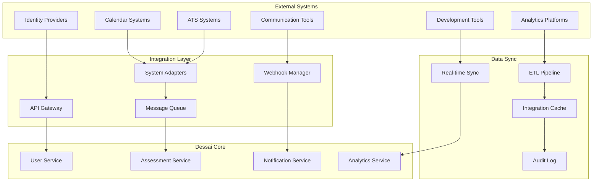
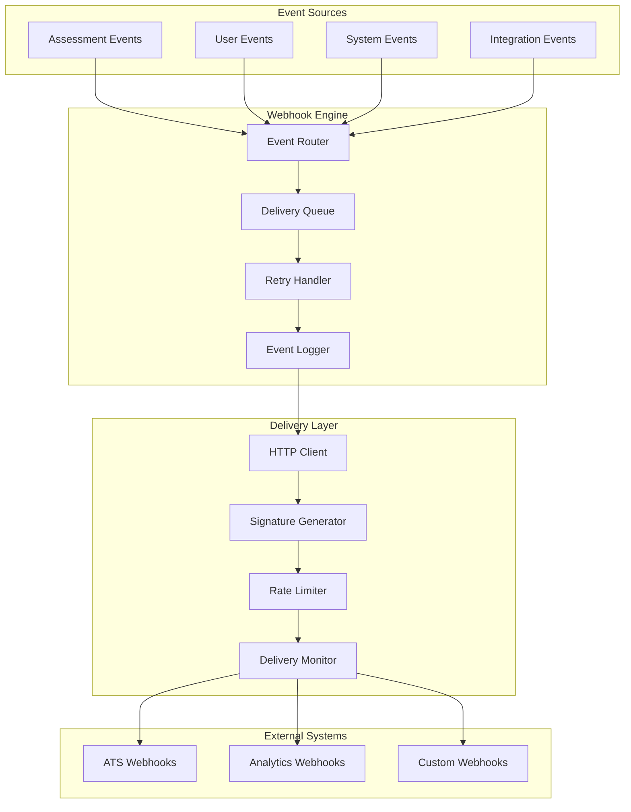

# Dessai Integrations & External Systems
version: "1.0.0"
last_updated: "2025-08-08"

## Overview

This document outlines the comprehensive integration strategy for the Dessai technical hiring platform. It covers integrations with Applicant Tracking Systems (ATS), calendar systems, communication tools, identity providers, and other external services that enhance the platform's functionality and streamline hiring workflows.

## Table of Contents

1. [Integration Architecture](#integration-architecture)
2. [ATS Integrations](#ats-integrations)
3. [Calendar & Scheduling](#calendar--scheduling)
4. [Identity Provider Integration](#identity-provider-integration)
5. [Communication Systems](#communication-systems)
6. [Development Tools](#development-tools)
7. [Analytics & Reporting](#analytics--reporting)
8. [Webhook Framework](#webhook-framework)
9. [API Standards & SDKs](#api-standards--sdks)
10. [Integration Security](#integration-security)

## Integration Architecture

### Integration Patterns



### Integration Types

#### Synchronous Integrations
```yaml
synchronous_integrations:
  real_time_apis:
    description: "Direct API calls for immediate responses"
    use_cases:
      - "User authentication"
      - "Calendar availability checks"
      - "Real-time notifications"
    timeout: "30 seconds"
    retry_policy: "exponential_backoff"
    
  webhooks:
    description: "Event-driven notifications"
    use_cases:
      - "Assessment completion notifications"
      - "Status updates"
      - "Data synchronization triggers"
    reliability: "at_least_once_delivery"
    verification: "signature_validation"
```

#### Asynchronous Integrations
```yaml
asynchronous_integrations:
  batch_processing:
    description: "Scheduled data synchronization"
    use_cases:
      - "Daily candidate sync"
      - "Assessment result exports"
      - "Analytics data transfer"
    frequency: "configurable"
    error_handling: "dead_letter_queue"
    
  event_streaming:
    description: "Continuous event processing"
    use_cases:
      - "Real-time analytics"
      - "Audit logging"
      - "System monitoring"
    protocol: "kafka_or_rabbitmq"
    ordering: "partition_based"
```

## ATS Integrations

### Supported ATS Platforms

#### Greenhouse Integration
```yaml
greenhouse_integration:
  authentication: "api_key"
  supported_features:
    candidate_management:
      - "Import candidate profiles"
      - "Sync candidate status"
      - "Update candidate records"
    job_management:
      - "Sync job postings"
      - "Link assessments to jobs"
      - "Track application status"
    assessment_workflow:
      - "Trigger assessments from Greenhouse"
      - "Send results back to Greenhouse"
      - "Update interview scorecards"
  
  api_endpoints:
    candidates: "GET/POST/PUT /v1/candidates"
    jobs: "GET /v1/jobs"
    scorecards: "POST /v1/scorecards"
    
  webhook_events:
    - "candidate.created"
    - "candidate.updated" 
    - "application.submitted"
    - "interview.scheduled"
```

#### Workday Integration
```yaml
workday_integration:
  authentication: "oauth2"
  supported_features:
    candidate_management:
      - "Candidate profile synchronization"
      - "Application tracking"
      - "Status updates"
    requisition_management:
      - "Job requisition sync"
      - "Assessment requirements"
      - "Approval workflows"
    reporting:
      - "Assessment metrics"
      - "Hiring funnel analytics"
      - "Compliance reporting"
  
  api_endpoints:
    candidates: "/Human_Resources/v1/Workers"
    jobs: "/Human_Resources/v1/Job_Requisitions"
    assessments: "/Human_Resources/v1/Assessments"
    
  data_mapping:
    candidate_fields:
      workday_id: "Worker_ID"
      email: "Email_Address"
      first_name: "Legal_Name.First_Name"
      last_name: "Legal_Name.Last_Name"
```

#### BambooHR Integration
```yaml
bamboohr_integration:
  authentication: "basic_auth"
  supported_features:
    employee_management:
      - "Employee directory sync"
      - "Interviewer availability"
      - "Role-based permissions"
    applicant_tracking:
      - "Candidate pipeline"
      - "Assessment scheduling"
      - "Result reporting"
  
  api_endpoints:
    employees: "GET /v1/employees"
    applicants: "GET/POST /v1/applicants"
    custom_fields: "GET /v1/meta/fields"
```

### ATS Integration Framework

#### Generic ATS Adapter
```typescript
interface ATSAdapter {
  // Connection management
  authenticate(): Promise<AuthToken>;
  validateConnection(): Promise<boolean>;
  
  // Candidate operations
  getCandidates(filters?: CandidateFilter): Promise<Candidate[]>;
  getCandidate(id: string): Promise<Candidate>;
  createCandidate(candidate: CandidateData): Promise<string>;
  updateCandidate(id: string, updates: Partial<CandidateData>): Promise<void>;
  
  // Job operations
  getJobs(filters?: JobFilter): Promise<Job[]>;
  getJob(id: string): Promise<Job>;
  
  // Assessment operations
  createAssessmentRecord(data: AssessmentRecord): Promise<string>;
  updateAssessmentStatus(id: string, status: AssessmentStatus): Promise<void>;
  submitAssessmentResults(id: string, results: AssessmentResults): Promise<void>;
  
  // Webhook management
  registerWebhook(endpoint: string, events: string[]): Promise<string>;
  unregisterWebhook(webhookId: string): Promise<void>;
}

interface CandidateData {
  email: string;
  firstName: string;
  lastName: string;
  phone?: string;
  resume?: string;
  customFields?: Record<string, any>;
  applicationId?: string;
  jobId?: string;
}

interface AssessmentResults {
  overallScore: number;
  questionResults: QuestionResult[];
  duration: number;
  integrityReport: IntegrityReport;
  recommendations: string[];
}
```

#### Data Synchronization
```yaml
data_sync_strategy:
  candidate_sync:
    direction: "bidirectional"
    frequency: "real_time"
    conflict_resolution: "last_modified_wins"
    fields_mapping:
      dessai_field: "ats_field"
      email: "email_address"
      first_name: "first_name"
      last_name: "last_name"
      
  assessment_sync:
    direction: "dessai_to_ats"
    frequency: "immediate_on_completion"
    data_included:
      - "overall_score"
      - "question_scores"
      - "completion_status"
      - "time_taken"
      - "integrity_flags"
      
  status_sync:
    direction: "bidirectional"
    frequency: "real_time"
    status_mapping:
      dessai_status: "ats_status"
      "invited": "assessment_sent"
      "in_progress": "assessment_in_progress"
      "completed": "assessment_completed"
      "expired": "assessment_expired"
```

## Calendar & Scheduling

### Calendar System Integrations

#### Google Calendar Integration
```yaml
google_calendar:
  authentication: "oauth2"
  scopes: ["calendar.readonly", "calendar.events"]
  
  features:
    availability_check:
      - "Free/busy time lookup"
      - "Recurring event handling"
      - "Multiple calendar support"
    event_management:
      - "Create interview events"
      - "Update event details"
      - "Send calendar invitations"
      - "Handle attendee responses"
    
  api_operations:
    check_availability: "GET /calendar/v3/freeBusy"
    create_event: "POST /calendar/v3/calendars/{calendarId}/events"
    update_event: "PUT /calendar/v3/calendars/{calendarId}/events/{eventId}"
    
  webhook_notifications:
    - "event.created"
    - "event.updated"
    - "event.deleted"
    - "attendee.responded"
```

#### Microsoft Outlook Integration
```yaml
microsoft_outlook:
  authentication: "oauth2_msal"
  scopes: ["Calendars.ReadWrite", "MailboxSettings.Read"]
  
  features:
    calendar_access:
      - "Primary and secondary calendars"
      - "Shared calendar permissions"
      - "Timezone handling"
    meeting_management:
      - "Teams meeting integration"
      - "Room resource booking"
      - "Meeting recording setup"
    
  api_operations:
    get_calendars: "GET /me/calendars"
    check_availability: "POST /me/calendar/getSchedule"
    create_meeting: "POST /me/events"
    
  teams_integration:
    meeting_creation: "automatic_teams_link"
    recording_permissions: "configurable"
    participant_management: "role_based"
```

#### Calendly Integration
```yaml
calendly_integration:
  authentication: "oauth2_or_api_key"
  
  features:
    scheduling_automation:
      - "Embed scheduling links"
      - "Custom availability rules"
      - "Buffer time management"
    event_types:
      - "Technical interview slots"
      - "Assessment review meetings"
      - "Follow-up discussions"
    
  webhook_events:
    - "invitee.created"
    - "invitee.canceled"
    - "meeting.started"
    - "meeting.ended"
    
  customization:
    branding: "custom_colors_and_logos"
    questions: "pre_meeting_questionnaire"
    confirmations: "custom_email_templates"
```

### Smart Scheduling Features

#### Intelligent Scheduling Algorithm
```typescript
interface SchedulingPreferences {
  timeZone: string;
  availableHours: {
    start: string; // "09:00"
    end: string;   // "17:00"
  };
  availableDays: number[]; // [1,2,3,4,5] for weekdays
  bufferTime: number; // minutes between meetings
  maxMeetingsPerDay: number;
  preferredDuration: number; // minutes
}

interface SchedulingRequest {
  participantEmails: string[];
  duration: number;
  preferredTimes?: Date[];
  deadline: Date;
  requirements: SchedulingRequirements;
}

interface SchedulingRequirements {
  minAdvanceNotice: number; // hours
  allowWeekends: boolean;
  timeZonePreference?: string;
  roomResources?: string[];
}
```

#### Automated Rescheduling
```yaml
rescheduling_automation:
  triggers:
    - "participant_cancellation"
    - "calendar_conflict"
    - "technical_requirements_change"
    
  policies:
    notification_timing: "24_hours_advance"
    max_reschedule_attempts: 3
    fallback_options: "suggest_alternative_times"
    
  conflict_resolution:
    priority_rules:
      - "candidate_convenience_first"
      - "interviewer_availability_second"
      - "business_hours_preference"
```

## Identity Provider Integration

### Enterprise Identity Providers

#### Active Directory / LDAP
```yaml
active_directory:
  connection_type: "ldap_or_ldaps"
  authentication: "service_account"
  
  user_synchronization:
    sync_frequency: "hourly"
    user_attributes:
      - "sAMAccountName"
      - "mail"
      - "displayName"
      - "department"
      - "title"
      - "manager"
    group_mapping:
      "Dessai-Interviewers": "interviewer"
      "Dessai-Admins": "admin"
      "Dessai-Authors": "author"
      
  security_features:
    ssl_verification: true
    connection_pooling: true
    failover_support: true
    
  group_operations:
    nested_groups: "supported"
    dynamic_groups: "supported"
    group_filters: "configurable"
```

#### SAML 2.0 Integration
```yaml
saml_integration:
  identity_provider: "generic_saml2"
  
  configuration:
    sso_url: "configurable"
    slo_url: "configurable"
    x509_certificate: "required"
    name_id_format: "email_address"
    
  attribute_mapping:
    email: "http://schemas.xmlsoap.org/ws/2005/05/identity/claims/emailaddress"
    first_name: "http://schemas.xmlsoap.org/ws/2005/05/identity/claims/givenname"
    last_name: "http://schemas.xmlsoap.org/ws/2005/05/identity/claims/surname"
    groups: "http://schemas.microsoft.com/ws/2008/06/identity/claims/groups"
    
  security_requirements:
    assertion_signing: "required"
    assertion_encryption: "optional"
    signature_algorithm: "SHA256"
```

#### OAuth 2.0 / OpenID Connect
```yaml
oauth_oidc:
  providers:
    google:
      client_id: "configurable"
      scopes: ["openid", "profile", "email"]
      discovery_url: "https://accounts.google.com/.well-known/openid_configuration"
      
    microsoft:
      client_id: "configurable" 
      tenant_id: "configurable"
      scopes: ["openid", "profile", "email"]
      
    okta:
      domain: "configurable"
      client_id: "configurable"
      scopes: ["openid", "profile", "email", "groups"]
      
  token_management:
    refresh_tokens: "supported"
    token_expiry_handling: "automatic_refresh"
    revocation_support: "yes"
    
  user_provisioning:
    just_in_time: "supported"
    attribute_updates: "on_each_login"
    deprovisioning: "manual_or_automated"
```

### Social Login Integration

```yaml
social_login:
  github:
    use_case: "developer_authentication"
    scopes: ["read:user", "user:email"]
    additional_data: "public_repositories"
    
  linkedin:
    use_case: "professional_verification"
    scopes: ["r_liteprofile", "r_emailaddress"]
    additional_data: "professional_experience"
    
  security_considerations:
    account_linking: "email_verification_required"
    duplicate_prevention: "email_matching"
    data_validation: "profile_completeness_check"
```

## Communication Systems

### Email Integration

#### Email Service Providers
```yaml
email_providers:
  sendgrid:
    authentication: "api_key"
    features:
      - "transactional_emails"
      - "template_management"
      - "delivery_analytics"
      - "bounce_handling"
    templates:
      - "assessment_invitation"
      - "assessment_reminder"
      - "results_notification"
      - "interview_scheduling"
      
  aws_ses:
    authentication: "iam_role_or_access_key"
    features:
      - "high_deliverability"
      - "bounce_complaint_handling"
      - "sending_statistics"
    configuration:
      verified_domains: "required"
      reputation_monitoring: "enabled"
      
  microsoft_graph:
    authentication: "oauth2"
    features:
      - "outlook_integration"
      - "calendar_invites"
      - "rich_email_content"
```

#### Email Templates & Automation
```yaml
email_automation:
  assessment_workflow:
    invitation:
      trigger: "assessment_assigned"
      timing: "immediate"
      personalization: "candidate_name_position"
      
    reminder:
      trigger: "24_hours_before_deadline"
      timing: "configurable"
      escalation: "multiple_reminders"
      
    completion:
      trigger: "assessment_submitted"
      timing: "immediate"
      content: "confirmation_next_steps"
      
  template_management:
    customization: "per_organization"
    a_b_testing: "supported"
    localization: "multi_language"
    brand_consistency: "logo_colors_fonts"
```

### SMS & Push Notifications

```yaml
sms_integration:
  twilio:
    services: ["sms", "voice", "verify"]
    use_cases:
      - "two_factor_authentication"
      - "assessment_reminders"
      - "urgent_notifications"
    compliance: "opt_in_required"
    
  push_notifications:
    firebase_cloud_messaging:
      platforms: ["web", "mobile"]
      features:
        - "targeted_messaging"
        - "rich_notifications"
        - "analytics"
    web_push:
      service_worker: "required"
      permissions: "user_granted"
```

### Video Conferencing

```yaml
video_conferencing:
  zoom:
    authentication: "jwt_or_oauth"
    features:
      - "meeting_creation"
      - "recording_management"
      - "participant_control"
      - "breakout_rooms"
    integration_points:
      - "calendar_events"
      - "assessment_sessions"
      - "interview_coordination"
      
  microsoft_teams:
    authentication: "azure_ad"
    features:
      - "meeting_scheduling"
      - "screen_sharing"
      - "recording_access"
    integration: "outlook_calendar_sync"
    
  google_meet:
    authentication: "oauth2"
    features:
      - "instant_meetings"
      - "calendar_integration"
      - "recording_storage"
```

## Development Tools

### Version Control Integration

```yaml
version_control:
  github:
    webhooks:
      - "push_events"
      - "pull_request_events"
      - "commit_status_updates"
    features:
      - "repository_analysis"
      - "code_quality_metrics"
      - "contribution_history"
      
  gitlab:
    api_integration:
      - "project_access"
      - "merge_request_data"
      - "pipeline_status"
      
  bitbucket:
    oauth_integration: "repository_access"
    data_extraction: "commit_history"
```

### Code Analysis Tools

```yaml
code_analysis:
  sonarqube:
    integration_type: "webhook_and_api"
    metrics_collected:
      - "code_quality_scores"
      - "technical_debt"
      - "security_vulnerabilities"
      - "test_coverage"
      
  codeclimate:
    api_integration: "pull_based"
    assessment_correlation: "automatic_scoring"
    
  security_scanning:
    snyk: "vulnerability_assessment"
    checkmarx: "static_analysis"
    veracode: "dynamic_analysis"
```

### CI/CD Integration

```yaml
cicd_integration:
  jenkins:
    webhook_triggers: "build_completion"
    artifact_collection: "test_results"
    
  github_actions:
    workflow_integration: "assessment_validation"
    artifact_storage: "build_outputs"
    
  azure_devops:
    pipeline_integration: "full_lifecycle"
    test_result_import: "automated"
```

## Analytics & Reporting

### Business Intelligence Integration

```yaml
analytics_platforms:
  tableau:
    connection_type: "rest_api_or_direct_db"
    data_refresh: "scheduled"
    dashboards:
      - "hiring_metrics"
      - "assessment_performance"
      - "interviewer_analytics"
      
  power_bi:
    connection: "power_query"
    real_time_data: "streaming_datasets"
    embedded_reports: "iframe_integration"
    
  looker:
    modeling: "lookml_definitions"
    embedded_analytics: "white_label"
    
  custom_analytics:
    export_formats: ["csv", "json", "parquet"]
    api_access: "rest_and_graphql"
    real_time_streaming: "kafka_or_websockets"
```

### Data Warehouse Integration

```yaml
data_warehouse:
  snowflake:
    connection: "jdbc_or_odbc"
    data_pipeline: "scheduled_etl"
    data_models:
      - "assessment_fact_table"
      - "candidate_dimension"
      - "question_dimension"
      
  amazon_redshift:
    data_loading: "copy_command"
    query_optimization: "distribution_keys"
    
  google_bigquery:
    streaming_inserts: "real_time_analytics"
    ml_integration: "bigquery_ml"
```

## Webhook Framework

### Webhook Architecture



### Webhook Configuration

```yaml
webhook_framework:
  event_types:
    assessment_events:
      - "assessment.created"
      - "assessment.updated"
      - "assessment.started"
      - "assessment.completed"
      - "assessment.expired"
      
    candidate_events:
      - "candidate.invited"
      - "candidate.registered"
      - "candidate.profile_updated"
      
    submission_events:
      - "submission.created"
      - "submission.updated"
      - "submission.graded"
      
    proctoring_events:
      - "proctoring.violation_detected"
      - "proctoring.session_ended"
      - "proctoring.report_generated"
      
  delivery_guarantees:
    retry_policy:
      max_attempts: 5
      backoff_strategy: "exponential"
      initial_delay: "1_second"
      max_delay: "5_minutes"
      
    timeout_settings:
      connection_timeout: "10_seconds"
      read_timeout: "30_seconds"
      
    failure_handling:
      dead_letter_queue: "enabled"
      manual_retry: "admin_interface"
      
  security:
    signature_method: "hmac_sha256"
    header_name: "X-Dessai-Signature"
    timestamp_validation: "5_minute_window"
    
  monitoring:
    delivery_status: "tracked"
    response_codes: "logged"
    failure_alerts: "configurable"
```

### Webhook Payload Formats

```typescript
interface WebhookPayload {
  id: string;
  event: string;
  timestamp: string;
  version: string;
  data: EventData;
  metadata: EventMetadata;
}

interface EventMetadata {
  organizationId: string;
  sourceService: string;
  correlationId: string;
  retryCount?: number;
}

// Example: Assessment completion event
interface AssessmentCompletedData {
  assessmentId: string;
  candidateId: string;
  submissionId: string;
  completionTime: string;
  duration: number;
  score: number;
  maxScore: number;
  integrityFlags: string[];
  questionResults: QuestionResult[];
}
```

## API Standards & SDKs

### RESTful API Standards

```yaml
api_standards:
  versioning:
    strategy: "url_path"
    format: "/v1/resource"
    deprecation_policy: "6_months_notice"
    
  resource_naming:
    convention: "kebab_case"
    pluralization: "resources_plural"
    nesting: "maximum_3_levels"
    
  http_methods:
    GET: "retrieve_resources"
    POST: "create_resources"
    PUT: "update_entire_resource"
    PATCH: "partial_updates"
    DELETE: "remove_resources"
    
  response_format:
    success: "json_with_data_envelope"
    error: "json_with_error_details"
    pagination: "cursor_based"
    
  authentication:
    bearer_tokens: "jwt_preferred"
    api_keys: "for_service_accounts"
    oauth2: "for_user_delegated_access"
```

### SDK Development

```yaml
sdk_languages:
  javascript:
    package_name: "@dessai/api-client"
    features:
      - "typescript_support"
      - "promise_based"
      - "automatic_retries"
      - "request_cancellation"
    
  python:
    package_name: "dessai-python-client"
    features:
      - "async_support"
      - "type_hints"
      - "dataclass_models"
      - "requests_session"
    
  java:
    package_name: "com.dessai.api-client"
    features:
      - "reactive_support"
      - "builder_pattern"
      - "jackson_serialization"
      
  csharp:
    package_name: "Dessai.ApiClient"
    features:
      - "async_await_support"
      - "strongly_typed_models"
      - "httpclient_integration"
```

### GraphQL API

```yaml
graphql_api:
  schema_design:
    type_system: "strongly_typed"
    nullable_handling: "explicit"
    pagination: "relay_cursor_connections"
    
  query_capabilities:
    field_selection: "fine_grained"
    filtering: "where_clauses"
    sorting: "order_by_fields"
    aggregations: "count_sum_avg"
    
  real_time_features:
    subscriptions: "websocket_based"
    live_queries: "cache_invalidation"
    
  security:
    query_complexity: "analysis_and_limits"
    depth_limiting: "configurable_max_depth"
    rate_limiting: "per_operation"
```

## Integration Security

### Security Requirements

```yaml
integration_security:
  authentication:
    api_keys:
      - "unique_per_integration"
      - "regular_rotation_required"
      - "scoped_permissions"
      
    oauth_tokens:
      - "secure_token_storage"
      - "automatic_refresh"
      - "scope_validation"
      
    certificates:
      - "mutual_tls_for_sensitive_data"
      - "certificate_validation"
      - "revocation_checking"
      
  data_transmission:
    encryption: "tls_1_3_minimum"
    certificate_validation: "strict"
    data_minimization: "only_necessary_fields"
    
  webhook_security:
    signature_verification: "hmac_sha256"
    timestamp_validation: "replay_attack_prevention"
    ip_whitelisting: "optional_but_recommended"
    
  audit_logging:
    integration_events: "all_logged"
    data_access: "tracked"
    failures: "alerted"
    
  compliance:
    gdpr: "data_processing_agreements"
    soc2: "vendor_risk_assessments"
    hipaa: "business_associate_agreements"
```

### Error Handling & Monitoring

```yaml
error_handling:
  integration_failures:
    network_errors: "automatic_retry"
    authentication_failures: "alert_and_manual_intervention"
    rate_limiting: "backoff_and_queue"
    data_validation: "log_and_alert"
    
  monitoring_metrics:
    availability: "uptime_percentage"
    latency: "response_time_percentiles"
    error_rates: "failure_percentage"
    throughput: "requests_per_second"
    
  alerting:
    integration_down: "immediate_alert"
    high_error_rate: "threshold_based"
    performance_degradation: "trend_based"
    
  health_checks:
    endpoint: "/health/integrations"
    frequency: "every_30_seconds"
    timeout: "10_seconds"
    dependencies: "cascade_checking"
```

This comprehensive integration framework ensures that Dessai can seamlessly connect with existing enterprise systems while maintaining security, reliability, and performance standards. The modular design allows for easy addition of new integrations as requirements evolve.
