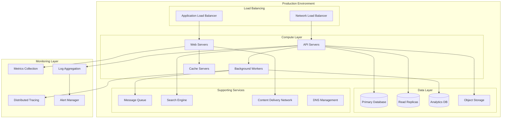
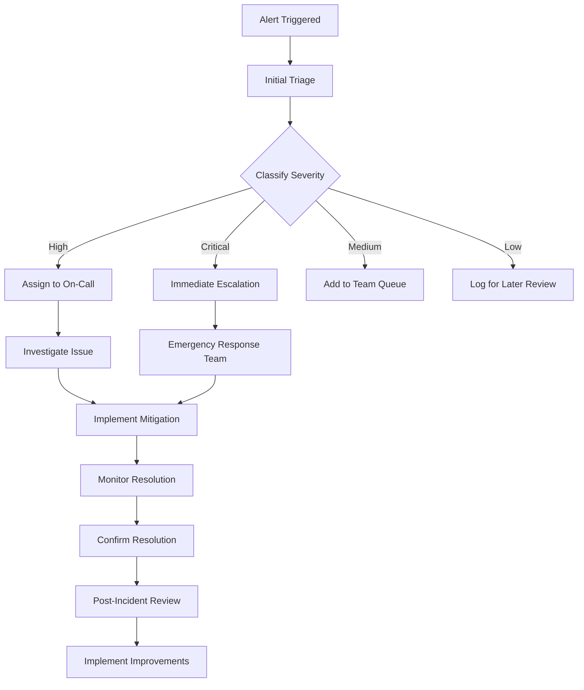

# Dessai Operations & Monitoring
version: "1.0.0"
last_updated: "2025-08-08"

## Overview

This document outlines the comprehensive operations and monitoring strategy for the Dessai technical hiring platform. It covers deployment procedures, monitoring systems, alerting mechanisms, incident response, performance management, and maintenance protocols to ensure high availability, reliability, and optimal performance.

## Table of Contents

1. [Operational Architecture](#operational-architecture)
2. [Deployment & CI/CD](#deployment--cicd)
3. [Monitoring & Observability](#monitoring--observability)
4. [Alerting & Incident Management](#alerting--incident-management)
5. [Performance Management](#performance-management)
6. [Capacity Planning](#capacity-planning)
7. [Backup & Disaster Recovery](#backup--disaster-recovery)
8. [Maintenance & Updates](#maintenance--updates)
9. [Security Operations](#security-operations)
10. [Compliance & Auditing](#compliance--auditing)

## Operational Architecture

### Infrastructure Overview



### Environment Strategy

```yaml
environments:
  development:
    purpose: "Feature development and initial testing"
    resources: "Minimal - single instance deployments"
    data: "Synthetic test data"
    monitoring: "Basic logging and metrics"
    
  staging:
    purpose: "Pre-production testing and validation"
    resources: "Production-like but smaller scale"
    data: "Anonymized production data subset"
    monitoring: "Full monitoring stack"
    testing: "Automated integration and E2E tests"
    
  production:
    purpose: "Live customer-facing environment"
    resources: "Full scale with redundancy"
    data: "Live customer data"
    monitoring: "Comprehensive monitoring and alerting"
    security: "Enhanced security controls"
    
  disaster_recovery:
    purpose: "Backup production environment"
    resources: "Scaled down but ready to scale up"
    data: "Real-time replication from production"
    activation: "Manual or automatic failover"
```

## Deployment & CI/CD

### CI/CD Pipeline Architecture

```mermaid
graph LR
    subgraph "Source Control"
        REPO[Git Repository]
        PR[Pull Request]
        MERGE[Merge to Main]
    end
    
    subgraph "Build Pipeline"
        BUILD[Build & Test]
        SECURITY[Security Scan]
        QUALITY[Quality Gates]
        ARTIFACT[Create Artifacts]
    end
    
    subgraph "Deployment Pipeline"
        DEPLOY_DEV[Deploy to Dev]
        DEPLOY_STAGING[Deploy to Staging]
        APPROVAL[Manual Approval]
        DEPLOY_PROD[Deploy to Production]
    end
    
    subgraph "Post-Deployment"
        SMOKE[Smoke Tests]
        MONITOR[Monitor Deployment]
        ROLLBACK[Rollback if Needed]
        NOTIFY[Notifications]
    end
    
    REPO --> PR
    PR --> BUILD
    MERGE --> BUILD
    
    BUILD --> SECURITY
    SECURITY --> QUALITY
    QUALITY --> ARTIFACT
    
    ARTIFACT --> DEPLOY_DEV
    DEPLOY_DEV --> DEPLOY_STAGING
    DEPLOY_STAGING --> APPROVAL
    APPROVAL --> DEPLOY_PROD
    
    DEPLOY_PROD --> SMOKE
    SMOKE --> MONITOR
    MONITOR --> ROLLBACK
    MONITOR --> NOTIFY
```



### Deployment Strategies

#### Blue-Green Deployment
```yaml
blue_green_deployment:
  strategy: "Zero-downtime deployment"
  
  process:
    1: "Deploy new version to green environment"
    2: "Run health checks and smoke tests"
    3: "Switch load balancer to green environment"
    4: "Monitor for issues"
    5: "Keep blue environment as quick rollback option"
    
  advantages:
    - "Zero downtime"
    - "Quick rollback capability"
    - "Production testing opportunity"
    
  requirements:
    - "Double resource capacity during deployment"
    - "Database migration compatibility"
    - "Stateless application design"
```

#### Canary Deployment
```yaml
canary_deployment:
  strategy: "Gradual rollout with risk mitigation"
  
  phases:
    phase_1:
      traffic: "5%"
      duration: "30 minutes"
      success_criteria: "Error rate < 0.1%, Latency < 200ms"
      
    phase_2:
      traffic: "25%"
      duration: "1 hour"
      success_criteria: "Error rate < 0.1%, Latency < 200ms"
      
    phase_3:
      traffic: "100%"
      duration: "Complete rollout"
      success_criteria: "All metrics within normal ranges"
      
  monitoring:
    - "Real-time error rates"
    - "Response time percentiles"
    - "Business metrics"
    - "User feedback"
    
  rollback_triggers:
    - "Error rate > 0.5%"
    - "Latency increase > 50%"
    - "Critical business metric degradation"
```

### Infrastructure as Code

```yaml
infrastructure_as_code:
  tools:
    terraform:
      version: "1.5+"
      providers: ["aws", "cloudflare", "datadog"]
      state_management: "remote_backend_with_locking"
      
    ansible:
      version: "2.14+"
      use_cases: ["configuration_management", "application_deployment"]
      
    kubernetes_manifests:
      structure: "helm_charts"
      environment_configs: "separate_values_files"
      
  practices:
    version_control: "Git repository for all infrastructure code"
    code_review: "Required for infrastructure changes"
    testing: "Terraform plan validation"
    documentation: "Inline comments and README files"
    
  deployment_process:
    1: "Infrastructure code changes"
    2: "Plan generation and review"
    3: "Approval process"
    4: "Apply changes with monitoring"
    5: "Validation and documentation update"
```

## Monitoring & Observability

### Monitoring Stack

```yaml
monitoring_stack:
  metrics_collection:
    prometheus:
      retention: "30 days"
      scrape_interval: "15 seconds"
      high_availability: "federated_setup"
      
    grafana:
      dashboards: "custom_and_community"
      alerting: "integrated_with_prometheus"
      users: "team_access_with_rbac"
      
  logging:
    elasticsearch:
      retention: "90 days"
      indices: "time_based_rotation"
      cluster: "multi_node_for_ha"
      
    logstash:
      parsing: "structured_log_parsing"
      enrichment: "metadata_addition"
      
    kibana:
      dashboards: "operational_and_security_views"
      alerts: "watcher_based_alerting"
      
  tracing:
    jaeger:
      sampling: "probabilistic_1_percent"
      storage: "elasticsearch_backend"
      retention: "7 days"
      
    opentelemetry:
      instrumentation: "auto_and_manual"
      exporters: ["jaeger", "prometheus"]
```

### Key Metrics

#### Application Metrics
```yaml
application_metrics:
  performance_metrics:
    - name: "response_time"
      type: "histogram"
      labels: ["method", "endpoint", "status_code"]
      
    - name: "throughput"
      type: "counter"
      labels: ["service", "endpoint"]
      
    - name: "error_rate"
      type: "counter" 
      labels: ["service", "error_type"]
      
    - name: "concurrent_users"
      type: "gauge"
      labels: ["service"]
      
  business_metrics:
    - name: "assessments_completed"
      type: "counter"
      labels: ["organization", "assessment_type"]
      
    - name: "candidates_active"
      type: "gauge"
      labels: ["organization"]
      
    - name: "proctoring_violations"
      type: "counter"
      labels: ["violation_type", "severity"]
      
    - name: "code_execution_time"
      type: "histogram"
      labels: ["language", "complexity"]
```

#### Infrastructure Metrics
```yaml
infrastructure_metrics:
  system_metrics:
    - "CPU utilization"
    - "Memory usage"
    - "Disk I/O"
    - "Network I/O"
    
  database_metrics:
    - "Connection pool usage"
    - "Query performance"
    - "Replication lag"
    - "Lock contention"
    
  cache_metrics:
    - "Hit/miss ratios"
    - "Eviction rates"
    - "Memory usage"
    - "Connection counts"
    
  queue_metrics:
    - "Queue depth"
    - "Processing rate"
    - "Dead letter count"
    - "Consumer lag"
```

### Observability Dashboards

```yaml
dashboard_categories:
  executive_dashboard:
    metrics:
      - "System availability"
      - "User satisfaction scores"
      - "Assessment completion rates"
      - "Revenue impact metrics"
    audience: "executives_and_managers"
    
  operational_dashboard:
    metrics:
      - "Service health status"
      - "Error rates and trends"
      - "Response time percentiles"
      - "Resource utilization"
    audience: "devops_and_sre_teams"
    
  development_dashboard:
    metrics:
      - "Deployment frequency"
      - "Lead time for changes"
      - "Change failure rate"
      - "Mean time to recovery"
    audience: "development_teams"
    
  security_dashboard:
    metrics:
      - "Security alerts"
      - "Authentication failures"
      - "Access patterns"
      - "Vulnerability status"
    audience: "security_team"
```

## Alerting & Incident Management

### Alert Configuration

```yaml
alerting_rules:
  critical_alerts:
    service_down:
      condition: "up == 0"
      duration: "1 minute"
      severity: "critical"
      notification: "immediate_pager"
      
    high_error_rate:
      condition: "error_rate > 5%"
      duration: "5 minutes"
      severity: "critical"
      notification: "immediate_pager"
      
    database_connection_failure:
      condition: "db_connections_failed > 0"
      duration: "1 minute"
      severity: "critical"
      notification: "immediate_pager"
      
  warning_alerts:
    high_response_time:
      condition: "response_time_p95 > 2000ms"
      duration: "10 minutes"
      severity: "warning"
      notification: "slack_and_email"
      
    high_cpu_usage:
      condition: "cpu_usage > 80%"
      duration: "15 minutes"
      severity: "warning"
      notification: "slack_and_email"
      
    disk_space_low:
      condition: "disk_usage > 85%"
      duration: "5 minutes"
      severity: "warning"
      notification: "slack_and_email"
```

### Incident Response Process



### Incident Severity Levels

```yaml
severity_levels:
  sev1_critical:
    definition: "Complete service outage or data breach"
    response_time: "5 minutes"
    escalation: "immediate_to_leadership"
    communication: "status_page_and_customer_notification"
    examples:
      - "Platform completely inaccessible"
      - "Data security breach"
      - "Complete assessment system failure"
      
  sev2_high:
    definition: "Significant service degradation"
    response_time: "15 minutes"
    escalation: "senior_engineer_and_manager"
    communication: "internal_notification"
    examples:
      - "Assessment submissions failing"
      - "Login system issues"
      - "Proctoring system down"
      
  sev3_medium:
    definition: "Minor service impact"
    response_time: "2 hours"
    escalation: "engineering_team"
    communication: "team_notification"
    examples:
      - "Slow report generation"
      - "Minor UI glitches"
      - "Non-critical feature unavailable"
      
  sev4_low:
    definition: "No immediate service impact"
    response_time: "next_business_day"
    escalation: "individual_engineer"
    communication: "ticket_system"
    examples:
      - "Documentation errors"
      - "Minor performance issues"
      - "Cosmetic bugs"
```

## Performance Management

### Performance Monitoring

```yaml
performance_monitoring:
  synthetic_monitoring:
    uptime_checks:
      - "Homepage availability"
      - "Login functionality"
      - "Assessment start process"
      - "API endpoint health"
    frequency: "1 minute"
    locations: "multiple_geographic_regions"
    
  real_user_monitoring:
    metrics:
      - "Page load times"
      - "User interaction latency"
      - "Error rates by browser/device"
      - "Conversion funnel performance"
    sampling: "100% for errors, 10% for performance"
    
  load_testing:
    frequency: "weekly"
    scenarios:
      - "Normal load (baseline)"
      - "Peak usage (3x baseline)"
      - "Stress test (10x baseline)"
      - "Spike test (sudden load increase)"
    tools: ["k6", "artillery", "jmeter"]
```

### Performance Optimization

```yaml
optimization_strategies:
  application_level:
    caching:
      - "Application-level caching"
      - "Database query result caching"
      - "API response caching"
      - "CDN for static assets"
      
    database_optimization:
      - "Query optimization"
      - "Index optimization"
      - "Connection pooling"
      - "Read replica usage"
      
    code_optimization:
      - "Algorithmic improvements"
      - "Memory usage optimization"
      - "Async processing for heavy tasks"
      - "Code splitting and lazy loading"
      
  infrastructure_level:
    scaling:
      - "Horizontal scaling for stateless services"
      - "Vertical scaling for databases"
      - "Auto-scaling based on metrics"
      - "Load balancing optimization"
      
    resource_optimization:
      - "Right-sizing instances"
      - "Reserved capacity planning"
      - "Spot instance usage"
      - "Resource scheduling"
```

### Performance SLAs

```yaml
performance_slas:
  availability:
    target: "99.9%"
    measurement: "uptime_monitoring"
    exclusions: "planned_maintenance"
    
  response_time:
    web_pages: "< 2 seconds (95th percentile)"
    api_endpoints: "< 500ms (95th percentile)"
    assessment_loading: "< 3 seconds"
    code_execution: "< 10 seconds"
    
  throughput:
    concurrent_users: "10,000+"
    api_requests: "1,000 RPS"
    assessments_running: "1,000 simultaneous"
    
  error_rates:
    target: "< 0.1% for critical operations"
    measurement: "rolling_24_hour_window"
    alerting: "real_time_monitoring"
```

## Capacity Planning

### Resource Forecasting

```yaml
capacity_planning:
  forecasting_methodology:
    data_sources:
      - "Historical usage patterns"
      - "Business growth projections"
      - "Seasonal variations"
      - "Marketing campaign impact"
      
    models:
      - "Linear regression for trend analysis"
      - "Seasonal decomposition"
      - "Machine learning for complex patterns"
      
    review_frequency: "monthly"
    planning_horizon: "12 months"
    
  resource_categories:
    compute_resources:
      - "CPU utilization trends"
      - "Memory usage patterns"
      - "Container/pod counts"
      - "Auto-scaling metrics"
      
    storage_resources:
      - "Database growth rates"
      - "Object storage usage"
      - "Log retention requirements"
      - "Backup storage needs"
      
    network_resources:
      - "Bandwidth utilization"
      - "CDN usage patterns"
      - "API call volumes"
      - "Video streaming requirements"
```

### Scaling Strategies

```yaml
scaling_strategies:
  horizontal_scaling:
    triggers:
      - "CPU usage > 70%"
      - "Memory usage > 80%"
      - "Response time > SLA"
      - "Queue depth > threshold"
      
    policies:
      scale_out: "add_20%_capacity"
      scale_in: "remove_10%_capacity_gradually"
      cooldown: "5_minutes_between_actions"
      
  vertical_scaling:
    use_cases:
      - "Database performance improvements"
      - "Memory-intensive workloads"
      - "CPU-bound operations"
      
    process:
      - "Schedule during maintenance window"
      - "Backup before scaling"
      - "Monitor performance post-scaling"
      
  predictive_scaling:
    algorithms:
      - "Time-series forecasting"
      - "Machine learning models"
      - "Pattern recognition"
      
    implementation:
      - "Pre-scale before expected traffic"
      - "Consider seasonal patterns"
      - "Factor in business events"
```

## Backup & Disaster Recovery

### Backup Strategy

```yaml
backup_strategy:
  database_backups:
    frequency:
      full_backup: "daily_at_2am_utc"
      incremental: "every_6_hours"
      transaction_log: "every_15_minutes"
      
    retention:
      daily_backups: "30_days"
      weekly_backups: "12_weeks"
      monthly_backups: "12_months"
      yearly_backups: "7_years"
      
    storage:
      primary: "cloud_storage_with_encryption"
      secondary: "different_geographic_region"
      testing: "monthly_restore_tests"
      
  application_data:
    configuration_backup:
      frequency: "before_each_deployment"
      storage: "version_controlled_repository"
      
    file_backup:
      frequency: "daily"
      method: "incremental_with_deduplication"
      retention: "90_days"
```

### Disaster Recovery Plan

```yaml
disaster_recovery:
  rto_targets:
    critical_systems: "1_hour"
    important_systems: "4_hours"
    standard_systems: "24_hours"
    
  rpo_targets:
    database_data: "15_minutes"
    file_data: "1_hour"
    configuration: "immediate"
    
  recovery_procedures:
    infrastructure_failure:
      steps:
        1: "Activate disaster recovery site"
        2: "Restore from latest backups"
        3: "Update DNS to point to DR site"
        4: "Verify system functionality"
        5: "Communicate status to stakeholders"
      
    data_corruption:
      steps:
        1: "Identify scope of corruption"
        2: "Stop writes to affected systems"
        3: "Restore from clean backup"
        4: "Replay transactions if possible"
        5: "Validate data integrity"
        
  testing_schedule:
    tabletop_exercises: "quarterly"
    partial_failover_tests: "semi_annually"
    full_disaster_recovery_test: "annually"
```

## Maintenance & Updates

### Maintenance Windows

```yaml
maintenance_windows:
  scheduled_maintenance:
    primary_window: "Saturday 2:00 AM - 6:00 AM UTC"
    emergency_window: "Any time with 4-hour notice"
    
  maintenance_types:
    system_updates:
      frequency: "monthly"
      duration: "2_hours"
      impact: "minimal_with_rolling_updates"
      
    database_maintenance:
      frequency: "quarterly"
      duration: "4_hours"
      impact: "read_only_mode"
      
    security_patches:
      frequency: "as_needed"
      duration: "varies"
      priority: "immediate_for_critical"
      
  communication:
    advance_notice: "72_hours_minimum"
    channels: ["status_page", "email", "in_app"]
    updates: "every_30_minutes_during_maintenance"
```

### Update Management

```yaml
update_management:
  software_updates:
    operating_system:
      schedule: "monthly_patch_tuesday"
      testing: "staging_environment_first"
      rollback_plan: "automated_if_health_checks_fail"
      
    application_dependencies:
      security_updates: "within_24_hours"
      minor_updates: "monthly"
      major_updates: "quarterly_with_testing"
      
    third_party_services:
      monitoring: "automated_version_checking"
      testing: "sandbox_environment_validation"
      deployment: "canary_rollout_strategy"
      
  database_updates:
    schema_migrations:
      process: "backward_compatible_changes"
      testing: "full_regression_suite"
      rollback: "automated_rollback_scripts"
      
    data_migrations:
      planning: "impact_assessment_required"
      execution: "during_maintenance_window"
      validation: "automated_data_integrity_checks"
```

## Security Operations

### Security Monitoring

```yaml
security_monitoring:
  threat_detection:
    log_analysis:
      - "Authentication failures"
      - "Privilege escalation attempts"
      - "Suspicious user behavior"
      - "Network anomalies"
      
    behavioral_analysis:
      - "Unusual access patterns"
      - "Data exfiltration attempts"
      - "Account compromise indicators"
      - "Insider threat detection"
      
    integration:
      - "SIEM system feeding"
      - "Threat intelligence feeds"
      - "Security orchestration"
      - "Automated response actions"
      
  vulnerability_management:
    scanning:
      frequency: "daily_automated_scans"
      scope: "infrastructure_and_applications"
      reporting: "weekly_vulnerability_reports"
      
    patching:
      critical_vulnerabilities: "within_24_hours"
      high_vulnerabilities: "within_7_days"
      medium_vulnerabilities: "within_30_days"
      
  compliance_monitoring:
    controls: "continuous_monitoring"
    reporting: "automated_compliance_reports"
    auditing: "quarterly_internal_audits"
```

### Incident Response Operations

```yaml
security_incident_response:
  detection_sources:
    - "Automated security alerts"
    - "User reports"
    - "Threat intelligence feeds"
    - "External notifications"
    
  response_team:
    roles:
      - "Incident Commander"
      - "Security Analyst"
      - "Systems Engineer"
      - "Communications Lead"
      
  response_procedures:
    containment:
      - "Isolate affected systems"
      - "Preserve evidence"
      - "Block malicious activities"
      
    eradication:
      - "Remove threats"
      - "Patch vulnerabilities"
      - "Update security controls"
      
    recovery:
      - "Restore systems safely"
      - "Monitor for recurrence"
      - "Validate security posture"
```

## Compliance & Auditing

### Compliance Monitoring

```yaml
compliance_framework:
  standards:
    soc2_type2:
      controls: "trust_service_criteria"
      evidence: "automated_collection"
      reporting: "quarterly_assessments"
      
    gdpr:
      requirements: "data_protection_by_design"
      monitoring: "continuous_compliance_checking"
      reporting: "data_processing_records"
      
    iso27001:
      controls: "security_management_system"
      assessment: "annual_external_audit"
      improvement: "continuous_improvement_process"
      
  audit_logging:
    events:
      - "User authentication"
      - "Data access"
      - "System configuration changes"
      - "Administrative actions"
      
    retention: "7_years_for_compliance"
    integrity: "cryptographic_signatures"
    accessibility: "structured_query_interface"
```

### Audit Procedures

```yaml
audit_procedures:
  internal_audits:
    frequency: "quarterly"
    scope: "rotating_focus_areas"
    methodology: "risk_based_approach"
    
  external_audits:
    frequency: "annually"
    auditors: "certified_third_party"
    preparation: "6_weeks_lead_time"
    
  continuous_monitoring:
    automated_controls: "real_time_monitoring"
    exception_reporting: "daily_reports"
    trend_analysis: "monthly_reviews"
    
  remediation:
    finding_classification: "risk_based_prioritization"
    corrective_actions: "assigned_owners_and_timelines"
    verification: "independent_validation"
    reporting: "executive_dashboard_updates"
```

This comprehensive operations and monitoring framework ensures that the Dessai platform maintains high availability, security, and performance while meeting compliance requirements and providing excellent user experience. Regular review and updates of these procedures ensure they remain effective as the platform evolves and scales.
