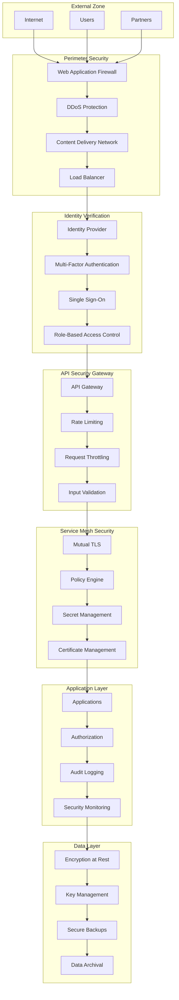
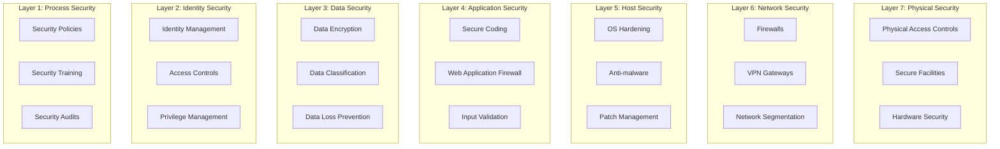
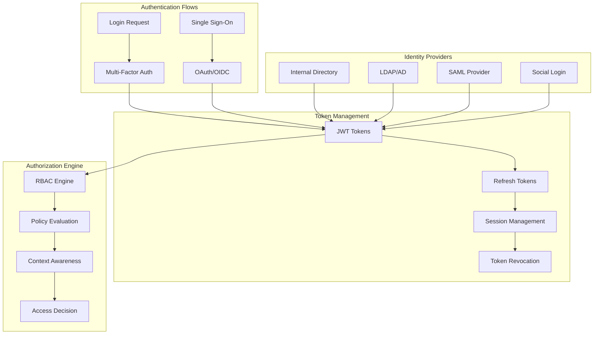
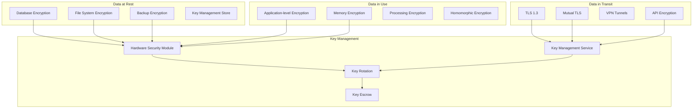
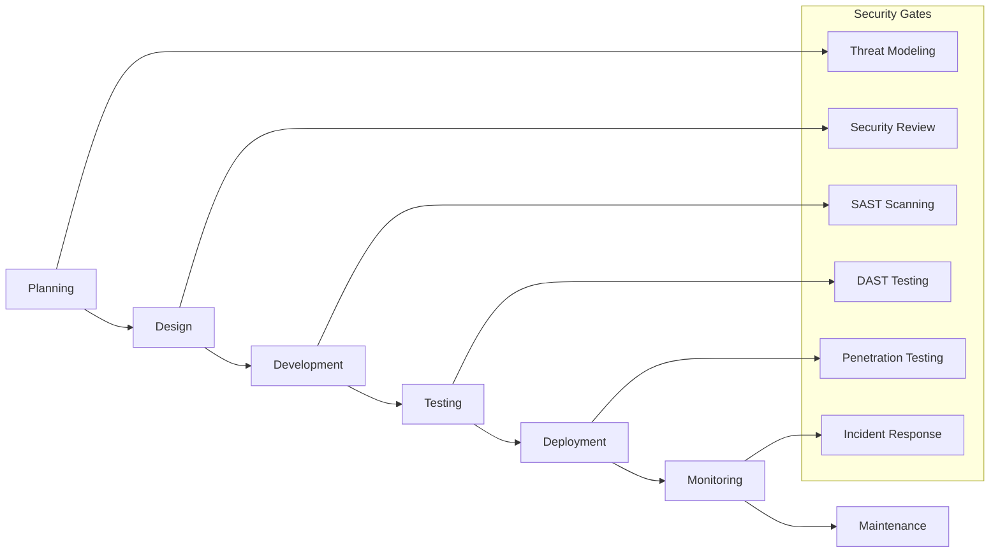
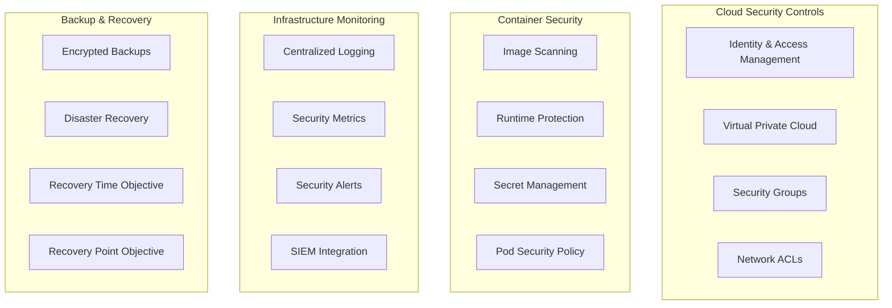
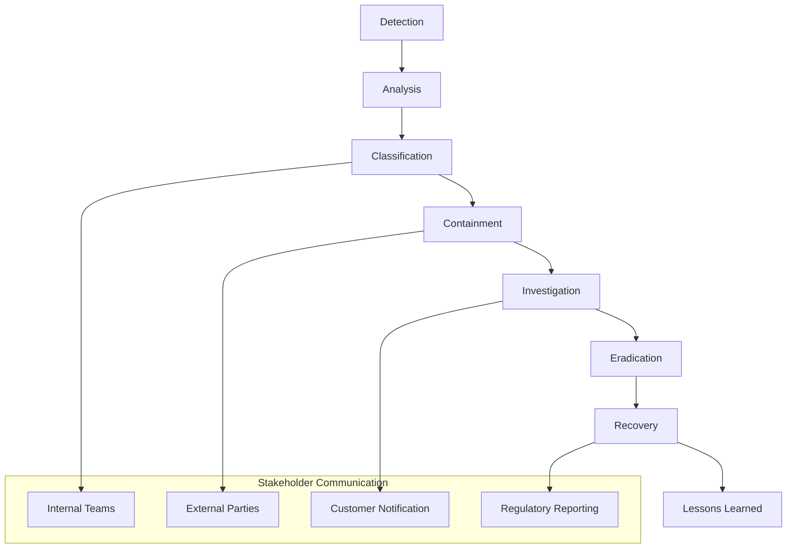
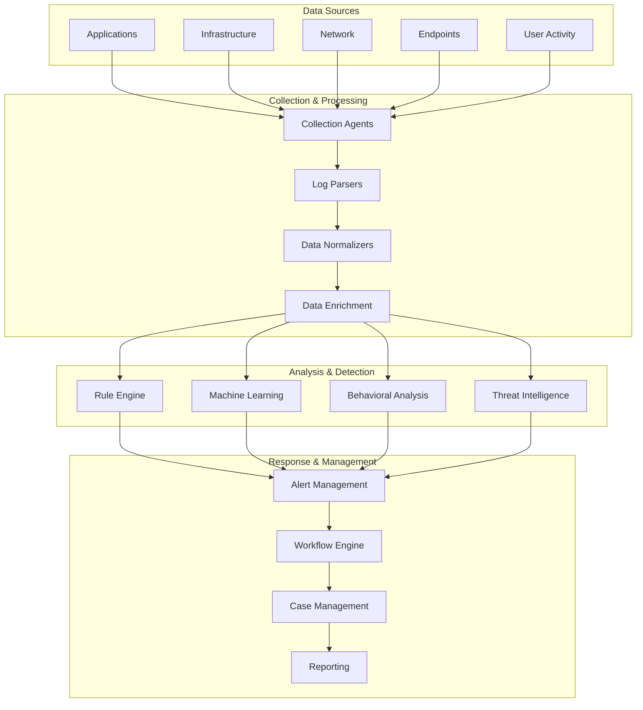

# Dessai Security & Compliance Framework
version: "1.0.0"
last_updated: "2025-08-08"

## Overview

This document outlines the comprehensive security and compliance framework for the Dessai technical hiring platform. The framework follows zero-trust principles, defense-in-depth strategies, and meets international compliance standards for handling sensitive data in recruitment processes.

## Table of Contents

1. [Security Architecture](#security-architecture)
2. [Threat Model](#threat-model)
3. [Identity & Access Management](#identity--access-management)
4. [Data Protection](#data-protection)
5. [Application Security](#application-security)
6. [Infrastructure Security](#infrastructure-security)
7. [Compliance Framework](#compliance-framework)
8. [Incident Response](#incident-response)
9. [Security Monitoring](#security-monitoring)
10. [Security Policies](#security-policies)

## Security Architecture

### Zero Trust Security Model



### Security Zones

#### Zone Classification
```
┌─────────────────────────────────────────────────────────────────┐
│                        Security Zones                          │
├─────────────────────────────────────────────────────────────────┤
│ Zone         │ Trust Level │ Access Controls │ Monitoring      │
├─────────────────────────────────────────────────────────────────┤
│ Internet     │ Untrusted   │ WAF, DDoS       │ Full logging    │
│ DMZ          │ Limited     │ Firewall rules  │ Enhanced        │
│ Application  │ Conditional │ Authentication  │ Behavioral      │
│ Service      │ Verified    │ mTLS, RBAC      │ API monitoring  │
│ Data         │ Restricted  │ Encryption+ACL  │ Data access     │
│ Management   │ Privileged  │ Bastion+MFA     │ Admin activity  │
└─────────────────────────────────────────────────────────────────┘
```

### Defense in Depth Strategy



## Threat Model

### STRIDE Threat Analysis

#### Threat Categories
```
┌─────────────────────────────────────────────────────────────────┐
│                      STRIDE Analysis                           │
├─────────────────────────────────────────────────────────────────┤
│ Threat        │ Assessment Context    │ Mitigation Strategy     │
├─────────────────────────────────────────────────────────────────┤
│ Spoofing      │ Identity impersonation│ Strong authentication   │
│ Tampering     │ Code/data modification│ Integrity checks        │
│ Repudiation   │ Denying actions       │ Digital signatures      │
│ Info Disclosure│ Unauthorized access   │ Encryption + access     │
│ Denial Service│ Service unavailability│ Rate limiting + scaling │
│ Elevation     │ Privilege escalation  │ Least privilege + RBAC  │
└─────────────────────────────────────────────────────────────────┘
```

#### Asset Risk Assessment

```typescript
interface ThreatModel {
  assets: SecurityAsset[];
  threatActors: ThreatActor[];
  attackVectors: AttackVector[];
  vulnerabilities: Vulnerability[];
  controls: SecurityControl[];
}

interface SecurityAsset {
  id: string;
  name: string;
  type: AssetType;
  classification: DataClassification;
  criticality: CriticalityLevel;
  threats: string[];
  value: number; // 1-10 scale
  exposure: number; // 1-10 scale
  impact: ImpactAssessment;
}

enum AssetType {
  DATA = 'data',
  APPLICATION = 'application',
  INFRASTRUCTURE = 'infrastructure',
  PERSONNEL = 'personnel',
  REPUTATION = 'reputation'
}

interface ImpactAssessment {
  confidentiality: number; // 1-10
  integrity: number; // 1-10
  availability: number; // 1-10
  financial: number; // 1-10
  regulatory: number; // 1-10
  reputational: number; // 1-10
}

interface ThreatActor {
  type: ActorType;
  motivation: string[];
  capabilities: string[];
  resources: ResourceLevel;
  targetAssets: string[];
}

enum ActorType {
  INSIDER_MALICIOUS = 'insider_malicious',
  INSIDER_NEGLIGENT = 'insider_negligent',
  CYBERCRIMINAL = 'cybercriminal',
  HACKTIVIST = 'hacktivist',
  NATION_STATE = 'nation_state',
  COMPETITOR = 'competitor'
}
```

### Attack Surface Analysis

#### Web Application Attack Surface
```
┌─────────────────────────────────────────────────────────────────┐
│                    Attack Surface Map                          │
├─────────────────────────────────────────────────────────────────┤
│ Component       │ Entry Points     │ Risk Level │ Controls      │
├─────────────────────────────────────────────────────────────────┤
│ Web Frontend    │ HTTP/HTTPS       │ High       │ WAF, CSP      │
│ API Endpoints   │ REST/GraphQL     │ High       │ AuthN/AuthZ   │
│ Authentication  │ Login forms      │ Critical   │ MFA, Rate Lmt │
│ File Uploads    │ Media endpoints  │ High       │ Validation    │
│ Code Execution  │ Sandbox APIs     │ Critical   │ Isolation     │
│ WebSocket       │ Real-time conn   │ Medium     │ Auth, Rate    │
│ Admin Panel     │ Management UI    │ Critical   │ Strong Auth   │
│ Proctoring      │ Camera/Mic API   │ High       │ Privacy       │
└─────────────────────────────────────────────────────────────────┘
```

#### Common Attack Scenarios

```yaml
attack_scenarios:
  account_takeover:
    description: "Unauthorized access to user accounts"
    attack_chain:
      - "Credential stuffing or phishing"
      - "Bypass authentication controls"
      - "Access candidate data and assessments"
    impact: "High - Data breach, privacy violation"
    probability: "Medium"
    controls:
      - "Multi-factor authentication"
      - "Account lockout policies"
      - "Anomaly detection"
      
  assessment_fraud:
    description: "Cheating during technical assessments"
    attack_chain:
      - "Bypass proctoring controls"
      - "Use unauthorized assistance"
      - "Submit fraudulent solutions"
    impact: "Medium - Hiring decision compromise"
    probability: "High"
    controls:
      - "Enhanced proctoring"
      - "Code similarity detection"
      - "Behavioral analysis"
      
  data_exfiltration:
    description: "Unauthorized extraction of sensitive data"
    attack_chain:
      - "Gain unauthorized access"
      - "Escalate privileges"
      - "Extract candidate/assessment data"
    impact: "Critical - Compliance violation, reputation damage"
    probability: "Low"
    controls:
      - "Data loss prevention"
      - "Access monitoring"
      - "Encryption at rest"
      
  supply_chain_attack:
    description: "Compromise through third-party dependencies"
    attack_chain:
      - "Inject malicious code in dependencies"
      - "Compromise build pipeline"
      - "Deploy malicious updates"
    impact: "Critical - Full system compromise"
    probability: "Low"
    controls:
      - "Dependency scanning"
      - "Supply chain security"
      - "Code signing"
```

## Identity & Access Management

### Authentication Architecture



### Role-Based Access Control (RBAC)

#### Role Hierarchy
```typescript
interface Role {
  id: string;
  name: string;
  description: string;
  level: number;
  inheritsFrom?: string[];
  permissions: Permission[];
  constraints: RoleConstraint[];
}

interface Permission {
  resource: string;
  action: string;
  conditions?: PolicyCondition[];
  effect: Effect;
}

enum Effect {
  ALLOW = 'allow',
  DENY = 'deny'
}

interface RoleConstraint {
  type: ConstraintType;
  value: any;
  description: string;
}

enum ConstraintType {
  TIME_BASED = 'time_based',
  LOCATION_BASED = 'location_based',
  IP_BASED = 'ip_based',
  DEVICE_BASED = 'device_based',
  SEPARATION_OF_DUTIES = 'separation_of_duties'
}
```

#### Permission Matrix
```
┌─────────────────────────────────────────────────────────────────┐
│                    Permission Matrix                           │
├─────────────────────────────────────────────────────────────────┤
│ Role          │Users│Assess│Quest│Subm│Proc│Anal│Admin│Reports│
├─────────────────────────────────────────────────────────────────┤
│ Candidate     │  R  │  R   │  R  │ CRU│  -  │  -  │  -  │   -   │
│ Interviewer   │  R  │ CRU  │  R  │ CR │ CRU │  R  │  -  │   R   │
│ Author        │  R  │  R   │CRUD │  R │  -  │  R  │  -  │   R   │
│ Recruiter     │ CRU │CRUD  │  R  │ CR │  R  │CRUD │  -  │  CRUD │
│ Admin         │CRUD │CRUD  │CRUD │CRUD│CRUD │CRUD │CRUD │  CRUD │
│ Super Admin   │CRUD │CRUD  │CRUD │CRUD│CRUD │CRUD │CRUD │  CRUD │
├─────────────────────────────────────────────────────────────────┤
│ Legend: C=Create, R=Read, U=Update, D=Delete                   │
└─────────────────────────────────────────────────────────────────┘
```

### Authentication Policies

#### Password Policy
```yaml
password_policy:
  minimum_length: 12
  character_requirements:
    uppercase: 1
    lowercase: 1
    digits: 1
    special_characters: 1
  complexity_rules:
    - "Cannot contain common dictionary words"
    - "Cannot contain personal information"
    - "Cannot reuse last 12 passwords"
  expiration:
    max_age_days: 90
    warning_days: 14
  lockout_policy:
    failed_attempts: 5
    lockout_duration: 30 # minutes
    progressive_delays: true
```

#### Multi-Factor Authentication
```yaml
mfa_policy:
  required_roles:
    - "admin"
    - "interviewer"
    - "author"
  optional_roles:
    - "candidate"
  methods:
    - type: "totp"
      providers: ["google_authenticator", "authy"]
    - type: "sms"
      providers: ["twilio"]
    - type: "email"
      providers: ["sendgrid"]
    - type: "webauthn"
      providers: ["yubikey", "platform"]
  backup_codes:
    enabled: true
    count: 10
    single_use: true
```

## Data Protection

### Encryption Strategy



### Data Classification & Handling

#### Classification Levels
```typescript
enum DataClassification {
  PUBLIC = 'public',
  INTERNAL = 'internal', 
  CONFIDENTIAL = 'confidential',
  RESTRICTED = 'restricted'
}

interface DataHandlingRequirements {
  classification: DataClassification;
  encryption: EncryptionRequirements;
  access: AccessRequirements;
  retention: RetentionPolicy;
  disposal: DisposalPolicy;
  backup: BackupRequirements;
  monitoring: MonitoringRequirements;
}

interface EncryptionRequirements {
  atRest: EncryptionStandard;
  inTransit: EncryptionStandard;
  inUse?: EncryptionStandard;
  keyLength: number;
  algorithm: string;
}

enum EncryptionStandard {
  AES_256 = 'aes-256',
  AES_256_GCM = 'aes-256-gcm',
  RSA_4096 = 'rsa-4096',
  ECDSA_P384 = 'ecdsa-p384'
}
```

#### Data Classification Matrix
```
┌─────────────────────────────────────────────────────────────────┐
│                  Data Classification Matrix                    │
├─────────────────────────────────────────────────────────────────┤
│ Data Type         │ Classification │ Encryption │ Retention     │
├─────────────────────────────────────────────────────────────────┤
│ Marketing Content │ Public         │ Optional   │ Unlimited     │
│ System Docs       │ Internal       │ Standard   │ 7 years      │
│ Questions Library │ Confidential   │ Strong     │ 5 years      │
│ Assessment Results│ Confidential   │ Strong     │ 7 years      │
│ Candidate PII     │ Restricted     │ Strong+HSM │ Legal req     │
│ Proctoring Data   │ Restricted     │ Strong+HSM │ 3 years      │
│ Auth Credentials  │ Restricted     │ Strong+HSM │ Until changed │
│ Audit Logs        │ Confidential   │ Strong     │ 10 years     │
└─────────────────────────────────────────────────────────────────┘
```

### Privacy Controls

#### Privacy by Design Implementation
```typescript
interface PrivacyControls {
  dataMinimization: DataMinimization;
  consentManagement: ConsentManagement;
  rightToForgotten: RightToForgotten;
  dataPortability: DataPortability;
  privacyImpactAssessment: PIA;
}

interface DataMinimization {
  collectionLimits: string[];
  purposeLimitation: string[];
  retentionLimits: RetentionPolicy;
  anonymization: AnonymizationStrategy;
}

interface ConsentManagement {
  granularConsent: boolean;
  consentWithdrawal: boolean;
  consentAuditing: boolean;
  legalBasis: LegalBasisType[];
}

enum LegalBasisType {
  CONSENT = 'consent',
  CONTRACT = 'contract',
  LEGAL_OBLIGATION = 'legal_obligation',
  VITAL_INTERESTS = 'vital_interests',
  PUBLIC_TASK = 'public_task',
  LEGITIMATE_INTERESTS = 'legitimate_interests'
}
```

## Application Security

### Secure Development Lifecycle (SDLC)



### Code Security Standards

#### Secure Coding Guidelines
```yaml
secure_coding_standards:
  input_validation:
    - "Validate all input at boundaries"
    - "Use whitelist validation approach"
    - "Sanitize output based on context"
    - "Implement proper encoding"
    
  authentication:
    - "Never store passwords in plaintext"
    - "Use secure password hashing (bcrypt, scrypt)"
    - "Implement proper session management"
    - "Use secure token generation"
    
  authorization:
    - "Implement least privilege principle"
    - "Check permissions on every request"
    - "Fail securely by default"
    - "Log authorization failures"
    
  cryptography:
    - "Use approved cryptographic algorithms"
    - "Never implement custom crypto"
    - "Use secure random number generation"
    - "Implement proper key management"
    
  error_handling:
    - "Fail securely without information disclosure"
    - "Log security events"
    - "Implement centralized error handling"
    - "Use generic error messages for users"
    
  data_protection:
    - "Encrypt sensitive data at rest"
    - "Use TLS for data in transit"
    - "Implement data loss prevention"
    - "Follow data retention policies"
```

### Application Security Testing

#### Security Testing Pipeline
```yaml
security_testing:
  static_analysis:
    tools: ["SonarQube", "Checkmarx", "Semgrep"]
    triggers: ["commit", "pull_request"]
    thresholds:
      critical: 0
      high: 2
      medium: 10
      
  dependency_scanning:
    tools: ["Snyk", "OWASP Dependency Check"]
    scan_frequency: "daily"
    vulnerability_db_update: "hourly"
    
  dynamic_analysis:
    tools: ["OWASP ZAP", "Burp Suite"]
    scan_types: ["authenticated", "unauthenticated"]
    scan_frequency: "weekly"
    
  interactive_testing:
    tools: ["Contrast Security", "Veracode"]
    coverage_threshold: 80
    
  penetration_testing:
    frequency: "quarterly"
    scope: "full_application"
    methodology: "OWASP_WSTG"
    
  compliance_scanning:
    standards: ["OWASP_ASVS", "ISO_27001", "SOC2"]
    frequency: "monthly"
```

## Infrastructure Security

### Cloud Security Architecture



### Container Security Standards

```yaml
container_security:
  base_images:
    - "Use minimal, hardened base images"
    - "Keep base images updated"
    - "Scan images for vulnerabilities"
    - "Sign and verify image integrity"
    
  runtime_security:
    - "Run containers as non-root"
    - "Use read-only filesystems"
    - "Limit resource consumption"
    - "Implement network segmentation"
    
  secrets_management:
    - "Never embed secrets in images"
    - "Use secret management systems"
    - "Rotate secrets regularly"
    - "Encrypt secrets at rest"
    
  monitoring:
    - "Monitor container behavior"
    - "Detect runtime anomalies"
    - "Log security events"
    - "Implement intrusion detection"
```

## Compliance Framework

### Regulatory Compliance

#### GDPR Compliance
```yaml
gdpr_compliance:
  legal_basis:
    - "Consent for marketing communications"
    - "Contract for service delivery"
    - "Legitimate interest for fraud prevention"
    
  data_subject_rights:
    access:
      response_time: "30 days"
      format: "structured, machine-readable"
    rectification:
      response_time: "30 days"
      verification: "identity verification required"
    erasure:
      response_time: "30 days" 
      exceptions: "legal obligations, legitimate interests"
    portability:
      response_time: "30 days"
      format: "structured, commonly used"
    restriction:
      response_time: "30 days"
      scope: "processing activities"
    objection:
      response_time: "30 days"
      assessment: "legitimate interests balancing"
      
  privacy_notices:
    transparency: "clear, plain language"
    information: "comprehensive data processing info"
    updates: "notification of material changes"
    
  data_processing_records:
    activities: "documented processing activities"
    purposes: "specific, explicit, legitimate"
    categories: "personal data categories"
    retention: "retention periods specified"
    security: "security measures documented"
```

#### SOC 2 Type II Compliance
```yaml
soc2_compliance:
  trust_service_criteria:
    security:
      - "Access controls implemented"
      - "Logical and physical security"
      - "System operations monitoring"
      - "Risk assessment processes"
      
    availability:
      - "System availability monitoring"
      - "Capacity management"
      - "Backup and recovery procedures"
      - "Incident response processes"
      
    processing_integrity:
      - "Data processing accuracy"
      - "Completeness of processing"
      - "Authorization of processing"
      - "Error detection and correction"
      
    confidentiality:
      - "Confidential information protection"
      - "Access restriction controls"
      - "Disposal of confidential information"
      - "Confidentiality agreements"
      
    privacy:
      - "Privacy notice and consent"
      - "Choice and consent management"
      - "Collection limitation"
      - "Quality and integrity"
```

### Industry Standards Compliance

#### ISO 27001 Implementation
```typescript
interface ISO27001Controls {
  organizationOfInformationSecurity: OrganizationalControls;
  humanResourceSecurity: HRSecurityControls;
  assetManagement: AssetManagementControls;
  accessControl: AccessControlControls;
  cryptography: CryptographyControls;
  physicalEnvironmentalSecurity: PhysicalSecurityControls;
  operationsSecurity: OperationsSecurityControls;
  communicationsSecurity: CommunicationsSecurityControls;
  systemAcquisitionDevelopment: DevelopmentSecurityControls;
  supplierRelationships: SupplierSecurityControls;
  informationSecurityIncidentManagement: IncidentManagementControls;
  businessContinuity: BusinessContinuityControls;
  compliance: ComplianceControls;
}

interface SecurityControl {
  controlId: string;
  title: string;
  implementation: ImplementationStatus;
  evidence: string[];
  assessmentDate: Date;
  nextReviewDate: Date;
  responsible: string;
  gaps: ControlGap[];
}

enum ImplementationStatus {
  NOT_IMPLEMENTED = 'not_implemented',
  PARTIALLY_IMPLEMENTED = 'partially_implemented',
  IMPLEMENTED = 'implemented',
  NOT_APPLICABLE = 'not_applicable'
}
```

## Incident Response

### Incident Response Plan



### Incident Classification

#### Severity Levels
```yaml
incident_severity:
  critical:
    definition: "System compromise, data breach, or service unavailable"
    response_time: "15 minutes"
    escalation: "C-level executives"
    communication: "All stakeholders"
    
  high:
    definition: "Security vulnerability or significant service degradation"
    response_time: "1 hour"
    escalation: "Security team lead"
    communication: "Technical teams"
    
  medium:
    definition: "Policy violation or minor service impact"
    response_time: "4 hours"
    escalation: "Team manager"
    communication: "Relevant teams"
    
  low:
    definition: "Informational or potential security concern"
    response_time: "24 hours"
    escalation: "Team member"
    communication: "Team level"
```

### Breach Response Procedures

```yaml
data_breach_response:
  immediate_response:
    time_limit: "1 hour"
    actions:
      - "Contain the breach"
      - "Assess scope and impact"
      - "Preserve evidence"
      - "Activate incident team"
      
  investigation:
    time_limit: "24 hours"
    actions:
      - "Conduct forensic analysis"
      - "Determine root cause"
      - "Assess data involved"
      - "Document timeline"
      
  notification:
    internal:
      time_limit: "2 hours"
      recipients: ["CISO", "Legal", "Privacy Officer"]
    external:
      customers:
        time_limit: "72 hours"
        method: "Email notification"
      regulators:
        time_limit: "72 hours" # GDPR requirement
        method: "Formal notification"
      law_enforcement:
        time_limit: "As required"
        trigger: "Criminal activity suspected"
        
  remediation:
    immediate:
      - "Stop ongoing data exposure"
      - "Implement additional controls"
      - "Reset compromised credentials"
    medium_term:
      - "Patch vulnerabilities"
      - "Enhance monitoring"
      - "Update procedures"
    long_term:
      - "Architecture improvements"
      - "Control enhancements"
      - "Training updates"
```

## Security Monitoring

### Security Operations Center (SOC)



### Security Metrics & KPIs

```yaml
security_metrics:
  preventive_metrics:
    - name: "Vulnerability patching time"
      target: "< 30 days for critical, < 90 days for high"
      frequency: "monthly"
      
    - name: "Security training completion"
      target: "> 95% annually"
      frequency: "quarterly"
      
    - name: "Security control coverage"
      target: "> 90% of assets"
      frequency: "continuous"
      
  detective_metrics:
    - name: "Mean time to detection (MTTD)"
      target: "< 1 hour for critical incidents"
      frequency: "weekly"
      
    - name: "False positive rate"
      target: "< 10% for high severity alerts"
      frequency: "monthly"
      
    - name: "Alert investigation time"
      target: "< 30 minutes for critical alerts"
      frequency: "daily"
      
  responsive_metrics:
    - name: "Mean time to response (MTTR)"
      target: "< 15 minutes for critical incidents"
      frequency: "weekly"
      
    - name: "Incident containment time"
      target: "< 2 hours for security incidents"
      frequency: "monthly"
      
    - name: "Recovery time objective (RTO)"
      target: "< 4 hours for critical systems"
      frequency: "quarterly"
```

## Security Policies

### Information Security Policy Framework

```yaml
security_policies:
  acceptable_use_policy:
    scope: "All users and systems"
    key_requirements:
      - "Authorized use only"
      - "No illegal activities"
      - "Respect for privacy"
      - "Protection of credentials"
      
  data_handling_policy:
    scope: "All data processing activities"
    key_requirements:
      - "Data classification compliance"
      - "Encryption requirements"
      - "Access controls"
      - "Retention compliance"
      
  incident_response_policy:
    scope: "All security incidents"
    key_requirements:
      - "Immediate reporting"
      - "Response procedures"
      - "Evidence preservation"
      - "Communication protocols"
      
  business_continuity_policy:
    scope: "All critical business functions"
    key_requirements:
      - "Continuity planning"
      - "Disaster recovery"
      - "Regular testing"
      - "Plan maintenance"
      
  vendor_management_policy:
    scope: "All third-party relationships"
    key_requirements:
      - "Due diligence assessments"
      - "Contractual security requirements"
      - "Ongoing monitoring"
      - "Risk management"
```

### Security Awareness Program

```yaml
security_awareness:
  onboarding_training:
    duration: "4 hours"
    topics:
      - "Company security policies"
      - "Data classification and handling"
      - "Password and authentication security"
      - "Phishing and social engineering"
      - "Incident reporting procedures"
    assessment: "Required 80% passing score"
    
  ongoing_training:
    frequency: "Monthly"
    format: "Micro-learning sessions"
    topics:
      - "Current threat landscape"
      - "Security best practices"
      - "Policy updates"
      - "Case studies"
    
  phishing_simulation:
    frequency: "Quarterly"
    difficulty: "Progressive"
    follow_up: "Immediate training for failures"
    reporting: "Quarterly metrics to leadership"
    
  specialized_training:
    developers:
      - "Secure coding practices"
      - "OWASP Top 10"
      - "Code review techniques"
      - "Security testing"
    administrators:
      - "System hardening"
      - "Access management"
      - "Incident response"
      - "Forensics basics"
```

This comprehensive security and compliance framework provides the foundation for building and maintaining a secure, compliant technical hiring platform that protects sensitive candidate and organizational data while meeting regulatory requirements and industry standards.

## Security Architecture Review

This framework requires regular review and updates to address evolving threats and regulatory changes. Key review activities include:

- **Quarterly**: Threat model updates, control effectiveness assessment
- **Semi-annually**: Policy reviews, risk assessments
- **Annually**: Compliance audits, penetration testing, business impact analysis

The security architecture should be continuously validated against real-world attacks and adjusted based on threat intelligence, security incidents, and changes in the business environment.
