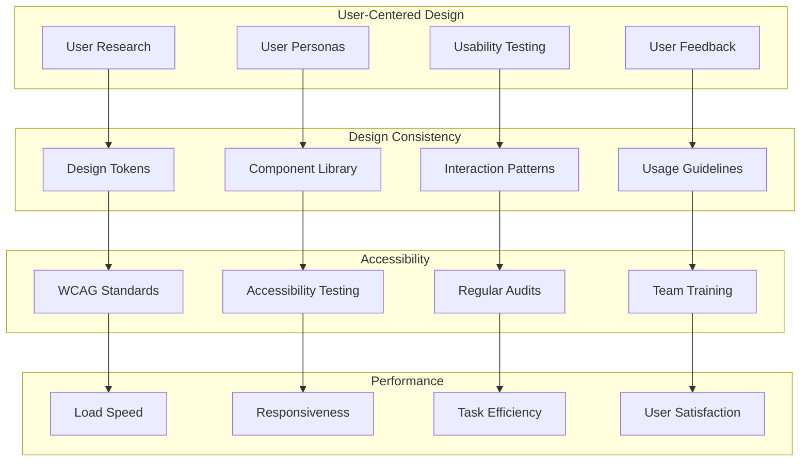
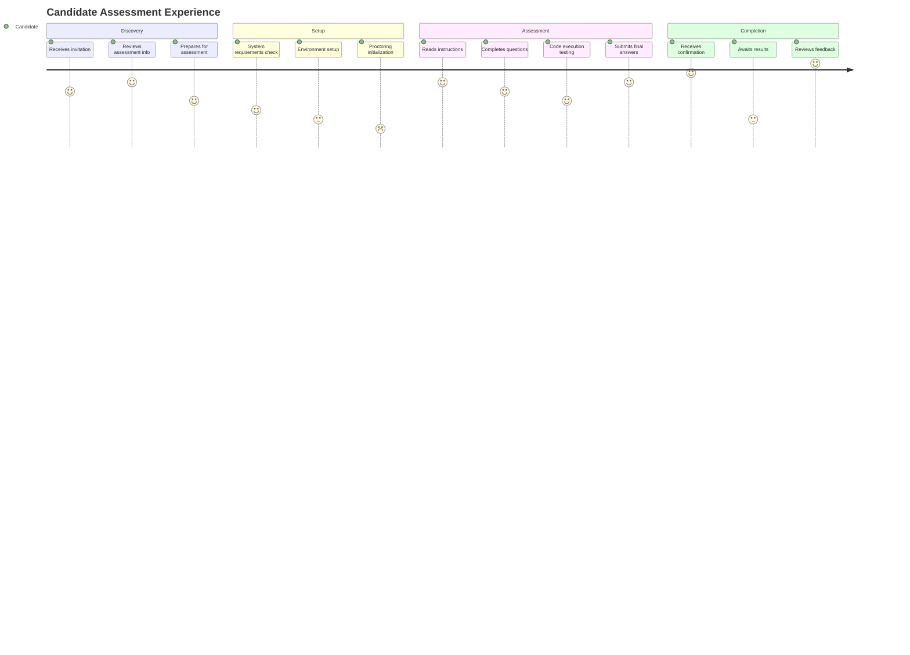
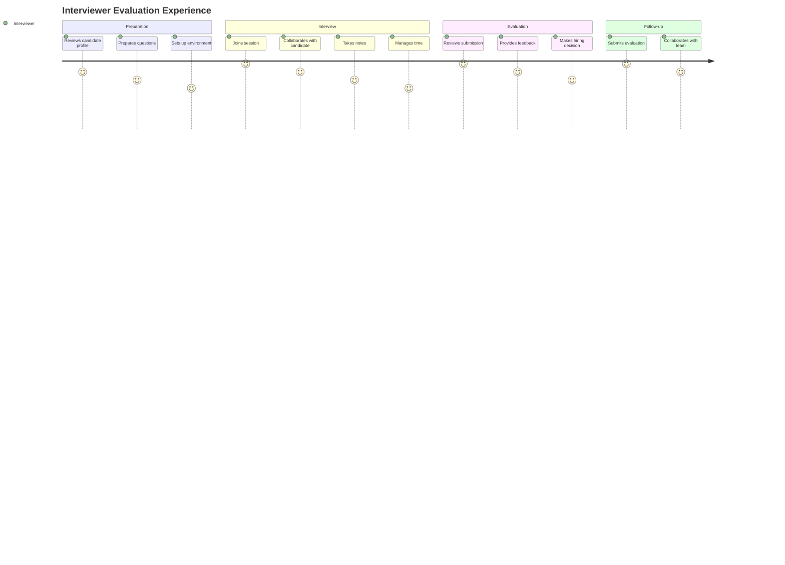
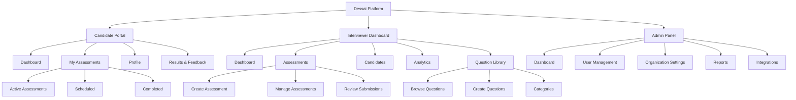

# Dessai User Experience Specifications
version: "1.0.0"
last_updated: "2025-08-08"

## Overview

This document defines the comprehensive user experience specifications for the Dessai technical hiring platform. The UX design follows accessibility-first principles, provides inclusive experiences for diverse user groups, and optimizes for both efficiency and user satisfaction across all interaction touchpoints.

## Table of Contents

1. [UX Design Principles](#ux-design-principles)
2. [User Personas & Journeys](#user-personas--journeys)
3. [Information Architecture](#information-architecture)
4. [Interface Design System](#interface-design-system)
5. [Accessibility Standards](#accessibility-standards)
6. [Responsive Design](#responsive-design)
7. [Interaction Patterns](#interaction-patterns)
8. [Assessment Experience](#assessment-experience)
9. [Proctoring Experience](#proctoring-experience)
10. [Performance Standards](#performance-standards)

## UX Design Principles

### Core Principles

```yaml
design_principles:
  accessibility_first:
    description: "Design for all users, including those with disabilities"
    implementation: "WCAG 2.1 AA compliance minimum"
    
  inclusive_design:
    description: "Consider diverse backgrounds, cultures, and technical skills"
    implementation: "Multi-language support, cultural sensitivity"
    
  trust_transparency:
    description: "Build trust through clear communication and transparency"
    implementation: "Clear data usage, assessment criteria, feedback"
    
  efficiency_simplicity:
    description: "Minimize cognitive load and task completion time"
    implementation: "Progressive disclosure, smart defaults"
    
  error_prevention:
    description: "Prevent errors before they occur"
    implementation: "Validation, confirmation, undo functionality"
    
  emotional_design:
    description: "Create positive, confidence-building experiences"
    implementation: "Encouraging messaging, progress indicators"
```

### Design System Philosophy



## User Personas & Journeys

### Primary User Personas

#### Candidate (Sarah - Software Developer)
```yaml
persona_candidate:
  demographics:
    age: 28
    role: "Mid-level Software Developer"
    experience: "5 years programming"
    location: "San Francisco, CA"
    
  goals:
    - "Showcase technical skills effectively"
    - "Understand assessment expectations"
    - "Receive meaningful feedback"
    - "Have a fair, unbiased evaluation"
    
  pain_points:
    - "Unclear assessment criteria"
    - "Technical difficulties during tests"
    - "Lack of feedback on performance"
    - "Invasive proctoring experience"
    
  motivations:
    - "Career advancement"
    - "Learning and improvement"
    - "Professional recognition"
    
  tech_comfort: "High"
  preferred_devices: ["Desktop", "Laptop"]
  accessibility_needs: "None specified"
```

#### Interviewer (Marcus - Senior Engineer)
```yaml
persona_interviewer:
  demographics:
    age: 35
    role: "Senior Software Engineer / Tech Lead"
    experience: "12 years industry experience"
    location: "Austin, TX"
    
  goals:
    - "Efficiently evaluate candidate skills"
    - "Conduct fair, consistent assessments"
    - "Collaborate effectively during interviews"
    - "Make informed hiring decisions"
    
  pain_points:
    - "Time-consuming evaluation process"
    - "Inconsistent assessment quality"
    - "Difficulty comparing candidates"
    - "Technical issues during interviews"
    
  motivations:
    - "Building strong teams"
    - "Identifying top talent"
    - "Efficient hiring process"
    
  tech_comfort: "High"
  preferred_devices: ["Desktop", "Dual monitors"]
  accessibility_needs: "None specified"
```

#### Recruiter (Emma - Technical Recruiter)
```yaml
persona_recruiter:
  demographics:
    age: 32
    role: "Senior Technical Recruiter"
    experience: "8 years recruiting"
    location: "New York, NY"
    
  goals:
    - "Streamline the hiring pipeline"
    - "Track candidate progress efficiently"
    - "Generate meaningful reports"
    - "Coordinate interview scheduling"
    
  pain_points:
    - "Manual coordination tasks"
    - "Lack of visibility into assessments"
    - "Difficulty extracting insights"
    - "Integration with existing tools"
    
  motivations:
    - "Improving hiring outcomes"
    - "Process efficiency"
    - "Data-driven decisions"
    
  tech_comfort: "Medium"
  preferred_devices: ["Desktop", "Mobile"]
  accessibility_needs: "None specified"
```

### User Journey Maps

#### Candidate Assessment Journey


#### Interviewer Evaluation Journey


## Information Architecture

### Site Map & Navigation



### Content Strategy

#### Information Hierarchy
```yaml
content_hierarchy:
  primary_navigation:
    - label: "Dashboard"
      priority: 1
      audience: ["all_users"]
      
    - label: "Assessments"
      priority: 2
      audience: ["candidate", "interviewer", "recruiter"]
      
    - label: "Analytics"
      priority: 3
      audience: ["interviewer", "recruiter", "admin"]
      
  secondary_navigation:
    - label: "Profile Settings"
      priority: 4
      audience: ["all_users"]
      
    - label: "Help & Support"
      priority: 5
      audience: ["all_users"]
      
  contextual_navigation:
    - "Assessment progress indicators"
    - "Question navigation within assessments"
    - "Filter and search options"
    - "Breadcrumb navigation"
```

## Interface Design System

### Design Tokens

```yaml
design_tokens:
  colors:
    primary:
      50: "#f0f9ff"
      100: "#e0f2fe"
      500: "#0ea5e9"  # Primary brand color
      600: "#0284c7"
      900: "#0c4a6e"
      
    semantic:
      success: "#10b981"
      warning: "#f59e0b"
      error: "#ef4444"
      info: "#3b82f6"
      
    neutral:
      50: "#f8fafc"
      100: "#f1f5f9"
      500: "#64748b"
      900: "#0f172a"
      
  typography:
    font_families:
      primary: "'Inter', -apple-system, BlinkMacSystemFont, sans-serif"
      monospace: "'JetBrains Mono', 'Fira Code', monospace"
      
    font_sizes:
      xs: "0.75rem"    # 12px
      sm: "0.875rem"   # 14px
      base: "1rem"     # 16px
      lg: "1.125rem"   # 18px
      xl: "1.25rem"    # 20px
      "2xl": "1.5rem"  # 24px
      "3xl": "1.875rem" # 30px
      
    font_weights:
      normal: 400
      medium: 500
      semibold: 600
      bold: 700
      
  spacing:
    xs: "0.25rem"   # 4px
    sm: "0.5rem"    # 8px
    md: "1rem"      # 16px
    lg: "1.5rem"    # 24px
    xl: "2rem"      # 32px
    "2xl": "3rem"   # 48px
    
  borders:
    radius:
      sm: "0.25rem"
      md: "0.375rem"
      lg: "0.5rem"
      full: "9999px"
      
    width:
      thin: "1px"
      medium: "2px"
      thick: "4px"
      
  shadows:
    sm: "0 1px 2px 0 rgba(0, 0, 0, 0.05)"
    md: "0 4px 6px -1px rgba(0, 0, 0, 0.1)"
    lg: "0 10px 15px -3px rgba(0, 0, 0, 0.1)"
    xl: "0 20px 25px -5px rgba(0, 0, 0, 0.1)"
```

### Component Library

#### Button Components
```typescript
interface ButtonProps {
  variant: 'primary' | 'secondary' | 'outline' | 'ghost' | 'danger';
  size: 'sm' | 'md' | 'lg';
  disabled?: boolean;
  loading?: boolean;
  icon?: ReactNode;
  children: ReactNode;
  onClick?: () => void;
}

// Button variants and their specifications
const buttonVariants = {
  primary: {
    background: 'primary-500',
    color: 'white',
    hover: 'primary-600',
    focus: 'ring-primary-200'
  },
  secondary: {
    background: 'neutral-100',
    color: 'neutral-900',
    hover: 'neutral-200',
    focus: 'ring-neutral-200'
  },
  outline: {
    background: 'transparent',
    border: 'primary-500',
    color: 'primary-500',
    hover: 'primary-50'
  }
};
```

#### Form Components
```typescript
interface InputProps {
  type: 'text' | 'email' | 'password' | 'number';
  label: string;
  placeholder?: string;
  value: string;
  onChange: (value: string) => void;
  error?: string;
  required?: boolean;
  disabled?: boolean;
  helperText?: string;
  autoComplete?: string;
}

interface SelectProps {
  label: string;
  options: Array<{ value: string; label: string; disabled?: boolean }>;
  value: string;
  onChange: (value: string) => void;
  error?: string;
  required?: boolean;
  disabled?: boolean;
  placeholder?: string;
  multiple?: boolean;
}
```

#### Layout Components
```yaml
layout_components:
  grid_system:
    columns: 12
    breakpoints:
      sm: "640px"
      md: "768px"  
      lg: "1024px"
      xl: "1280px"
      "2xl": "1536px"
    gaps: ["xs", "sm", "md", "lg", "xl"]
    
  container:
    max_widths:
      sm: "640px"
      md: "768px"
      lg: "1024px"
      xl: "1280px"
    padding: "md"
    
  card:
    variants: ["elevated", "outlined", "flat"]
    padding: ["sm", "md", "lg"]
    border_radius: "lg"
    
  modal:
    sizes: ["sm", "md", "lg", "xl", "full"]
    backdrop: "blur"
    close_behavior: "click_outside"
```

## Accessibility Standards

### WCAG 2.1 AA Compliance

#### Accessibility Requirements
```yaml
accessibility_standards:
  perceivable:
    text_alternatives:
      - "Alt text for all images"
      - "Captions for videos"
      - "Audio descriptions"
      
    adaptable_content:
      - "Semantic HTML structure"
      - "Logical reading order"
      - "Meaningful headings hierarchy"
      
    distinguishable:
      - "4.5:1 color contrast minimum"
      - "7:1 contrast for large text"
      - "No color-only information"
      - "Resizable text up to 200%"
      
  operable:
    keyboard_accessible:
      - "Full keyboard navigation"
      - "Visible focus indicators"
      - "No keyboard traps"
      
    timing_adjustable:
      - "Adjustable time limits"
      - "Pause/stop moving content"
      - "No auto-refreshing"
      
    seizure_prevention:
      - "No flashing content > 3Hz"
      - "Large safe area requirements"
      
  understandable:
    readable:
      - "Language identification"
      - "Clear, simple language"
      - "Defined abbreviations"
      
    predictable:
      - "Consistent navigation"
      - "Consistent identification"
      - "Context changes on request"
      
  robust:
    compatible:
      - "Valid HTML markup"
      - "Screen reader compatibility"
      - "Assistive technology support"
```

#### Assistive Technology Support
```yaml
assistive_technology:
  screen_readers:
    supported: ["NVDA", "JAWS", "VoiceOver", "TalkBack"]
    features:
      - "Semantic landmarks"
      - "ARIA labels and descriptions"
      - "Live regions for dynamic content"
      - "Skip links for navigation"
      
  keyboard_navigation:
    patterns:
      - "Tab order follows visual order"
      - "Arrow keys for component navigation"
      - "Enter/Space for activation"
      - "Escape for dismissing modals"
      
  voice_control:
    supported: ["Dragon", "Voice Control", "Voice Access"]
    features:
      - "Clear, descriptive labels"
      - "Clickable text alternatives"
      - "Voice-friendly naming"
      
  motor_impairments:
    features:
      - "Large click targets (44px minimum)"
      - "Sufficient spacing between elements"
      - "Drag and drop alternatives"
      - "Hover alternatives for mobile"
```

### Inclusive Design Considerations

```yaml
inclusive_design:
  cognitive_accessibility:
    - "Clear, consistent navigation"
    - "Simple, jargon-free language"
    - "Progress indicators"
    - "Error prevention and recovery"
    - "Multiple ways to complete tasks"
    
  cultural_considerations:
    - "Right-to-left text support"
    - "Cultural color associations"
    - "Date/time format preferences"
    - "Number format localization"
    
  low_bandwidth:
    - "Progressive image loading"
    - "Offline functionality"
    - "Data usage indicators"
    - "Lightweight alternatives"
    
  older_users:
    - "Larger default text size"
    - "Clear visual hierarchy"
    - "Simplified interactions"
    - "Patient timeout handling"
```

## Responsive Design

### Breakpoint Strategy

```yaml
responsive_design:
  breakpoints:
    mobile: "320px - 767px"
    tablet: "768px - 1023px"
    desktop: "1024px - 1439px"
    large_desktop: "1440px+"
    
  approach: "mobile_first"
  
  layout_adaptations:
    navigation:
      mobile: "hamburger_menu"
      tablet: "tab_bar"
      desktop: "sidebar"
      
    content:
      mobile: "single_column"
      tablet: "two_column"
      desktop: "multi_column"
      
    assessment_interface:
      mobile: "stacked_layout"
      tablet: "side_by_side"
      desktop: "multi_panel"
```

### Touch and Interaction Design

```yaml
touch_design:
  target_sizes:
    minimum: "44px x 44px"
    recommended: "48px x 48px"
    comfortable: "56px x 56px"
    
  spacing:
    between_targets: "8px minimum"
    comfortable: "16px"
    
  gestures:
    supported:
      - "tap"
      - "long_press"
      - "swipe"
      - "pinch_zoom"
    avoided:
      - "hover_dependencies"
      - "right_click_only_functions"
      - "complex_multi_touch"
```

## Interaction Patterns

### Navigation Patterns

#### Primary Navigation
```yaml
navigation_patterns:
  main_navigation:
    pattern: "persistent_sidebar"
    collapse_behavior: "auto_on_mobile"
    active_state: "highlighted_with_icon"
    
  breadcrumbs:
    pattern: "hierarchical"
    separator: "chevron"
    clickable: true
    max_levels: 4
    
  pagination:
    pattern: "numbered_with_prev_next"
    items_per_page: [10, 25, 50, 100]
    total_display: true
    
  tabs:
    pattern: "horizontal_scrollable"
    active_indicator: "underline"
    keyboard_navigation: true
```

### Feedback Patterns

```yaml
feedback_patterns:
  loading_states:
    quick_actions: "spinner_inline"
    page_loads: "skeleton_screens"
    data_processing: "progress_bar_with_text"
    
  success_feedback:
    form_submission: "toast_notification"
    auto_save: "subtle_indicator"
    completion: "celebration_animation"
    
  error_handling:
    validation: "inline_error_messages"
    system_errors: "error_page_with_recovery"
    network_issues: "retry_with_explanation"
    
  empty_states:
    no_data: "illustration_with_action"
    no_results: "search_suggestions"
    first_time: "onboarding_guidance"
```

## Assessment Experience

### Assessment Interface Design

```mermaid
graph TB
    subgraph "Assessment Layout"
        HEADER[Assessment Header]
        NAVIGATION[Question Navigation]
        CONTENT[Question Content Area]
        SIDEBAR[Tools & Information]
        FOOTER[Action Controls]
    end
    
    subgraph "Header Components"
        TITLE[Assessment Title]
        TIMER[Timer Display]
        PROGRESS[Progress Indicator]
        HELP[Help Button]
    end
    
    subgraph "Content Components"
        QUESTION[Question Text]
        CODE_EDITOR[Code Editor]
        OUTPUT[Output Panel]
        RESOURCES[Reference Materials]
    end
    
    subgraph "Navigation Components"
        PREV[Previous Question]
        NEXT[Next Question]
        OVERVIEW[Question Overview]
        SUBMIT[Submit Assessment]
    end
    
    HEADER --> TITLE
    HEADER --> TIMER
    HEADER --> PROGRESS
    HEADER --> HELP
    
    CONTENT --> QUESTION
    CONTENT --> CODE_EDITOR
    CONTENT --> OUTPUT
    CONTENT --> RESOURCES
    
    FOOTER --> PREV
    FOOTER --> NEXT
    FOOTER --> OVERVIEW
    FOOTER --> SUBMIT
```



### Question Type Interfaces

#### Coding Question Interface
```yaml
coding_interface:
  layout:
    question_panel:
      width: "40%"
      position: "left"
      resizable: true
      
    editor_panel:
      width: "60%"
      position: "right"
      tabs: ["code", "test_results", "console"]
      
  editor_features:
    syntax_highlighting: true
    auto_completion: true
    bracket_matching: true
    line_numbers: true
    minimap: false # to reduce distraction
    themes: ["light", "dark"]
    
  execution_feedback:
    real_time_validation: true
    test_case_results: "expandable_list"
    performance_metrics: "time_and_memory"
    error_highlighting: "inline_with_tooltips"
```

#### Multiple Choice Interface
```yaml
multiple_choice_interface:
  layout: "vertical_stack"
  option_styling:
    indicator: "radio_buttons_or_checkboxes"
    spacing: "comfortable"
    hover_state: "subtle_highlight"
    
  selection_feedback:
    immediate: "visual_selection_state"
    validation: "on_submit_or_navigation"
    
  accessibility:
    keyboard_navigation: "arrow_keys"
    screen_reader: "proper_labeling"
```

#### System Design Interface
```yaml
system_design_interface:
  layout: "flexible_canvas"
  tools:
    drawing: ["shapes", "connectors", "text", "sticky_notes"]
    templates: ["common_architectures", "component_libraries"]
    collaboration: ["shared_cursor", "comments", "version_history"]
    
  export_options:
    formats: ["pdf", "png", "svg"]
    sharing: "shareable_links"
```

### Progress and Time Management

```yaml
progress_management:
  progress_indicators:
    overall: "progress_bar_with_percentage"
    per_section: "step_indicator"
    current_question: "question_x_of_y"
    
  time_management:
    display: "always_visible_timer"
    warnings:
      - "75% time elapsed - gentle warning"
      - "90% time elapsed - prominent warning"
      - "5 minutes remaining - urgent warning"
    auto_save: "every_30_seconds"
    
  navigation_controls:
    question_jumping: "allowed_with_confirmation"
    section_skipping: "based_on_assessment_rules"
    review_mode: "flag_for_review_functionality"
```

## Proctoring Experience

### Proctoring Interface Design

```yaml
proctoring_interface:
  candidate_view:
    camera_preview:
      size: "small_corner_overlay"
      toggle: "minimizable_not_closable"
      position: "non_intrusive_corner"
      
    status_indicators:
      connection: "subtle_indicator"
      recording: "clear_but_not_alarming"
      integrity: "only_when_issues"
      
    instructions:
      pre_assessment: "clear_setup_guide"
      during_assessment: "minimal_reminders"
      issue_resolution: "helpful_troubleshooting"
      
  proctor_dashboard:
    candidate_monitoring:
      layout: "grid_view_with_focus"
      video_quality: "adjustable"
      alert_system: "prioritized_notifications"
      
    integrity_tools:
      event_timeline: "chronological_list"
      flag_system: "severity_based_color_coding"
      notes: "timestamped_annotations"
      
    intervention_tools:
      messaging: "discrete_candidate_communication"
      session_control: "pause_terminate_options"
      escalation: "supervisor_handoff"
```

### Privacy-Preserving Design

```yaml
privacy_design:
  data_minimization:
    recording_scope: "only_necessary_areas"
    data_retention: "clearly_communicated_limits"
    access_controls: "role_based_viewing_restrictions"
    
  transparency:
    data_collection: "clear_disclosure"
    monitoring_activities: "real_time_status"
    data_usage: "plain_language_explanation"
    
  user_control:
    consent_management: "granular_opt_in"
    data_requests: "easy_access_and_deletion"
    complaint_process: "clear_escalation_path"
```

## Performance Standards

### Page Load Performance

```yaml
performance_targets:
  initial_page_load:
    time_to_first_byte: "< 200ms"
    first_contentful_paint: "< 1.5s"
    largest_contentful_paint: "< 2.5s"
    cumulative_layout_shift: "< 0.1"
    
  assessment_interface:
    question_navigation: "< 100ms"
    code_execution: "< 5s"
    auto_save: "< 500ms"
    real_time_updates: "< 100ms"
    
  optimization_strategies:
    code_splitting: "route_based"
    image_optimization: "webp_with_fallbacks"
    caching: "aggressive_static_assets"
    cdn: "global_edge_delivery"
```

### User Task Performance

```yaml
task_performance:
  authentication:
    login_completion: "< 30 seconds"
    registration: "< 2 minutes"
    password_reset: "< 1 minute"
    
  assessment_setup:
    system_check: "< 30 seconds"
    proctoring_setup: "< 60 seconds"
    assessment_start: "< 10 seconds"
    
  assessment_interaction:
    question_loading: "< 2 seconds"
    answer_saving: "< 1 second"
    feedback_display: "< 500ms"
    
  error_recovery:
    connection_restoration: "< 10 seconds"
    session_recovery: "< 30 seconds"
    data_restoration: "< 5 seconds"
```

### Usability Metrics

```yaml
usability_metrics:
  success_rates:
    task_completion: "> 95%"
    error_free_completion: "> 85%"
    first_attempt_success: "> 80%"
    
  efficiency:
    time_on_task: "within_expected_range"
    clicks_to_completion: "minimized_paths"
    cognitive_load: "measured_through_testing"
    
  satisfaction:
    system_usability_scale: "> 80"
    net_promoter_score: "> 50"
    user_retention: "> 85%"
    
  accessibility:
    wcag_compliance: "AA_level_minimum"
    assistive_technology: "100%_compatibility"
    keyboard_navigation: "complete_coverage"
```

This comprehensive UX specification provides the foundation for creating an intuitive, accessible, and high-performing technical hiring platform that serves all user types effectively while maintaining security and integrity standards.
