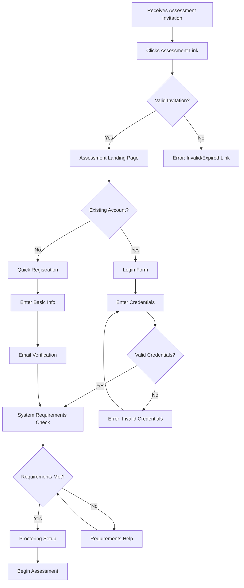
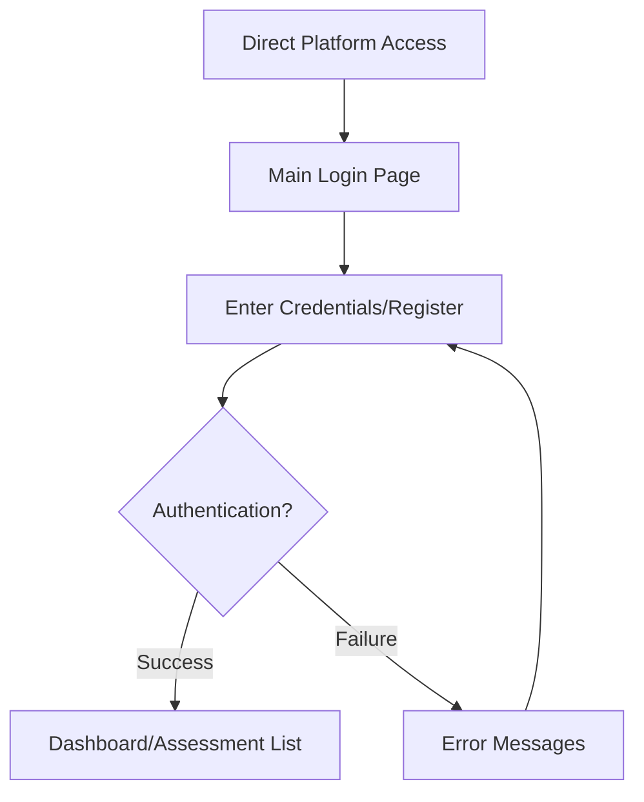

# Assessment Login Flow Requirements
**Version**: 1.0.0  
**Last Updated**: August 11, 2025  
**Persona**: Business Strategy Advisor (CEO)

## Executive Summary

The assessment login flow is the first touchpoint for candidates and sets the tone for their entire experience. This document outlines requirements for a secure, accessible, and user-friendly authentication system based on analysis of leading coding platforms.

## Competitive Analysis

### Platform Authentication Patterns
| Platform | Key Features | Strengths | Areas for Improvement |
|----------|-------------|-----------|---------------------|
| **HackerRank** | Email/password, Social login, SSO | Clean UI, fast loading | Limited customization for enterprise |
| **HackerEarth** | Email/password, Phone verification | Strong security | Complex multi-step process |
| **LeetCode** | Email/username, Social login | Minimal friction | Basic enterprise features |
| **Codeforces** | Username/email, Handle system | Flexible identification | Outdated UI patterns |

### Key Success Factors
1. **Minimal friction** - Candidates should access assessments quickly
2. **Enterprise integration** - Support for SSO and identity providers
3. **Security compliance** - GDPR, SOC 2, data protection
4. **Accessibility** - WCAG 2.1 AA compliance
5. **Multi-device support** - Responsive design for desktop/mobile

## User Journey Requirements

### Primary Flow: Invited Candidate


### Secondary Flow: Direct Access


## Functional Requirements

### FR-1: Authentication Methods
| ID | Requirement | Priority | Acceptance Criteria |
|----|-------------|----------|-------------------|
| FR-1.1 | Email/Password Login | HIGH | User can login with verified email and secure password |
| FR-1.2 | Social Authentication | MEDIUM | Support Google, GitHub, LinkedIn OAuth |
| FR-1.3 | Enterprise SSO | HIGH | Support SAML 2.0, OAuth 2.0, OpenID Connect |
| FR-1.4 | Magic Link Login | MEDIUM | Passwordless authentication via email |
| FR-1.5 | Two-Factor Authentication | HIGH | SMS, TOTP, backup codes support |

### FR-2: Registration Process
| ID | Requirement | Priority | Acceptance Criteria |
|----|-------------|----------|-------------------|
| FR-2.1 | Quick Registration | HIGH | Minimal fields for assessment access |
| FR-2.2 | Email Verification | HIGH | Mandatory email verification for new accounts |
| FR-2.3 | Profile Completion | MEDIUM | Optional profile completion post-assessment |
| FR-2.4 | Terms Acceptance | HIGH | GDPR-compliant consent management |
| FR-2.5 | Duplicate Prevention | HIGH | Prevent multiple accounts with same email |

### FR-3: Security & Compliance
| ID | Requirement | Priority | Acceptance Criteria |
|----|-------------|----------|-------------------|
| FR-3.1 | Password Security | HIGH | Min 8 chars, complexity requirements, breach check |
| FR-3.2 | Rate Limiting | HIGH | Prevent brute force attacks |
| FR-3.3 | Session Management | HIGH | Secure sessions, timeout handling |
| FR-3.4 | Audit Logging | HIGH | Log all authentication events |
| FR-3.5 | Data Protection | HIGH | GDPR compliance, data minimization |

## Non-Functional Requirements

### NFR-1: Performance
- **Load Time**: Login page loads in < 2 seconds
- **Authentication**: Login response in < 3 seconds
- **Availability**: 99.9% uptime for authentication services

### NFR-2: Accessibility
- **WCAG 2.1 AA**: Full compliance with accessibility standards
- **Screen Readers**: Compatible with NVDA, JAWS, VoiceOver
- **Keyboard Navigation**: Complete keyboard accessibility
- **Color Contrast**: Minimum 4.5:1 ratio for text

### NFR-3: Device Support
- **Desktop**: Chrome 90+, Firefox 88+, Safari 14+, Edge 90+
- **Mobile**: iOS 14+, Android 10+
- **Responsive**: Breakpoints at 768px, 1024px, 1440px
- **Touch**: Touch-friendly interface elements

## User Experience Specifications

### UX-1: Visual Design
```yaml
design_system:
  typography:
    primary: "Inter, system-ui, sans-serif"
    headings: "Inter, weight 600"
    body: "Inter, weight 400"
    
  colors:
    primary: "#2563eb"
    secondary: "#64748b"
    success: "#059669"
    error: "#dc2626"
    warning: "#d97706"
    background: "#ffffff"
    surface: "#f8fafc"
    
  spacing:
    grid: "8px"
    padding: "12px, 16px, 24px"
    margins: "8px, 16px, 24px, 32px"
    
  borders:
    radius: "6px"
    width: "1px"
    style: "solid"
```

### UX-2: Interaction Patterns
- **Form Validation**: Real-time validation with clear error messages
- **Loading States**: Skeleton screens and progress indicators
- **Error Handling**: Contextual error messages with recovery actions
- **Success Feedback**: Clear confirmation of successful actions

### UX-3: Content Strategy
- **Microcopy**: Clear, encouraging, professional tone
- **Error Messages**: Specific, actionable, non-technical language
- **Help Content**: Progressive disclosure, contextual help
- **Accessibility**: Alt text, ARIA labels, semantic markup

## Integration Requirements

### INT-1: External Systems
- **Identity Providers**: Active Directory, Okta, Auth0
- **Social Platforms**: Google, GitHub, LinkedIn APIs
- **Email Service**: SendGrid, AWS SES for verification emails
- **Analytics**: User behavior tracking, conversion metrics

### INT-2: Internal Systems
- **User Management Service**: Account creation, profile management
- **Assessment Service**: Assessment access validation
- **Proctoring Service**: Session initialization
- **Notification Service**: Email, SMS notifications

## Security Specifications

### SEC-1: Authentication Security
```yaml
password_policy:
  min_length: 8
  max_length: 128
  require_uppercase: true
  require_lowercase: true
  require_digits: true
  require_special_chars: true
  prevent_common_passwords: true
  prevent_user_info: true
  
session_security:
  jwt_algorithm: "RS256"
  access_token_ttl: "15 minutes"
  refresh_token_ttl: "7 days"
  session_timeout: "30 minutes idle"
  concurrent_sessions: 3
  
rate_limiting:
  login_attempts: "5 per 15 minutes"
  registration_attempts: "3 per hour"
  password_reset: "3 per hour"
  email_verification: "5 per hour"
```

### SEC-2: Data Protection
- **Encryption**: TLS 1.3 in transit, AES-256 at rest
- **PII Handling**: Minimal collection, secure storage, right to deletion
- **Audit Trails**: Immutable logs for compliance
- **Vulnerability Management**: Regular security scans, dependency updates

## Success Metrics

### Primary KPIs
- **Conversion Rate**: >85% invitation-to-assessment completion
- **Login Success Rate**: >95% first-attempt login success
- **Time to Assessment**: <2 minutes from invitation click
- **User Satisfaction**: >4.5/5 rating for login experience

### Secondary Metrics
- **Support Tickets**: <2% of users need login assistance
- **Abandonment Rate**: <10% drop-off at login step
- **Mobile Usage**: Support >40% mobile users
- **Accessibility Score**: 100% WCAG 2.1 AA compliance

## Implementation Phases

### Phase 1: Core Authentication (Week 1-2)
- Basic email/password authentication
- Registration with email verification
- Password reset functionality
- Basic security measures

### Phase 2: Enhanced Features (Week 3-4)
- Social authentication (Google, GitHub)
- Two-factor authentication
- Session management improvements
- Mobile optimization

### Phase 3: Enterprise Features (Week 5-6)
- SSO integration (SAML, OAuth)
- Advanced security features
- Audit logging
- Analytics integration

### Phase 4: Optimization (Week 7-8)
- Performance optimization
- A/B testing implementation
- Advanced analytics
- User feedback integration

## Risk Mitigation

### High Priority Risks
1. **Security Vulnerabilities**: Regular security audits, penetration testing
2. **Performance Issues**: Load testing, performance monitoring
3. **Accessibility Compliance**: Automated testing, manual audits
4. **User Experience**: User testing, feedback collection

### Contingency Plans
- **Backup Authentication**: Multiple authentication methods
- **Graceful Degradation**: Core functionality without JavaScript
- **Error Recovery**: Clear error messages with recovery steps
- **Support Escalation**: Easy access to technical support

---

**Next Steps**: Proceed with detailed HTML mock creation by Lead Designer persona.

**Suggested Commit Message**: `feat: add comprehensive assessment login flow requirements and UX specifications`
